# Programmentwurf
```table-of-contents
title: 
style: nestedList # TOC style (nestedList|nestedOrderedList|inlineFirstLevel)
minLevel: 0 # Include headings from the specified level
maxLevel: 0 # Include headings up to the specified level
includeLinks: true # Make headings clickable
hideWhenEmpty: false # Hide TOC if no headings are found
debugInConsole: false # Print debug info in Obsidian console
```
## 1. Einführung

Die Applikation ASE_Getraenke (Adavanced Software Engeniering) ist eine Command Line Interface (CLI), welches zu Unterstützung und Verwaltung der Gertränke des Wohnheims genutzt werden kann. Die Domäin ist, deswegen auch an die Prozesse des Wohnheimes angepasst und funktioniert, deswegen in diesem am reibungslosesten.

**Funktionaliäten**

1. **Kunden:** Im Kontext der Applikation sind Kunden, Wohnheimbewohner. Diese können über die Konsole erstellt unf verwaltet werden.
2. **Bestandkontrolle:** Die Software verwaltet den aktuellen Bestand der vorhanden Getränke im Wohnheim.
3. **Produktverwaltung:** Es können über die Applikation Produkte verwaltet werden, dazu gehören **TYP** (Kasten oder Flasche), **PFAND** und der **PREIS**.
4. **Bestellungen:** Bestellungen können Kunden zugewiesen oder von Kunden ausgeführt werden um neue Produkte zu Bestellen oder Produkte aus dem Bestand aus dem "Lager" zu nehmen
5. **Ausgabenverteilung:** Die Ausgaben bzw. der Kontostand jedes Kunden wird über seine Bestellungen gespeichert und kann ausgelesehen werden. 

**Ziel der Applikation**
Die Software soll die Getränke Verwaltung des Wohnheims digitalisieren und es für die Benutzer einfacher und nachvollziehbarer machen wie Kosten zustande kommen oder wann neue Getränke bestellt werden müssen

### 1.1 Starten der Applikation

**Prerequirments**

- Java Development Kit (JDK) Version 17.0.9
- Apache Maven Version 3.9.9

**Anleitung zum Ausführen der Anwendung**

1. **Repository klonen**
```sh 
git clone https://github.com/Gamagu/ase_getraenke.git
cd asegetraenke
```

2. Projekt Installieren und bauen 
```sh
mvn clean install
``` 
Nachdem ```mvn clean install``` kann um den um den Build-Prozess zu verkürzen ```mvn compile```genutzt werden

 3. Starten der Anwendung 
```sh 
cd getraenkeadapter
mvn exec:java
```

4.  Nutzung der Applikation über die Konsole 
```console 
getraenke getstockamountforprodukt
getraenke getallpfandwerte
getraenke setpfandwert
getraenke getpriceforprodukt
getraenke setpriceforprodukt
getraenke addprodukt
getraenke getpfandwert
getraenke getallproducts
getraenke addpfandwert
getraenke acceptlieferung
getraenke setpfandwertprodukt
getraenke getpricehistoryforprodukt
getraenke getproduct
getraenke addbestellung
getraenke addzahlungsvorgang
kunde getallkunden
kunde setname
kunde getkunde
kunde createkunde
kunde getallbestellungen
kunde getkundenbalance
```
Der Nutzer kann nun die präsentierten Funktionen aufrufen und wird durch den Prozess geleitet.  


### 1.3 Ausführen der Tests
Die Tests werden über den Maven-Lifecycle automatischen bei dem Befehl ```mvn clean install```  mit ausgeführt.  Die Anwendung ermöglicht auch das konkrette Ausführen der Tests.
```sh 
cd asegetraenke
mvn test
```

Die Testergebnisse werden dann in der Konsole angezeigt.
![[Screenshot 2025-04-04 at 06.09.39.png]]

## 2. Clean Architecture

### 2.1 Was ist Clean Architecture
Clean Architecture ist ein Softwarearchitekturkonzept mit dem Ziel, Software so zu gestalten, dass sie leicht verständlich, testbar, und flexibel bei Änderungen ist. Clean Architecture zeichnet sich durch eine klare Trennung der Verantwortlichkeiten und Abhängigkeiten aus, wodurch die Kernlogik der Anwendung unabhängig von äußeren Einflüssen bleibt.

Clean Architecture setzt sich aus folgenden Grundprinzipien zusammen:
1. Unabhängigkeit der Geschäftslogik
   Die Geschäftslogik (Use Cases) sollte unabhängig von den äußeren Details sein, wie z.B. Datenbanken, Benutzeroberflächen oder externen Frameworks.
2. Trennung der Verantwortlichkeiten
   Jede Schicht in der Architektur hat eine spezifische und klar definierte Aufgabe, was die Wartbarkeit und die Erweiterbarkeit der Anwendung fördert.
3. Dependency Rule
   Innere Schichten dürfen nichts von äußeren Schichten wissen. Abhängigkeiten sollten immer von außen nach innen zeigen, wobei die Kernlogik der Anwendung (wie die Geschäftslogik) keinen Bezug zu den weniger zentralen Detailbereichen (wie UI oder Datenbank) haben sollte.

### 2.2 Analyse der Schichten 
Das Projekt basiert auf einer klaren Trennung in drei Schichten: die Adapterschicht, die Anwendungsschicht und die Domänenschicht. Diese Schichten folgen den Prinzipien der Clean Architecture und haben jeweils spezifische Aufgaben und Verantwortlichkeiten.

#### 2.2.1 Domänenschicht
Die Domänenschicht bildet die Grundlage der Anwendung, indem sie die Datenbasis und deren Beziehungen definiert. Sie wird ausschließlich für die Datenrepräsentation genutzt und enthält nur minimale Logik. Zu dieser Logik gehören beispielsweise die Generierung von IDs oder die Verknüpfung verschiedener Datentypen. Ein Beispiel hierfür ist die Verknüpfung eines Produkts mit seinem aktuellen Preis. Das Hauptziel dieser Schicht ist es, eine konsistente und zuverlässige Datenbasis sicherzustellen, die unabhängig von äußeren Einflüssen bleibt.

#### 2.2.2 Anwendungsschicht
Die Anwendungsschicht enthält die zentrale Geschäftslogik der Anwendung. Sie wird durch sogenannte Use Cases beschrieben, die die Schnittstelle zwischen der Domänenschicht und der Adapterschicht bilden. Diese Use Cases sind dafür verantwortlich, die Daten aus der Domänenschicht zu verarbeiten und an die Adapterschicht weiterzugeben. Um die Struktur der Anwendung übersichtlich zu halten, sind die Use Cases in zwei Hauptbereiche unterteilt: kundenbezogene und getränkebezogene Funktionalitäten. Diese Unterteilung ermöglicht eine klare Trennung der Verantwortlichkeiten, reduziert die Anzahl der Source-Files und sorgt dafür, dass die Dateien nicht unnötig groß werden.

#### 2.2.3 Adapterschicht
Die Adapterschicht dient als Verbindung zwischen der Geschäftslogik und den äußeren Systemen. Sie ermöglicht den Zugriff auf die Geschäftslogik und die Speicherung der Daten. Die Speicherung erfolgt über ein Repository, das ein Interface der Domänenschicht implementiert. Die Benutzerschnittstelle wird in diesem Projekt über das Terminal bereitgestellt. Dadurch können Benutzer direkt auf die in der Anwendungsschicht implementierten Use Cases zugreifen und die verschiedenen Funktionen der Anwendung nutzen.
### 2.3 Analyse der Dependency Rule
Das Projekt ist in der Struktur so aufgebaut, dass es nicht möglich ist gegen die Regel der Dependency Rule zu verstoßen. Im Folgenden werden, deswegen keine Negativ Beispiele gezeigt bei denen diese Regel missachtet wird. 

```shell
├── 0-getraenkeadapter
├── 1-getraenkeapplication
├── 2-getraenkedomain
├── README.md
└── pom.xml
```

#### 2.3.1 Positiv Beispiel : `GetraenkeUsecases`
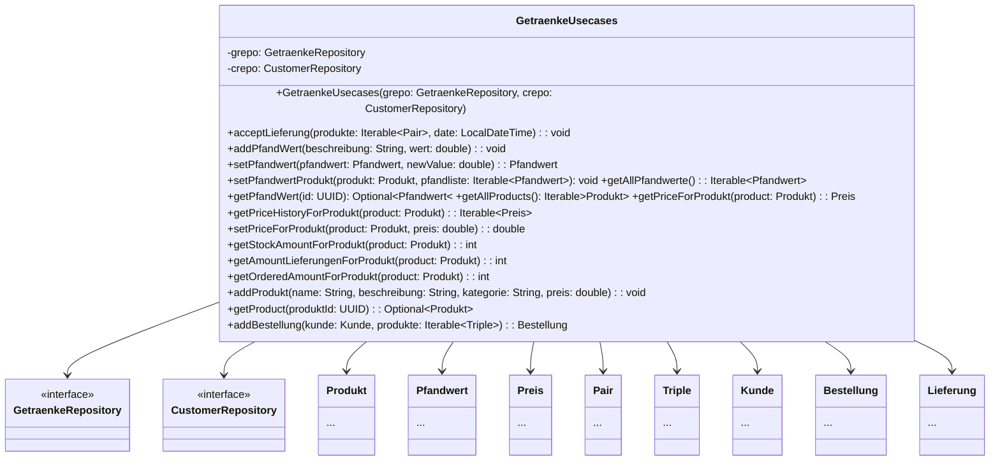
```mermaid
classDiagram
    class GetraenkeUsecases {
		-grepo: GetraenkeRepository 
		-crepo: CustomerRepository 
		+GetraenkeUsecases(grepo: GetraenkeRepository, crepo: CustomerRepository) 
		+acceptLieferung(produkte: Iterable~Pair~<Produkt, Integer>, date: LocalDateTime): void 
		+addPfandWert(beschreibung: String, wert: double): void 
		+setPfandwert(pfandwert: Pfandwert, newValue: double): Pfandwert 
		+setPfandwertProdukt(produkt: Produkt, pfandliste: Iterable~Pfandwert~): void +getAllPfandwerte(): Iterable~Pfandwert~ 
		+getPfandWert(id: UUID): Optional~Pfandwert~ +getAllProducts(): Iterable~Produkt~ +getPriceForProdukt(product: Produkt): Preis 
		+getPriceHistoryForProdukt(product: Produkt): Iterable~Preis~ 
		+setPriceForProdukt(product: Produkt, preis: double): double 
		+getStockAmountForProdukt(product: Produkt): int 
		+getAmountLieferungenForProdukt(product: Produkt): int 
		+getOrderedAmountForProdukt(product: Produkt): int 
		+addProdukt(name: String, beschreibung: String, kategorie: String, preis: double): void 
		+getProduct(produktId: UUID): Optional~Produkt~ 
		+addBestellung(kunde: Kunde, produkte: Iterable~Triple~<Produkt, Integer, Double>): Bestellung
    }

class GetraenkeRepository { <<interface>> } 
class CustomerRepository { <<interface>> } 
class Produkt { ... } 
class Pfandwert { ... } 
class Preis { ... } 
class Pair { ... } 
class Triple { ... } 
class Kunde { ... } 
class Bestellung { ... } 
class Lieferung { ... }

GetraenkeUsecases --> GetraenkeRepository 
GetraenkeUsecases --> CustomerRepository 
GetraenkeUsecases --> Produkt 
GetraenkeUsecases --> Pfandwert 
GetraenkeUsecases --> Preis 
GetraenkeUsecases --> Pair 
GetraenkeUsecases --> Triple 
GetraenkeUsecases --> Kunde 
GetraenkeUsecases --> Bestellung 
GetraenkeUsecases --> Lieferung
```

**Analyse:**
- **Abhängigkeiten:** Die Klasse `GetraenkeUsecases` hängt von mehren Entities der Domain Schicht ab und von den zwei Interfaces  `GetraenkeRepository`  und  `CustomerRepository` ab. 
- **Einhaltung Dependency Rule:** Die Klasse `GetraenkeUsecases` hat keine Dependencies nach außen. Sie befindet sich auf der Applikations-Schicht und hat nur Abhängigkeiten auf der Domain-Schicht. Somit verlaufen die Abhängigkeiten wie laut der Regel definiert ausschließlich von Innen nach Außen.
`Commit Stand: ec8012db4f8473d9cf1cad5178f139e92e3f416f`
#### 2.3.2 Positiv Beispiel : `KundenUsecases`
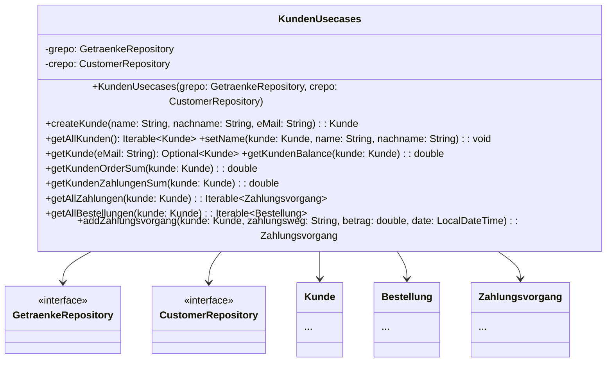
```mermaid
classDiagram
    class KundenUsecases {
	-grepo: GetraenkeRepository 
	-crepo: CustomerRepository 
	+KundenUsecases(grepo: GetraenkeRepository, crepo: CustomerRepository) 
	+createKunde(name: String, nachname: String, eMail: String): Kunde 
	+getAllKunden(): Iterable~Kunde~ +setName(kunde: Kunde, name: String, nachname: String): void 
	+getKunde(eMail: String): Optional~Kunde~ +getKundenBalance(kunde: Kunde): double 
	+getKundenOrderSum(kunde: Kunde): double 
	+getKundenZahlungenSum(kunde: Kunde): double 
	+getAllZahlungen(kunde: Kunde): Iterable~Zahlungsvorgang~ 
	+getAllBestellungen(kunde: Kunde): Iterable~Bestellung~ 
	+addZahlungsvorgang(kunde: Kunde, zahlungsweg: String, betrag: double, date: LocalDateTime): Zahlungsvorgang 
	}

class GetraenkeRepository { <<interface>> } 
class CustomerRepository { <<interface>> } 
class Kunde { ... } 
class Bestellung { ... } 
class Zahlungsvorgang { ... }

KundenUsecases --> GetraenkeRepository 
KundenUsecases --> CustomerRepository 
KundenUsecases --> Kunde 
KundenUsecases --> Bestellung 
KundenUsecases --> Zahlungsvorgang

```
- **Abhängigkeiten:** Genauso wie die Klasse zuvor hat die Klasse `KundenUsecases` Abhängigkeiten zu Entities der Domain-Schicht  und zu den Interfaces `GetraenkeRepository` und `CustomerRepository`. 
- **Einhaltung der Dependency Rule:** Die Klasse `KundenUsecases` hat keine Dependencies nach außen. Sie befindet sich auf der Applikations-Schicht und hat nur Abhängigkeiten auf der Domain-Schicht. Genauso wie zuvor verlaufen die Abhängigkeiten ausschließlich von Innen nach Außen
`Commit Stand: ec8012db4f8473d9cf1cad5178f139e92e3f416f`

## 3. SOLID 

### 3.1 Open/Closed Principle (OCP)

#### 3.1.1 Positives Beispiel `ConsoleAdapter` 

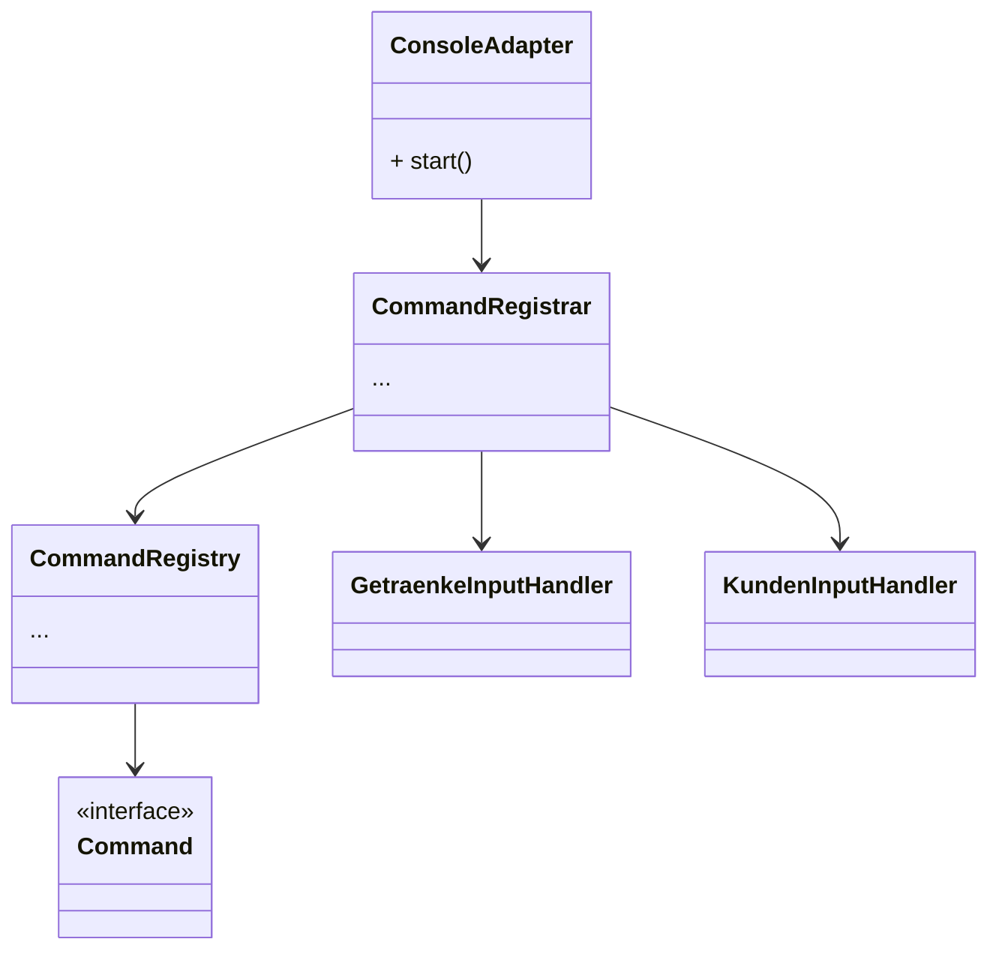
```mermaid
classDiagram
    class ConsoleAdapter {
	+ start()
	}

class Command { <<interface>> } 
class CommandRegistrar { ... }
class CommandRegistry { ... }


CommandRegistry --> Command 
CommandRegistrar --> CommandRegistry 
ConsoleAdapter --> CommandRegistrar
CommandRegistrar --> GetraenkeInputHandler
CommandRegistrar --> KundenInputHandler
```
**Analyse:**
Der `ConsoleAdapter`can einfach um neue Befehle erweitert werden. Die Befehle können hinzugefügt werden indem neue Klassen erstellt werden und die Methoden mit der Annotation `@Command(value = "getstockamountforprodukt", category = "getraenke")` ausgestattet werde. Die Klasse selbst muss sich dann allerdings noch bei dem `CommandRegistrar` selbst übergeben. Dieser Speicher dann den Namen und die Kategorie für die spätere Ausgabe. Das hinzufügen der Methoden kann in der neu eigefügten Klasse erfolgen und benötigt keine Änderungen an der `ConsoleAdapter` Klasse.
`Commit Stand: ec8012db4f8473d9cf1cad5178f139e92e3f416f`
#### 3.1.2 Negatives Beispiel `ConsoleUtils`

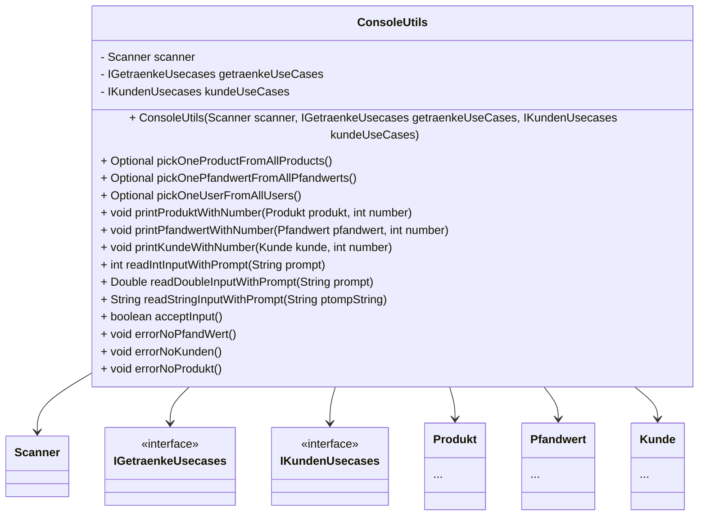
```mermaid
	classDiagram 
		class ConsoleUtils { 
			- Scanner scanner 
			- IGetraenkeUsecases getraenkeUseCases 
			- IKundenUsecases kundeUseCases 
			+ ConsoleUtils(Scanner scanner, IGetraenkeUsecases getraenkeUseCases, IKundenUsecases kundeUseCases) 
			+ Optional<Produkt> pickOneProductFromAllProducts() 
			+ Optional<Pfandwert> pickOnePfandwertFromAllPfandwerts() 
			+ Optional<Kunde> pickOneUserFromAllUsers() 
			+ void printProduktWithNumber(Produkt produkt, int number) 
			+ void printPfandwertWithNumber(Pfandwert pfandwert, int number) 
			+ void printKundeWithNumber(Kunde kunde, int number) 
			+ int readIntInputWithPrompt(String prompt) 
			+ Double readDoubleInputWithPrompt(String prompt) 
			+ String readStringInputWithPrompt(String ptompString) 
			+ boolean acceptInput() 
			+ void errorNoPfandWert() 
			+ void errorNoKunden() 
			+ void errorNoProdukt() } 
		class Produkt { ... } 
		class Pfandwert { ... } 
		class Kunde { ... } 
		class IGetraenkeUsecases { <<interface>> } 
		class IKundenUsecases { <<interface>> } 
		
		ConsoleUtils --> Scanner 
		ConsoleUtils --> IGetraenkeUsecases 
		ConsoleUtils --> IKundenUsecases 
		ConsoleUtils --> Produkt 
		ConsoleUtils --> Pfandwert 
		ConsoleUtils --> Kunde

```
**Analyse:**
`ConsoleUtils` erlaubt keine Erweiterung ohne in der eigentliche Funktion Änderungen durchzuführen. Sie verstößt außerdem gegen mehrere Prinzipien, da sie darüber hinaus schlecht benannt ist und für mehre Aufgaben übernimmt dazu gehören. das Ein- und Auslesen, Bestätigungsabfragen und Auswahl von verschiedenen Entities. Diese Beziehen sich zwar alle auf die Reine Interaktionen des Benutzer mit der Console kann allerdings deutlich eleganter gelöst werden. 

**Lösungsvorschlag:**
Vorerst sollte erwähnt werden , dass die Funktion erstmal unterteilt werden sollte in Folgende Klassen. Zuerst sollte die Klasse unterteilt werden in:
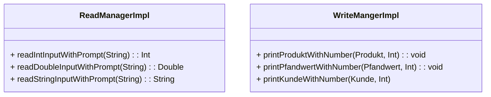
```mermaid
	classDiagram 
		class ReadManagerImpl {
			+ readIntInputWithPrompt(String): Int
			+ readDoubleInputWithPrompt(String): Double
			+ readStringInputWithPrompt(String): String
		} 
		
		class WriteMangerImpl { 
			+ printProduktWithNumber(Produkt, Int): void
			+ printPfandwertWithNumber(Pfandwert, Int): void
			+ printKundeWithNumber(Kunde, Int)
		 
		} 
```
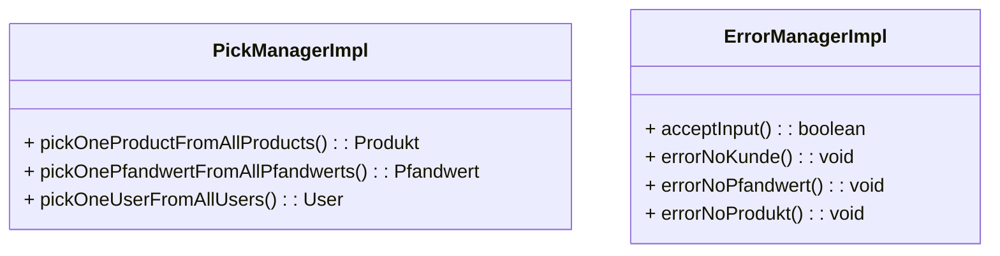
```mermaid
	classDiagram 
		
		class PickManagerImpl { 
			+ pickOneProductFromAllProducts(): Produkt
			+ pickOnePfandwertFromAllPfandwerts(): Pfandwert
			+ pickOneUserFromAllUsers(): User
		} 

		class ErrorManagerImpl {
			+ acceptInput(): boolean
			+ errorNoKunde(): void
			+ errorNoPfandwert(): void
			+ errorNoProdukt(): void
		}

```

Wenn wir nun die Erweiterung der Elemente erlauben z.B. anhand von `ReadManagerImpl`. Durch des extenden der `ReadManagerImpl` würde dann ermöglicht werden neue Funktionalitäten hinzuzufügen.

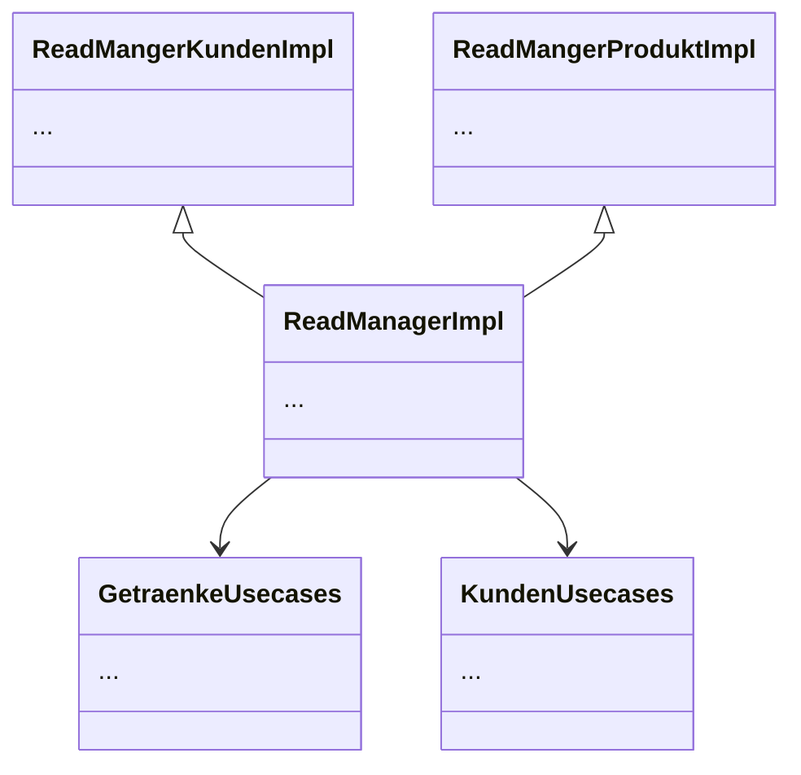
```mermaid
	classDiagram 
		class ReadManagerImpl{...}
		class GetraenkeUsecases { ... } 
		class KundenUsecases { ... } 

		class ReadMangerKundenImpl{...}
		class ReadMangerProduktImpl{...}


		ReadManagerImpl --> GetraenkeUsecases
		ReadManagerImpl --> KundenUsecases
		ReadMangerKundenImpl <|-- ReadManagerImpl
		ReadMangerProduktImpl <|-- ReadManagerImpl
		
```
`Commit Stand: ec8012db4f8473d9cf1cad5178f139e92e3f416f`

Verbessert in : `Commit Stand: 5f3b9ef74a6e7ebcc939c045b32dbf242c376569`
### 3.2 Interface Segregation Principle (ISP)

#### 3.2.1 Positives Beispiel `KundenInputHandler`
Die Klasse `KundenInputHandler` ist ein gutes Beispiel für das Interface Segregation Principle (ISP). Sie hängt nur von den Interfaces `IKundenUsecases`, `IConsoleUtils` und `ICommandRegistrar` ab und nutzt jeweils nur die für sie relevanten Methoden. Dadurch ist sichergestellt, dass `KundenInputHandler` nicht gezwungen ist, Methoden zu implementieren oder zu kennen, die für ihn nicht notwendig sind. Jedes Interface ist also spezifisch und nicht überladen.
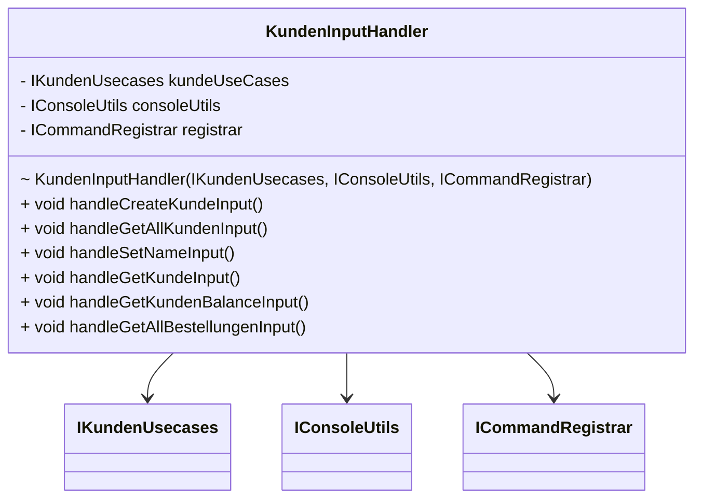
```mermaid
classDiagram
	class KundenInputHandler {
		- IKundenUsecases kundeUseCases
		- IConsoleUtils consoleUtils
		- ICommandRegistrar registrar
		~ KundenInputHandler(IKundenUsecases, IConsoleUtils, ICommandRegistrar)
		+ void handleCreateKundeInput()
		+ void handleGetAllKundenInput()
		+ void handleSetNameInput()
		+ void handleGetKundeInput()
		+ void handleGetKundenBalanceInput()
		+ void handleGetAllBestellungenInput()
	}

	class IKundenUsecases
	class IConsoleUtils
	class ICommandRegistrar

	KundenInputHandler --> IKundenUsecases
	KundenInputHandler --> IConsoleUtils
	KundenInputHandler --> ICommandRegistrar
```
`Commit Stand: ec8012db4f8473d9cf1cad5178f139e92e3f416f`
#### 3.1.2 Negatives Beispiel `CommandRegistrar`
Die Klasse `ConsoleUtils` verstößt gegen das Interface Segregation Principle, da sie Methoden für ganz unterschiedliche Aufgaben bündelt: Einlesen, Ausgabe, Auswahl und Fehlerbehandlung. Dadurch werden andere Klassen gezwungen, ein breites Interface zu kennen und ggf. zu verwenden, auch wenn sie nur Teilfunktionalität brauchen.
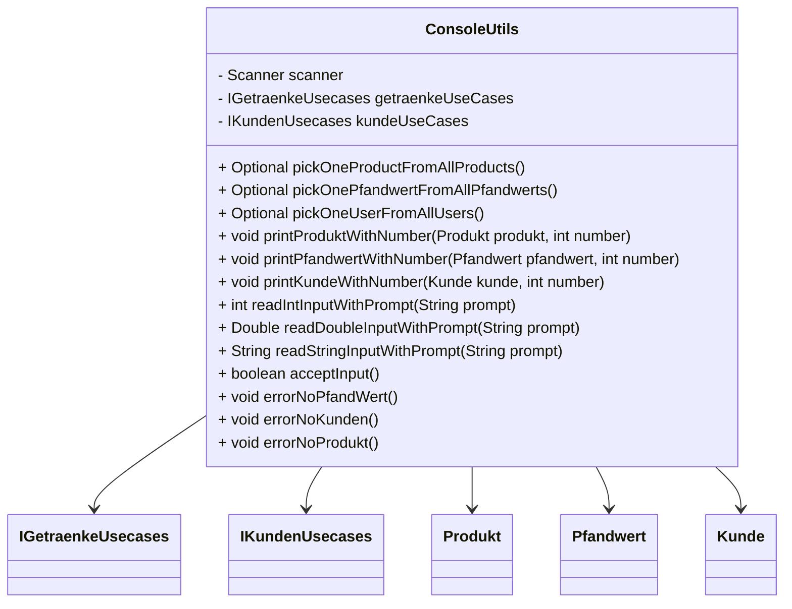
```mermaid
classDiagram
	class ConsoleUtils {
		- Scanner scanner
		- IGetraenkeUsecases getraenkeUseCases
		- IKundenUsecases kundeUseCases

		+ Optional pickOneProductFromAllProducts()
		+ Optional pickOnePfandwertFromAllPfandwerts()
		+ Optional pickOneUserFromAllUsers()
		+ void printProduktWithNumber(Produkt produkt, int number)
		+ void printPfandwertWithNumber(Pfandwert pfandwert, int number)
		+ void printKundeWithNumber(Kunde kunde, int number)
		+ int readIntInputWithPrompt(String prompt)
		+ Double readDoubleInputWithPrompt(String prompt)
		+ String readStringInputWithPrompt(String prompt)
		+ boolean acceptInput()
		+ void errorNoPfandWert()
		+ void errorNoKunden()
		+ void errorNoProdukt()
	}

	class IGetraenkeUsecases
	class IKundenUsecases
	class Produkt
	class Pfandwert
	class Kunde

	ConsoleUtils --> IGetraenkeUsecases
	ConsoleUtils --> IKundenUsecases
	ConsoleUtils --> Produkt
	ConsoleUtils --> Pfandwert
	ConsoleUtils --> Kunde
```
Die Klasse sollte in kleinere, spezialisierte Klassen bzw. Interfaces aufgeteilt werden:
- `ReadManager`: für das Einlesen von Daten
- `WriteManager`: für die formatierte Ausgabe
- `PickManager`: für Auswahlfunktionen
- `ErrorManager`: für Fehlermeldungen
So könnte z. B. `KundenInputHandler` nur `ReadManager` und `PickManager` verwenden, ohne mit unnötigen Methoden konfrontiert zu werden.

### 3.3 Single Responsibility Principle (SRP)
#### 3.3.1 Positives Beispiel `KundenInputHandler`

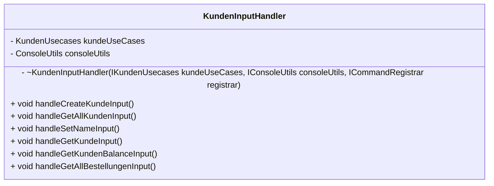
```mermaid 
	classDiagram 
		class KundenInputHandler { 
			- KundenUsecases kundeUseCases 
			- ConsoleUtils consoleUtils
			- ~KundenInputHandler(IKundenUsecases kundeUseCases, IConsoleUtils consoleUtils, ICommandRegistrar registrar) 
			+ void handleCreateKundeInput() 
			+ void handleGetAllKundenInput() 
			+ void handleSetNameInput() 
			+ void handleGetKundeInput() 
			+ void handleGetKundenBalanceInput() 
			+ void handleGetAllBestellungenInput() 
		} 
```

**Aufgabenbereich:**
Diese Klasse erfüllt das SRP Prinzip, da sie ausschließlich die kundenbezogenen Daten der Ein- und der Ausgabe verwalten. Aufgaben wie das tatsächliche Ausgeben, das Einlesen oder andere Teile der Entities zu verwalten sind nicht Teil der Klasse. Somit ist das ihre einzige Aufgabe und befolgt das Prinzip der SRP. 

`Commit Stand: ec8012db4f8473d9cf1cad5178f139e92e3f416f`
#### 3.3.2 Negatives Beispiel `GetraenkeRepositoryImpl`

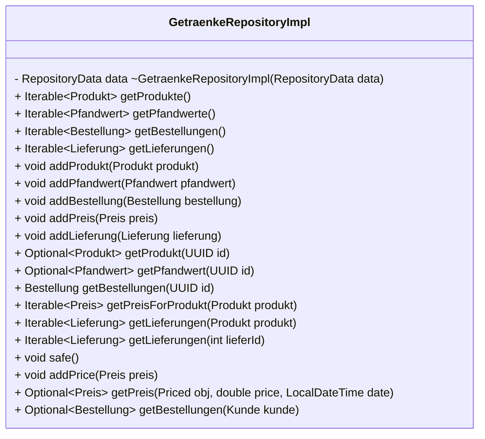
```mermaid 
	classDiagram 
		class GetraenkeRepositoryImpl { 
		- RepositoryData data ~GetraenkeRepositoryImpl(RepositoryData data) 
		+ Iterable~Produkt~ getProdukte() 
		+ Iterable~Pfandwert~ getPfandwerte() 
		+ Iterable~Bestellung~ getBestellungen() 
		+ Iterable~Lieferung~ getLieferungen() 
		+ void addProdukt(Produkt produkt) 
		+ void addPfandwert(Pfandwert pfandwert) 
		+ void addBestellung(Bestellung bestellung) 
		+ void addPreis(Preis preis) 
		+ void addLieferung(Lieferung lieferung) 
		+ Optional~Produkt~ getProdukt(UUID id) 
		+ Optional~Pfandwert~ getPfandwert(UUID id) 
		+ Bestellung getBestellungen(UUID id) 
		+ Iterable~Preis~ getPreisForProdukt(Produkt produkt) 
		+ Iterable~Lieferung~ getLieferungen(Produkt produkt) 
		+ Iterable~Lieferung~ getLieferungen(int lieferId) 
		+ void safe() 
		+ void addPrice(Preis preis) 
		+ Optional~Preis~ getPreis(Priced obj, double price, LocalDateTime date) 
		+ Optional~Bestellung~ getBestellungen(Kunde kunde) } 
```
**Analyse:**
Diese Klasse `GetraenkeRepositoryImpl` kümmert sich um unterschiedliche Entities und verletzt deswegen . Außerdem könnte man diese dann nachdem Auflösen in die Einzelnen Entities, dann nach Auslesen und Einlesen unterteilen. 

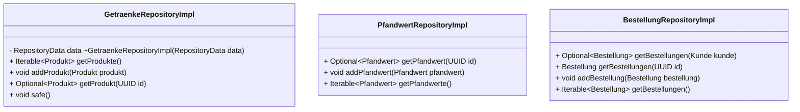
```mermaid 
	classDiagram 
		class GetraenkeRepositoryImpl { 
			- RepositoryData data ~GetraenkeRepositoryImpl(RepositoryData data) 
			+ Iterable~Produkt~ getProdukte() 
			+ void addProdukt(Produkt produkt) 
			+ Optional~Produkt~ getProdukt(UUID id) 
			+ void safe() 
		}
		
		class PfandwertRepositoryImpl {
			+ Optional~Pfandwert~ getPfandwert(UUID id) 
			+ void addPfandwert(Pfandwert pfandwert) 
			+ Iterable~Pfandwert~ getPfandwerte() 
		}

		class BestellungRepositoryImpl {
			+ Optional~Bestellung~ getBestellungen(Kunde kunde) 
			+ Bestellung getBestellungen(UUID id) 
			+ void addBestellung(Bestellung bestellung) 
			+ Iterable~Bestellung~ getBestellungen() 
		}

```
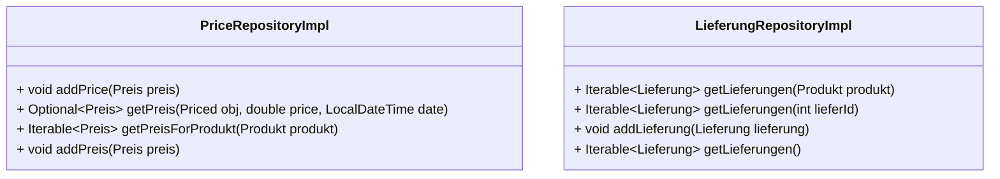
```mermaid 
	classDiagram 
		class PriceRepositoryImpl {
			+ void addPrice(Preis preis) 
			+ Optional~Preis~ getPreis(Priced obj, double price, LocalDateTime date) 
			+ Iterable~Preis~ getPreisForProdukt(Produkt produkt)
			+ void addPreis(Preis preis) 
		}

		class LieferungRepositoryImpl {
			+ Iterable~Lieferung~ getLieferungen(Produkt produkt) 
			+ Iterable~Lieferung~ getLieferungen(int lieferId) 
			+ void addLieferung(Lieferung lieferung) 
			+ Iterable~Lieferung~ getLieferungen() 
		}
	
```


**Lösungsvorschlag:**
Indem wir die Klasse `GetraenkeRepositoryImpl` in kleiner Klassen aufteilen hier 
`GetraenkeRepositoryImpl`,  `PfandwertRepositoryImpl`, `BestellungRepositoryImpl`, `PriceRepositoryImpl` und `LieferungRepositoryImpl` aufteilen müssten die Klassen nur noch die Implementation machen die sie auch benötigen. Somit wäre SRP nicht weiter durch die Klasse verletzt
`Commit Stand: ec8012db4f8473d9cf1cad5178f139e92e3f416f`
## 4. Weiter Prinzipien

### GRASP: Kopplung

#### Positives Beispiel: `CustomerRepository`
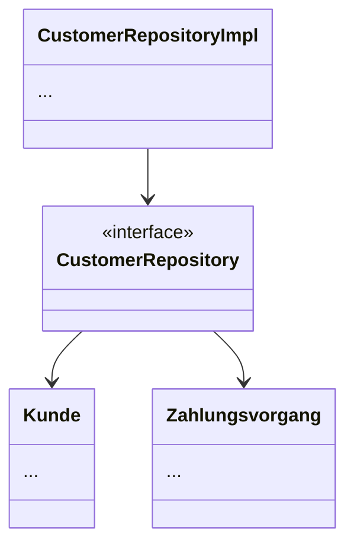
```mermaid 
	classDiagram 
		class CustomerRepositoryImpl {...}
		class CustomerRepository {<<interface>>}
		class Kunde {...}
		class Zahlungsvorgang {...}

		CustomerRepositoryImpl --> CustomerRepository
		CustomerRepository --> Kunde
		CustomerRepository --> Zahlungsvorgang
```
**Analyse:**

Diese Verbindung hat wenig Kopplung, da die Implementierung `CustomerRepositoryImpl` nicht direkt von einer Konkretten Implementierung abhängt sondern ein Interface implementiert `CustomerRepository`.  Die ermöglicht  mehre Möglichkeiten für die Implementierung des `CustomerRepository`.

`Commit Stand: ec8012db4f8473d9cf1cad5178f139e92e3f416f`
#### Negativ Beispiel `ConsoleUtils`
**ConsoleUtils** ist ein zentrales Beispiel für zu hohe Kopplung:  
Sie kennt und verwendet viele verschiedene Klassen und Interfaces, darunter:
- `Produkt`, `Pfandwert`, `Kunde` (Domain-Entities)
- `IGetraenkeUsecases`, `IKundenUsecases` (Use Cases)
- `Scanner` (technische Komponente)
Die Klasse ist daher mit zu vielen Komponenten des Systems stark gekoppelt. Das erschwert Testbarkeit, Wiederverwendbarkeit und Wartbarkeit.
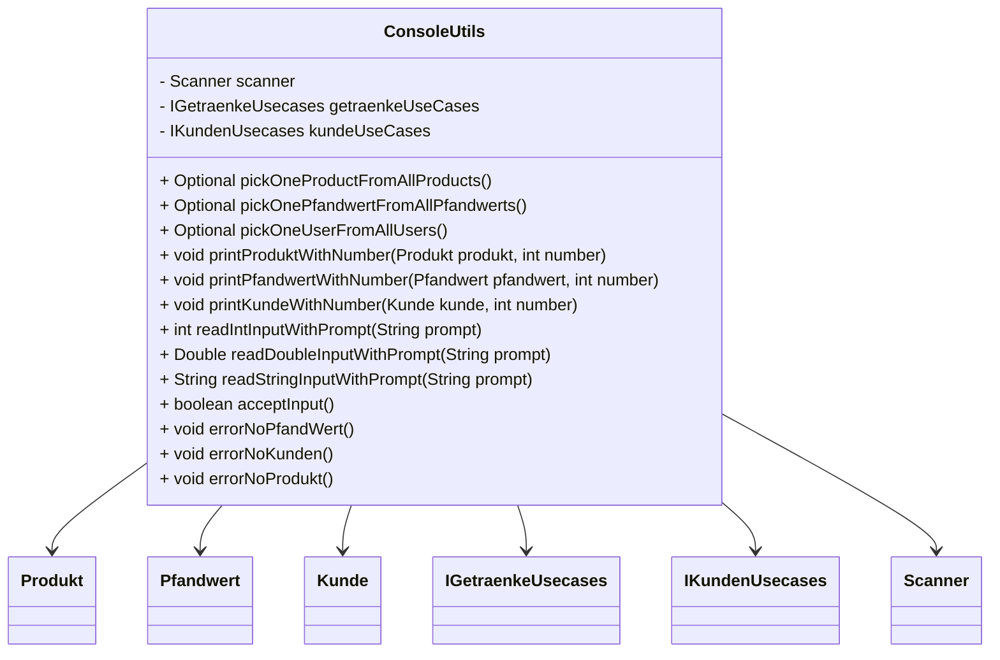
```mermaid 
classDiagram
	class ConsoleUtils {
		- Scanner scanner
		- IGetraenkeUsecases getraenkeUseCases
		- IKundenUsecases kundeUseCases

		+ Optional pickOneProductFromAllProducts()
		+ Optional pickOnePfandwertFromAllPfandwerts()
		+ Optional pickOneUserFromAllUsers()
		+ void printProduktWithNumber(Produkt produkt, int number)
		+ void printPfandwertWithNumber(Pfandwert pfandwert, int number)
		+ void printKundeWithNumber(Kunde kunde, int number)
		+ int readIntInputWithPrompt(String prompt)
		+ Double readDoubleInputWithPrompt(String prompt)
		+ String readStringInputWithPrompt(String prompt)
		+ boolean acceptInput()
		+ void errorNoPfandWert()
		+ void errorNoKunden()
		+ void errorNoProdukt()
	}

	class Produkt
	class Pfandwert
	class Kunde
	class IGetraenkeUsecases
	class IKundenUsecases
	class Scanner

	ConsoleUtils --> Produkt
	ConsoleUtils --> Pfandwert
	ConsoleUtils --> Kunde
	ConsoleUtils --> IGetraenkeUsecases
	ConsoleUtils --> IKundenUsecases
	ConsoleUtils --> Scanner
```
**Problematisch ist insbesondere:**
- Hohe Anzahl an direkten Abhängigkeiten.
- Enge Kopplung an konkrete Implementierungen.
- Direkte Verantwortung für viele verschiedene Aufgabenbereiche.
- Änderungen in Domain-Klassen (z. B. `Produkt`) können sich direkt auf `ConsoleUtils` auswirken.

**Lösungsvorschlag**
Die Kopplung kann durch die Aufspaltung in **spezialisierte Komponenten** deutlich reduziert werden:
- `PickManager` (für Auswahl)
- `ReadManager` (für Eingaben)
- `WriteManager` (für Ausgaben)
- `ErrorManager` (für Fehlerhandling)
Jede dieser Komponenten hängt dann nur noch von einem spezifischen Teil ab – und kann unabhängig weiterentwickelt oder getestet werden.

`Commit Stand: ec8012db4f8473d9cf1cad5178f139e92e3f416f` 

Verbessert in `Commit Stand: 5f3b9ef74a6e7ebcc939c045b32dbf242c376569`

### GRASP: High Cohesion `ConsoleUtils`

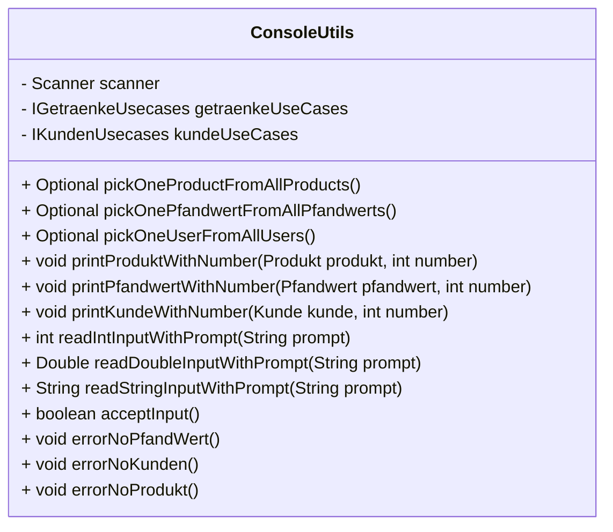
```mermaid 
classDiagram
class ConsoleUtils {
		- Scanner scanner
		- IGetraenkeUsecases getraenkeUseCases
		- IKundenUsecases kundeUseCases

		+ Optional pickOneProductFromAllProducts()
		+ Optional pickOnePfandwertFromAllPfandwerts()
		+ Optional pickOneUserFromAllUsers()
		+ void printProduktWithNumber(Produkt produkt, int number)
		+ void printPfandwertWithNumber(Pfandwert pfandwert, int number)
		+ void printKundeWithNumber(Kunde kunde, int number)
		+ int readIntInputWithPrompt(String prompt)
		+ Double readDoubleInputWithPrompt(String prompt)
		+ String readStringInputWithPrompt(String prompt)
		+ boolean acceptInput()
		+ void errorNoPfandWert()
		+ void errorNoKunden()
		+ void errorNoProdukt()
	}	
```
`Commit Stand: ec8012db4f8473d9cf1cad5178f139e92e3f416f`

#### Begründung

Die ursprüngliche Klasse `ConsoleUtils` wies eine zu breite Verantwortlichkeit auf: Sie kombinierte Eingabe- und Ausgabelogik, Fehlerbehandlung sowie die Auswahl von Entitäten. Dies führte zu niedriger Kohäsion und erschwerte die Wartbarkeit und Wiederverwendbarkeit.
Im Refactoring wurde `ConsoleUtils` in vier klar abgegrenzte Klassen aufgeteilt:
- `ConsoleReader`: Verantwortlich für das Einlesen und Validieren von Benutzereingaben.
- `ConsolePrinter`: Zuständig für die formatierte Ausgabe von Domänenobjekten.
- `ConsoleError`: Kapselt die Darstellung von Fehlermeldungen.
- `EntityPicker`: Bietet generische Auswahlmechanismen aus Listen, unabhängig vom konkreten Typ.
Jede dieser Klassen konzentriert sich auf eine eng umrissene Aufgabe und verwendet nur die dafür relevanten Attribute und Methoden.

#### Vorteile hoher Kohäsion
Durch die klare Trennung der Verantwortlichkeiten entstehen Klassen mit hoher Kohäsion: Jede Klasse enthält nur Methoden, die logisch und semantisch zusammengehören. Dies führt zu:
- **Besserer Lesbarkeit**: Die Intention der Klassen ist sofort erkennbar.
- **Einfacherer Wiederverwendung**: Komponenten wie `ConsoleReader` oder `EntityPicker` können auch in anderen Kontexten (z. B. Tests, anderer UI) verwendet werden.
- **Erhöhter Testbarkeit**: Die modularen Klassen lassen sich gezielt und unabhängig voneinander testen.
- **Reduzierter Wartungsaufwand**: Änderungen in der Eingabe- oder Ausgabelogik betreffen nur einzelne, klar abgegrenzte Klassen.

#### Technische Metriken
Nach dem Refactoring hat jede der vier Klassen:
- Eine überschaubare Anzahl an Methoden
- Eine einheitliche Schnittstelle
- Eine enge Nutzung ihrer Attribute (z. B. `scanner` nur in `ConsoleReader`)
Dies sind Indikatoren für eine **hohe Kohäsion** im Sinne von GRASP. Die neue Struktur verbessert die Modularität der Konsoleninteraktion signifikant.

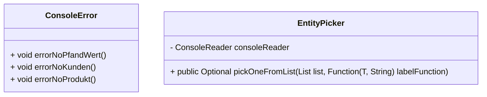
```mermaid 
classDiagram
class ConsoleError {
		+ void errorNoPfandWert()
		+ void errorNoKunden()
		+ void errorNoProdukt()
	}
	
class EntityPicker {
	- ConsoleReader consoleReader
	+ public Optional pickOneFromList(List list, Function(T, String) labelFunction) 
}
```
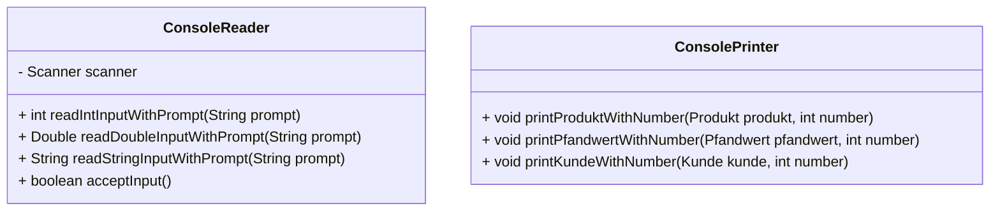
```mermaid 
classDiagram
class ConsoleReader {
	- Scanner scanner 
	+ int readIntInputWithPrompt(String prompt)
	+ Double readDoubleInputWithPrompt(String prompt)
	+ String readStringInputWithPrompt(String prompt)
	+ boolean acceptInput()
}

class ConsolePrinter {
	+ void printProduktWithNumber(Produkt produkt, int number)
	+ void printPfandwertWithNumber(Pfandwert pfandwert, int number)
	+ void printKundeWithNumber(Kunde kunde, int number)
}
```
`Commit Stand: 5f3b9ef74a6e7ebcc939c045b32dbf242c376569`
### Dont Repeat Yourself (DRY
#### Begründung

Die ursprüngliche Implementierung der Klasse `ConsoleUtils` verstieß gegen das **DRY-Prinzip (Don't Repeat Yourself)**, da mehrfach identische oder stark ähnliche Logik zur Auswahl und Ausgabe von Entitäten implementiert wurde. Die folgenden Methoden zeigen dieses Muster deutlich:

```java

public Optional<Produkt> pickOneProductFromAllProducts() { ... } 
public Optional<Pfandwert> pickOnePfandwertFromAllPfandwerts() { ... } 
public Optional<Kunde> pickOneUserFromAllUsers() { ... }  

public void printProduktWithNumber(Produkt produkt, int number) { ... } 
public void printPfandwertWithNumber(Pfandwert pfandwert, int number) { ... } 
public void printKundeWithNumber(Kunde kunde, int number) { ... }`
```
`Commit Stand: ec8012db4f8473d9cf1cad5178f139e92e3f416f`

Diese Methoden unterscheiden sich fast ausschließlich im Typ der verwendeten Entität, folgen jedoch demselben strukturellen Ablauf (z. B. Listen-Auswahl oder nummerierte Ausgabe).

#### Refactoring zur Vermeidung von Redundanz

Zur Auflösung der Wiederholungen wurde die generische Hilfsklasse `EntityPicker<T>` eingeführt. Sie kapselt die wiederkehrende Logik zur Auswahl eines Elements aus einer Liste und ist auf verschiedene Typen anwendbar:

```java
public Optional<T> pickOneFromList(List<T> list, Function<T, String> labelFunction)`
```
`Commit Stand: 5f3b9ef74a6e7ebcc939c045b32dbf242c376569`


Die Methode verwendet einen `Function<T, String>`, um eine flexible Beschriftung für beliebige Objekte zu ermöglichen. Dadurch kann dieselbe Methode sowohl für Produkte, Pfandwerte als auch Kunden verwendet werden.

#### Vorteile dieses Refactoring
- **Weniger Redundanz**: Wiederverwendbare generische Logik ersetzt mehrfach implementierten Code.
- **Erhöhte Erweiterbarkeit**: Neue Entitätstypen können mit minimalem Mehraufwand eingebunden werden.
- **Geringere Kopplung**: Die Logik zur Benutzerauswahl ist entkoppelt von spezifischen Domänenklassen.
- **Bessere Testbarkeit**: Die Auswahl-Logik ist isoliert und kann unabhängig getestet werden.

#### Technische Metriken
Die Anzahl der Methoden in `ConsoleUtils` wurde signifikant reduziert. Die generische `EntityPicker`-Klasse wird mehrfach verwendet und erfüllt somit das DRY-Prinzip auf effektive Weise und ersetzt die drei vorherigen Funktionen. 

## 5. Design Pattern 
### 5.1 Builder Pattern 
Das Builder Pattern wird verwendet, um die Erstellung von `Kunde`-Objekten zu strukturieren. Gerade bei mehreren Parametern wie Name, Nachname und E-Mail wird dadurch die **Lesbarkeit erhöht** und die Fehleranfälligkeit durch falsche Parameterreihenfolgen reduziert.

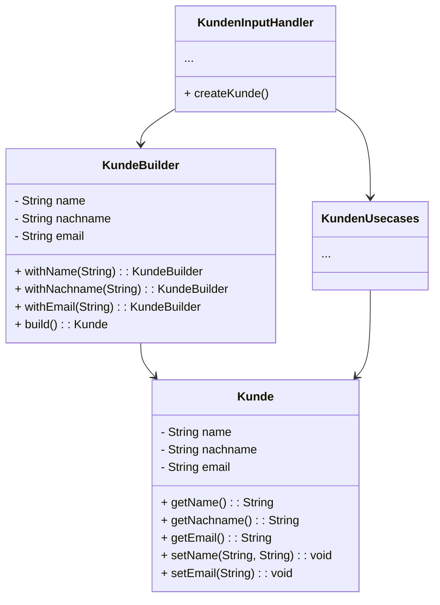
```mermaid
classDiagram

class Kunde {
    - String name
    - String nachname
    - String email
    + getName(): String
    + getNachname(): String
    + getEmail(): String
    + setName(String, String): void
    + setEmail(String): void
}

class KundeBuilder {
    - String name
    - String nachname
    - String email
    + withName(String): KundeBuilder
    + withNachname(String): KundeBuilder
    + withEmail(String): KundeBuilder
    + build(): Kunde
}

class KundenInputHandler{
	+ createKunde()
	...
}

class KundenUsecases {
	...
}

KundeBuilder --> Kunde 
KundenInputHandler --> KundeBuilder
KundenUsecases --> Kunde 
KundenInputHandler --> KundenUsecases

```


### 5.2 Strategy Pattern
Das Strategy Pattern wird im Projekt verwendet, um verschiedene Interaktionen mit Benutzereingaben flexibel zu gestalten. Beispielsweise nutzt `EntityPicker<T>` das Strategy-Prinzip, indem es die Anzeige und Auswahl von Objekten generisch hält und das Labeling über eine **konfigurierbare Strategie** (`Function<T, String>`) erlaubt.

So kann z. B. ein Produkt anders dargestellt werden als ein Kunde, **ohne dass der Auswahlmechanismus verändert werden muss**. 

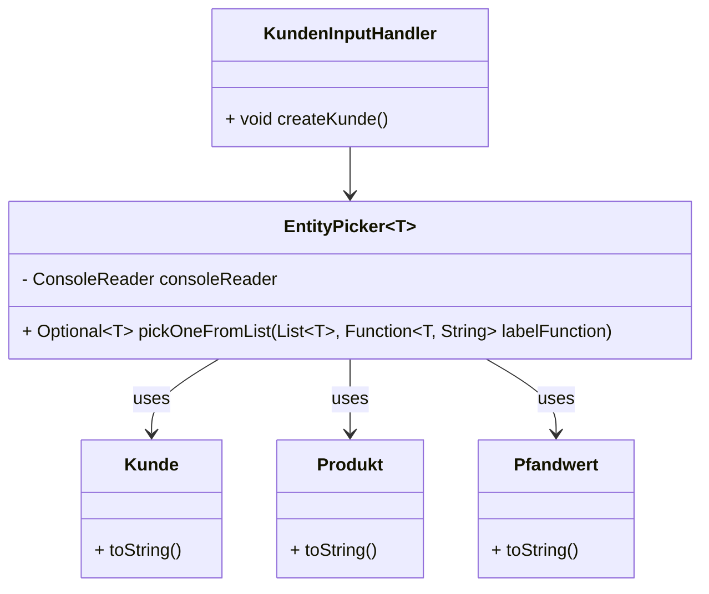
```mermaid
classDiagram
class EntityPicker~T~ {
    - ConsoleReader consoleReader
    + Optional~T~ pickOneFromList(List~T~, Function~T, String~ labelFunction)
}

class KundenInputHandler {
	+ void createKunde()
}

class Kunde {
	+ toString()
}

class Produkt {
	+ toString()
}

class Pfandwert {
	+ toString()
}

EntityPicker --> Kunde : uses
EntityPicker --> Produkt : uses
EntityPicker --> Pfandwert : uses
KundenInputHandler --> EntityPicker

```

## 6. Domain Driven Design (DDD)
Ab dem Start der Entwicklung der Projektes wurde die Domäne ins Zentrum der Entwicklung gestellt und das möglichst der reale Ablauf abgebildet wird.
## Entities
Unserer Grund etwas als ein Entity abzubilden ist, wenn die Daten erhalten werden müssen und dabei kein Änderungsverlauf der Daten gefordert ist, bzw. wenn Änderungen eigentlich nicht vorgesehen sind. Am Beispiel eines Nutzers ist es nicht nötig die Änderungen seines Vornames zu tracken. Als beispiel für wenn ein Verlauf gefordert ist, ist ein Preis für ein Produkt. Im Vollgendem werden unsere eizelnen Entities beschriebn. Die Beschreibung umfasst das Gegenstück, welches aus der echten Welt abgebildet wird und welche Daten gespeichert werden,
- Kunden
	- Ein Kunde beschreibt eine natürliche Person, welche in dem Getränkesystem einkaufen kann.
	- Gepseichert werden Name, Vorname und die Email.
- Produkte
	- Produkte beschreiben alles was verkauft werden kann. Im normalfall sind das Getränke.
	- Dabei werden Name, Beschreibung, Kategorie gespeichert.
	- Zusätzlich dazu werden Verweise zu dem zugehörigem Pfand und dem zugehörigem derzeitigem Preis gespeichert.
- Bestellungen
	- Bestellungen beschreiben eben eine Bestellung welche von einem Kunden aufgegeben wird.
	- Diese ist identifizierbar durch eien Rechnungsnummer und einen Zeitstempel.
	- Es werden darin verweise auf den Kunden und die Bestellten Produkte verwiesen.
	- Die Bestellten Produkte werden mit der Anzahl dieser und dem abgerechnetem Preis gespeichert. (Siehe Bestellprodukt)
- Zahlungsvorgang
	- Ein Zahlungsvorgang beschreibt das Ausgleichen der Schulden, welche durch Rechnungen erzeugt werden.
	- Dabei wird für jede Zahlung der Zahlungsweg, Betrag und der Zeitpunkt gespeichert.
	- Zusätzlich wird ein verweis auf den Kunden gespeichert.
- Lieferungen
	- Lieferungen ermöglichen es alle Produkte welche vom Getränktesystem gekauft werden zu erfassen und dadurch den Lagerbestandzu errechnen.
	- Dafür wird für jedes Produkt die Menge gespeichert, welche gekauft wird pro Lieferung.

## Valueobjects
Valueobjects haben bei uns oft den Zweck um einen Verlauf darzustellen. Diese sind möglichst kein um keine Daten redundant bei vielen Änderungen zu speichern.
- Preis
	- Ein Preis ist immer mit einem Objekt verbunden welches einen Preis haben kann. Dies ist in unserem Fall ein Produkt.
	- Darin wird eine Referenz auf das Produkt gespeichert. Zusätzlich wird der Zeitpunkt zu welchem der Preis gesetzt wird gespeichert und wie hoch der Preis ist.
- Pfandwert
	- Ein Pfandwert beschreibt beispielsweise eine Falsche oder einen Kasten, welcher mit Pfand abgerechnet wird.
	- Dafür wird eine Beschreibung eine Zeitpunkt der Erstellung und die Höhe des Pfandes gespeichert.
	- Obwohl der Pfand einen Preis hat, wird nicht ein Preis-Valueobject benutzt, da der Pfandwert sich normalerweise nicht ändert.
- Bestellungsprodukt
	- Ein Bestellungssprodukt beschreibt eine Bestellposition, d.h. ein Produkt und die zugehörige Menge.
	- Dies ist als Valueobject implementiert, da man für eine Position nachvollziehen kann wie diese geändert wurde und eventuell Bedienfehler  oder fehlende Wahre gut und nachvollziehbar verbessert werden kann.
## Aggregates
Aggregate werden als Zusammenfassung von Entities und Valueobjects genutzt, um an zusammenhängende Daten einfach heranzukommen.
- CustomerDashboard
	- Das CustomerDashboard fasst alle Daten zusammen welche sich auf einen Kunden beziehen und welche den Kunden Interessieren können.
	- Diese Informationen bestehen aus dem Kunden Entity, alle Bestellungen des Kunden und alle Zahlungsvorgänge.
	- Zusätzlich wird der gesammt gezahlte Betrag und der gesammte gekaufte Betrag vorberechnet. Daraus kann dann auch die noch geschuldete Summe berechnet werden.
- ProductInformation
	- Die ProduktInformation beschreibt alle Informationen welche ein Produkt bestreffen.
	- Gepspeichert werden: Eine Referenz auf das Produkt, die derzeitigen Pfandwerte des Produktes und der verlauf des Preises.
	- Vorberechnet werden die Anzahl welche bestellt wurden und wie viele noch auf Vorrat sind.

## Repositories
Grundsätzlich lässt sich unsere Datenbasis in zwei verschiedene Sub-Domänen unterscheiden. Daten bezüglich der Kunden und der des Getränkesystems. Nach dieser Stuktur wurden zwei Repositories erstellt.
Das Kundenrepository umfasst folgende Daten:
- Kundeninformionen, d.h. die Kunden-Entities
- Zahlungsvorgänge, d.h. die Zahlungsvorgänge-Entities.

Dazu sind Methoden vorgesehen diese Daten hinzuzufügen und auszulesen.

Das Getränkerepository umfasst die restlichen Daten:
- Produkte
- Pfandwerte
- Preise
- Lieferungen
- Bestellungen
- Bestellpositionen
Dieses Repository umfasst zusäzlich Methoden um diese Daten hinzuzufügen, auszulesen und vorallem schon nach filtervorgaben Auszulesen. Beispielsweise, dass nur ein User nach seiner Email gesucht werden kann.
## 7. Unit Tests 

### 7.1 Zehn Unit Tests - Tabelle 
| Unit Test Name | Beschreibung |
| testBuildValidKunde | Testet, ob der `KundeBuilder` ein gültiges `Kunde`-Objekt erstellt. |
| testBuildThrowsExceptionWhenFieldsAreNull | Überprüft, ob der `KundeBuilder` eine Exception wirft, wenn erforderliche Felder (Name, Nachname, E-Mail) null sind. |
| testBuildValidProdukt | Testet, ob der `ProduktBuilder` ein gültiges `Produkt`-Objekt erstellt. |
| testBuildThrowsExceptionWhenProduktFieldsAreNullprodukt | Überprüft, ob der `ProduktBuilder` eine Exception wirft, wenn erforderliche Felder (Name, Beschreibung, Kategorie) null sind. |
| testBuildWithPreisAndPfandwerte | Testet, ob der `ProduktBuilder` ein `Produkt` mit gültigen `Preis`- und `Pfandwert`-Objekten erstellt. |
| testGetAllKundenAndAdd | Testet, ob der `KundenUsecases` alle Kunden korrekt zurückgibt und neue Kunden hinzufügen kann. |
| testGetKundenBalance | Überprüft, ob die `getKundenBalance`-Methode die korrekte Balance für einen Kunden zurückgibt. |
| testAddZahlungsvorgang | Testet, ob der `KundenUsecases` einen neuen `Zahlungsvorgang` korrekt hinzufügen kann. |
| testPreisCreation | Überprüft, ob ein `Preis`-Objekt korrekt erstellt wird und die Attribute richtig gesetzt sind. |
| testPreisEquality | Testet, ob zwei `Preis`-Objekte mit identischen Attributen als gleich betrachtet werden. |
### 7.2 ATRIP
The ATRIP principles (Automatic, Thorough, Repeatable, Independent, Professional) are critical for ensuring high-quality tests. Here's a detailed application of these principles with examples:

1. **Automatic**: Tests should run without manual intervention. For example, the `testHandleCreateKundeInput` in `KundenInputHandler` uses mocked dependencies like `ConsoleReader` and `KundenUsecases`, allowing the test to execute automatically without requiring user input. A bad example would be a test that pauses execution to wait for manual input, such as calling `System.in.read()` for user interaction, which breaks automation.

2. **Thorough**: Tests should cover all relevant scenarios, including edge cases. For instance, `testBuildThrowsExceptionWhenFieldsAreNull` ensures that the `KundeBuilder` throws an exception when required fields are missing, covering a critical failure scenario. A bad example would be a test that only checks the happy path, such as verifying that a `Kunde` is created successfully without testing invalid inputs or edge cases.

3. **Repeatable**: Tests should produce consistent results regardless of the environment. For example, `testGetKundenBalance` mocks the `KundenUsecases` to return a fixed balance, ensuring the test behaves the same across different runs. A bad example would be a test that depends on external systems like a live database or network, where results might vary due to external factors.

4. **Independent**: Tests should not depend on the execution order or shared state. For example, `testAddZahlungsvorgang` isolates the logic of adding a payment by mocking all external dependencies, ensuring it can run independently of other tests. A bad example would be a test that relies on a global state modified by a previous test, leading to flaky results if the order changes.

5. **Professional**: Tests should be well-structured, readable, and maintainable. For instance, the use of descriptive method names like `testBuildValidKunde` and clear assertions improves readability and professionalism. A bad example would be a test with vague names like `test1` or without proper assertions, making it hard to understand or debug.

By adhering to these principles, tests become reliable, maintainable, and effective in validating the application's behavior.


===
### 7.3 Code Coverage 
Um die Qualität und Korrektheit der Anwendung sicherzustellen, wurden für die zentralen Use Cases Unit Tests geschrieben. Ein zentrales Ziel war es, eine möglichst hohe Testabdeckung (Code Coverage) in den **Anwendungsfällen (Usecases)** zu erreichen, da diese die Kernlogik des Systems abbilden. Die Code Coverage wurde mit Hilfe des Maven-Plug-ins `jacoco-maven-plugin` gemessen.

Die Coverage-Metrik gibt an, wie viel Prozent des Quellcodes durch Tests tatsächlich ausgeführt werden. Dabei gilt: Eine hohe Abdeckung allein garantiert keine Fehlerfreiheit, ist jedoch ein wichtiger Indikator für die Testtiefe und -qualität. Wichtig ist auch zu erwähnen das Tests nie beweisen können, das Software Fehlerfrei ist nur, dass ein Fehler vorliegt.

Die Tests konzentrieren sich hauptsächlich auf die Anwendungsschicht (Layer `getraenkeapplication`). Diese enthält die Klassen:
- `GetraenkeUsecases`
- `KundenUsecases`

Die Coverage-Berichte zeigen, dass diese Klassen zu einem großen Teil durch automatisierte Tests abgedeckt sind. Besonders häufig getestete Methoden sind:
- `createKunde(...)`, `getKundenBalance(...)`
- `addProdukt(...)`, `getStockAmountForProdukt(...)`, `setPriceForProdukt(...)`

### 7.4 Fakes und Mocks

####  7.4.1 Mock-Objekt: `Repo`
In dem Domain Layer der Applikation wird eine Mock-Klasse genutzt, welche die Funktionlität des Repositories simuliert. Diese Klasse implementiert das Interface, welches in der Applikationsschicht genutzt wird um eine DB. nachzubilden. Diese Mock-Klasse ist ungefähr eine Abbildung der Klasse aus der Applikationsschicht. Diese werden nicht zusammengefasst, da sie Semantisch etwas unterschiedliches bedeuten und getrennt voneinander benutzt werden.

Die Mock-Klasse wird benötigt, um die Logik des Domain Layers zu testen, da darin eine Abhänigkeits zum Repository besteht. Diese Abhänigkeit ist notwendig aus, da der Preis eines Produktes und das Produkt jeweils einen verweis auf das jeweils andere Objekt haben. Dadurch entsteht ein 'Henne-Ei'-Problem, welches mit der Abhänigkeit zum Repository gelöst wird. Diese Abhänigkeit lässt das Produkt checken, ob ein Preis im Repository existiert und wenn dies nicht der Fall ist, wird ein neuer Preis erstellt, bzw. andersherum wird ein Fehler geworfen.
Dieses Mock-Objekt ermöglicht es diese Logik ordentlich zu testen. Dies ist notwendig, da es eine zentrale Bedingung testet, welche für unser Datenmodell notwendig ist und potentiell bei falscher Bedienung der Anwendung zu Inkonsistenzen führen könnte. 


#### 7.4.2 `KundenInputHandler`
In den Tests des `KundenInputHandler` werden alle externen Abhängigkeiten durch **Mock-Objekte** ersetzt. Dies ermöglicht eine **isolierte Testbarkeit** der Benutzereingabe-Logik, ohne auf die reale Implementierung der Geschäftslogik oder auf tatsächliche Benutzereingaben angewiesen zu sein. Durch das mocken der der Abhänigkeiten ist der Test vollkommen isoliert von Benutzereingaben oder anderen Methoden. 

Zu den gemockten Abhängigkeiten zählen:
- `KundenUsecases` – zentrale Geschäftsanwendungsfälle
- `ConsoleReader` – zum Einlesen von Benutzereingaben
- `ConsolePrinter` – für formatierte Ausgaben
- `ConsoleError` – für Fehlerausgaben
- `EntityPicker<Kunde>` – zur Auswahl von Kunden
- `CommandRegistrar` – zur Registrierung von Befehlen

```mermaid
classDiagram
    class KundenInputHandler {
        - KundenUsecases kundenUsecases
        - ConsoleError consoleError
        - CommandRegistrar commandRegistrar
        - EntityPicker~Kunde~ kundenPicker
        - ConsoleReader consoleReader
        - ConsolePrinter consolePrinter
        + void handleCreateKundeInput()
        + void handleSetNameInput()
        + void handleGetAllKundenInput()
        + ...
    }

    class KundenUsecases {
        <<interface>>
        + createKunde(String, String, String)
        + getAllKunden()
        + getKunde(String)
        + getKundenBalance(Kunde)
        + getAllBestellungen(Kunde)
        + setName(Kunde, String, String)
    }

    class ConsoleReader {
        + readStringInputWithPrompt(String)
        + acceptInput()
    }

    class ConsolePrinter {
        + printKundeWithNumber(Kunde, int)
    }

    class ConsoleError {
        + errorNoKunden()
    }

    class EntityPicker~Kunde~ {
        + Optional~Kunde~ pickOneFromList(List~Kunde~, Function)
    }

    class CommandRegistrar {
        + registerCommand(...)
    }

    KundenInputHandler --> KundenUsecases : uses
    KundenInputHandler --> ConsoleError : uses
    KundenInputHandler --> CommandRegistrar : uses
    KundenInputHandler --> EntityPicker~Kunde~ : uses
    KundenInputHandler --> ConsoleReader : uses
    KundenInputHandler --> ConsolePrinter : uses

```

```java 
@Test
public void testHandleCreateKundeInput() {
    when(mockedKundeusecases.createKunde(anyString(), anyString(),anyString())).thenReturn(null);
    when(mockedConsoleReader.readStringInputWithPrompt("Name: ")).thenReturn("Max");
    when(mockedConsoleReader.readStringInputWithPrompt("Nachname: ")).thenReturn("Mustermann");
    when(mockedConsoleReader.readStringInputWithPrompt("E-Mail: ")).thenReturn("max@example.com");
    when(mockedConsoleReader.acceptInput()).thenReturn(true);

    kundenInputHandler.handleCreateKundeInput();

    verify(mockedKundeusecases).createKunde("Max", "Mustermann", "max@example.com");
}

```

**Beschreibung**
Das Mock-Objekt `KundenUsecases` simuliert die Kundenlogik, um den `KundenInputHandler` **unabhängig von der tatsächlichen Business-Logik** testen zu können. Auch Eingaben über `ConsoleReader` und die Auswahl über `EntityPicker` werden gemockt, um automatisierte Tests ohne Benutzereingabe zu ermöglichen. So kann gezielt überprüft werden, ob der Handler auf Eingaben korrekt reagiert und die erwarteten Usecase-Methoden wie `createKunde()` oder `setName()` aufruft – **ohne echte Implementierungen auszuführen**.

**Ziel**
Getestet wird ausschließlich die **Verarbeitung der Eingaben und Steuerung des Ablaufs** innerhalb des `KundenInputHandler`. Die tatsächliche Geschäftslogik (wie z. B. Datenbankzugriffe) wird **nicht** aufgerufen.
## 8. Refactoring 

### 8.1 Code Smells
#### 8.1.1 Large Class
Code Beispiel ist die Klasse`ConsoleUtils` in der Adapterschicht. Auf dem Stand `Commit Stand: ec8012db4f8473d9cf1cad5178f139e92e3f416f`. Diese ist eindeutig zu lange und ist für mehrere Aufgaben zuständig. 

```java
package de.nyg.adapters.asegetraenke.console.Utils;


import java.util.ArrayList;
...


public class ConsoleUtils {
    private final String NOPRODUKTMESSAGE = "There are no Product/s found";
    private final String NOPFANDWERTMESSAGE = "There are no Pfandwert/s found";
    private final String NOKUNDEMESSAGE = "There are no Customer/s found";

    private final Scanner scanner;
    private final GetraenkeUsecases getraenkeUseCases;
    private final KundenUsecases kundeUseCases;

    public ConsoleUtils(Scanner scanner, GetraenkeUsecases getraenkeUseCases, KundenUsecases kundeUseCases) {
        this.scanner = scanner;
        this.getraenkeUseCases = getraenkeUseCases;
        this.kundeUseCases = kundeUseCases;
    }

    public Optional<Produkt> pickOneProductFromAllProducts() {
        Iterable<Produkt> productVec = getraenkeUseCases.getAllProducts();
        List<Produkt> productList = StreamSupport.stream(productVec.spliterator(), false)
                                    .collect(Collectors.toList());
        if(productList.isEmpty()){
            return Optional.empty();
        }

        int count = 1;
        for(Produkt product : productList) {
            printProduktWithNumber(product, count);
        }
        int indexProdukt = 0;
        while (true) {
            indexProdukt = readIntInputWithPrompt("Which Customername do you want to change? Enter the Number: ");
            if(indexProdukt < productList.size()+1 && indexProdukt > 0){
                break;
            }
            System.out.println("Something went wrong the "+ indexProdukt +  " is not in the list");
        }
        Produkt produkt = productList.get(indexProdukt-1);
        System.out.println("Chosen Produkt: "+ produkt.toString());
        return Optional.of(productList.get(indexProdukt-1));
    }

    public Optional<Pfandwert> pickOnePfandwertFromAllPfandwerts() {
        Iterable<Pfandwert> pfandwertVec = getraenkeUseCases.getAllPfandwerte();
        List<Pfandwert> pfandwertList = StreamSupport.stream(pfandwertVec.spliterator(), false)
                                    .collect(Collectors.toList());
        if(pfandwertList.isEmpty()){
            return Optional.empty();
        }

        int count = 1;
        for(Pfandwert pfandwert : pfandwertList) {
            printPfandwertWithNumber(pfandwert, count);
        }
        int indexProdukt = 0;
        while (true) {
            indexProdukt = readIntInputWithPrompt("Which Customername do you want to change? Enter the Number: ");
            if(indexProdukt < pfandwertList.size()+1 && indexProdukt > 0){
                break;
            }
            System.out.println("Something went wrong the "+ indexProdukt +  " is not in the list");
        }
        Pfandwert pfandwert = pfandwertList.get(indexProdukt-1);
        System.out.println("Chosen Produkt: "+ pfandwert.toString());
        return Optional.of(pfandwertList.get(indexProdukt-1));
    }

    public Optional<Kunde> pickOneUserFromAllUsers(){
        Iterable<Kunde> kundenOptVec = this.kundeUseCases.getAllKunden();
        List<Kunde> kundenList = new ArrayList<Kunde>();
        kundenList = StreamSupport.stream(kundenOptVec.spliterator(), false).collect(Collectors.toList());
        int count = 1;
        for(Kunde kunde : kundenList) {
            printKundeWithNumber(kunde, count);
        }
        int indexCustomer = 0;
        while (true) {
            indexCustomer = readIntInputWithPrompt("Which Customername do you want to change? Enter the Number: ");
            if(indexCustomer < kundenList.size()+1 && indexCustomer > 0){
                break;
            }
            System.out.println("Something went wrong the "+ indexCustomer +  " is not in the list");
        }
        return Optional.of(kundenList.get(indexCustomer-1));
    }
    
    public void printProduktWithNumber(Produkt produkt, int number){
        System.out.println(number + ". "+ produkt.toString());
    }

    public void printPfandwertWithNumber(Pfandwert pfandwert, int number){
        System.out.println(number + ". "+ pfandwert.toString());
    }

    public void printKundeWithNumber(Kunde kunde, int number){
        System.out.println(number + ". "+ kunde.toString());
    } 

    public int readIntInputWithPrompt(String prompt){
        System.out.print(prompt);
        while(true){
            String input = this.scanner.nextLine();
            try{
                int inputCastInt = Integer.parseInt(input);
                return inputCastInt;
            }catch(Exception e){
                System.out.println("The input: "+ input+ " can not be translated into a number");
            }
        }
    }

    public Double readDoubleInputWithPrompt(String prompt){
        System.out.print(prompt);
        while(true){
            String input = this.scanner.nextLine();
            try{
                double inputCastInt = Double.parseDouble(input);
                return inputCastInt;
            }catch(Exception e){
                System.out.println("The input: "+ input+ " can not be translated into a number");
            }
        }
    }

    public String readStringInputWithPrompt(String ptompString){
        System.out.print(ptompString);
        return this.scanner.nextLine();
    }

    public boolean acceptInput(){
    ...
    }

    public void errorNoPfandWert() {
        System.out.println(NOPFANDWERTMESSAGE);
    }
 
    public void errorNoKunden() {
        System.out.println(NOKUNDEMESSAGE);
    }
    
    public void errorNoProdukt() {
        System.out.println(NOPRODUKTMESSAGE);
    }
}
```

Um die Länge und Komplexität dieser Klasse zu reduzieren wurde sie in 4 Klassen aufgeteilt. 
```mermaid 
classDiagram
class ConsoleError {
		+ void errorNoPfandWert()
		+ void errorNoKunden()
		+ void errorNoProdukt()
	}
	
class EntityPicker {
	- ConsoleReader consoleReader
	+ public Optional pickOneFromList(List list, Function(T, String) labelFunction) 
}
```
```mermaid 
classDiagram
class ConsoleReader {
	- Scanner scanner 
	+ int readIntInputWithPrompt(String prompt)
	+ Double readDoubleInputWithPrompt(String prompt)
	+ String readStringInputWithPrompt(String prompt)
	+ boolean acceptInput()
}

class ConsolePrinter {
	+ void printProduktWithNumber(Produkt produkt, int number)
	+ void printPfandwertWithNumber(Pfandwert pfandwert, int number)
	+ void printKundeWithNumber(Kunde kunde, int number)
}
```
Dies macht die einzelnen Klassen einfacher zu warten und spezifiziert die eigentliche Aufgabe, als alles in einem Überbegriff `Utils` zu vereinen. 

#### 8.1.2 Duplicate Code 

Am Beispiel des `EntityPicker` dieser vereint 3 Methoden die jeweils eine sehr ähnliche Aufgabe ausführen. 
```java
    public Optional<Produkt> pickOneProductFromAllProducts() {
        Iterable<Produkt> productVec = getraenkeUseCases.getAllProducts();
        List<Produkt> productList = StreamSupport.stream(productVec.spliterator(), false)
                                    .collect(Collectors.toList());
        if(productList.isEmpty()){
            return Optional.empty();
        }

        int count = 1;
        for(Produkt product : productList) {
            printProduktWithNumber(product, count);
        }
        int indexProdukt = 0;
        while (true) {
            indexProdukt = readIntInputWithPrompt("Which Customername do you want to change? Enter the Number: ");
            if(indexProdukt < productList.size()+1 && indexProdukt > 0){
                break;
            }
            System.out.println("Something went wrong the "+ indexProdukt +  " is not in the list");
        }
        Produkt produkt = productList.get(indexProdukt-1);
        System.out.println("Chosen Produkt: "+ produkt.toString());
        return Optional.of(productList.get(indexProdukt-1));
    }

    public Optional<Pfandwert> pickOnePfandwertFromAllPfandwerts() {
        Iterable<Pfandwert> pfandwertVec = getraenkeUseCases.getAllPfandwerte();
        List<Pfandwert> pfandwertList = StreamSupport.stream(pfandwertVec.spliterator(), false)
                                    .collect(Collectors.toList());
        if(pfandwertList.isEmpty()){
            return Optional.empty();
        }

        int count = 1;
        for(Pfandwert pfandwert : pfandwertList) {
            printPfandwertWithNumber(pfandwert, count);
        }
        int indexProdukt = 0;
        while (true) {
            indexProdukt = readIntInputWithPrompt("Which Customername do you want to change? Enter the Number: ");
            if(indexProdukt < pfandwertList.size()+1 && indexProdukt > 0){
                break;
            }
            System.out.println("Something went wrong the "+ indexProdukt +  " is not in the list");
        }
        Pfandwert pfandwert = pfandwertList.get(indexProdukt-1);
        System.out.println("Chosen Produkt: "+ pfandwert.toString());
        return Optional.of(pfandwertList.get(indexProdukt-1));
    }

    public Optional<Kunde> pickOneUserFromAllUsers(){
        Iterable<Kunde> kundenOptVec = this.kundeUseCases.getAllKunden();
        List<Kunde> kundenList = new ArrayList<Kunde>();
        kundenList = StreamSupport.stream(kundenOptVec.spliterator(), false).collect(Collectors.toList());
        int count = 1;
        for(Kunde kunde : kundenList) {
            printKundeWithNumber(kunde, count);
        }
        int indexCustomer = 0;
        while (true) {
            indexCustomer = readIntInputWithPrompt("Which Customername do you want to change? Enter the Number: ");
            if(indexCustomer < kundenList.size()+1 && indexCustomer > 0){
                break;
            }
            System.out.println("Something went wrong the "+ indexCustomer +  " is not in the list");
        }
        return Optional.of(kundenList.get(indexCustomer-1));
    }
```

Diese Methoden können generisch formuliert werden um die Wiederholungen selber Logik zu vermeiden und das anpassen im späteren Verlauf einheitlich zu ändern.

``` java
public Optional<T> pickOneFromList(List<T> list, Function<T, String> labelFunction) {
	if (list.isEmpty()) {
		System.out.println("Keine Einträge verfügbar.");
		return Optional.empty();
	}
	
	for (int i = 0; i < list.size(); i++) {
		System.out.println((i + 1) + ": " + labelFunction.apply(list.get(i)));
	}

	int choice = consoleReader.readIntInputWithPrompt("Bitte Nummer eingeben: ");
	
	if (choice >= 1 && choice <= list.size()) {
		return Optional.of(list.get(choice - 1));
	}

	return Optional.empty();
}

```

### 8.2 Refactorings

#### 8.2.1

#### 8.2.2
