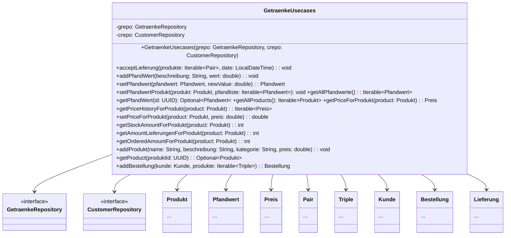
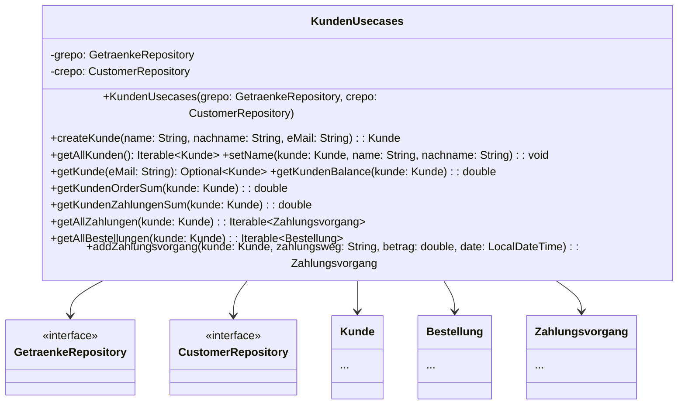
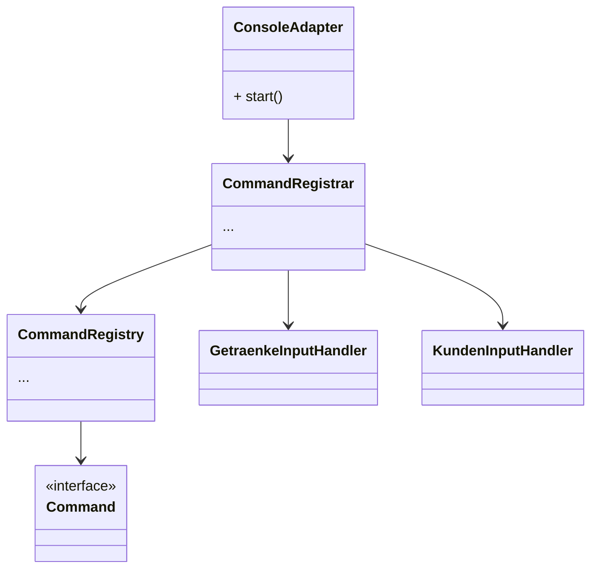
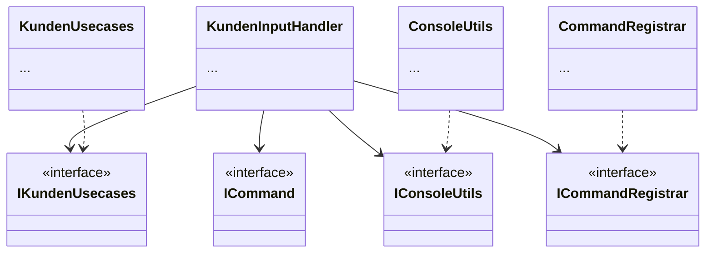
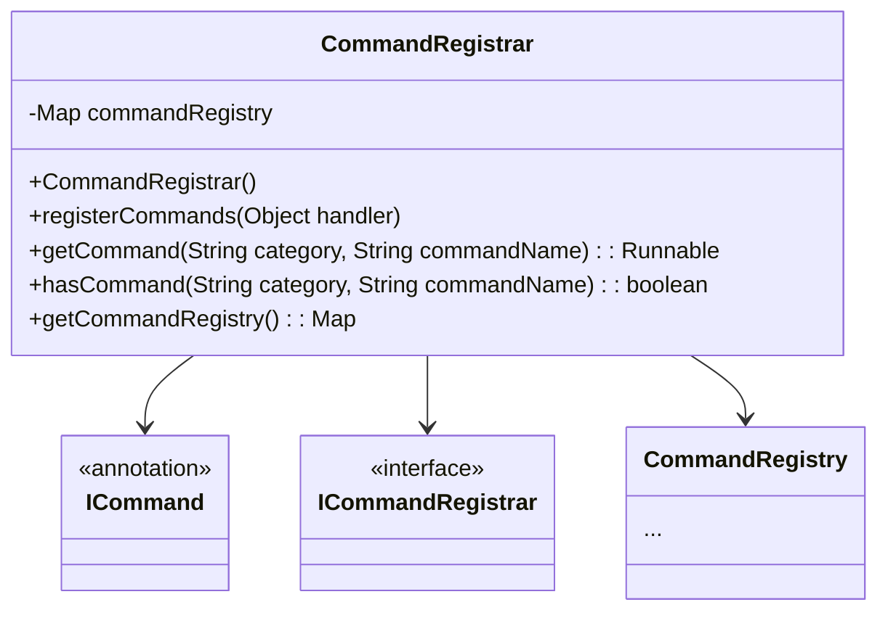
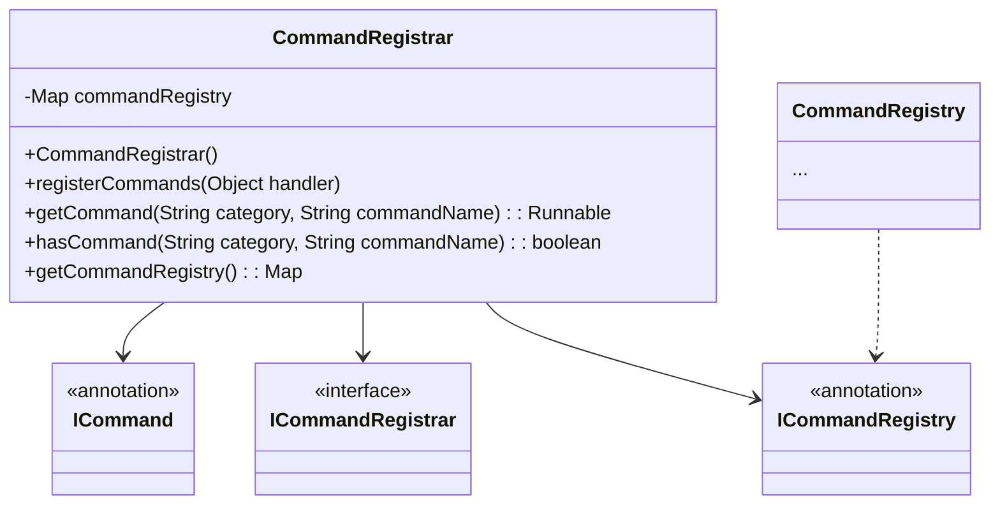
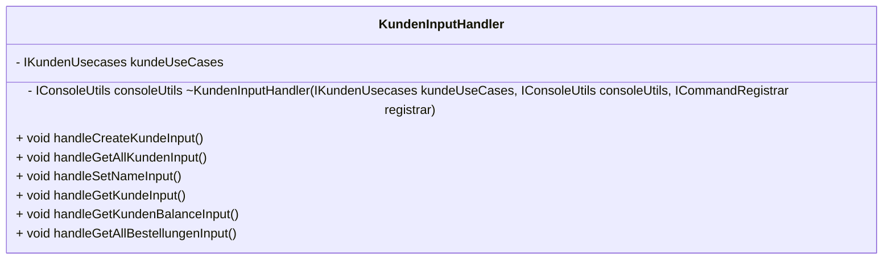
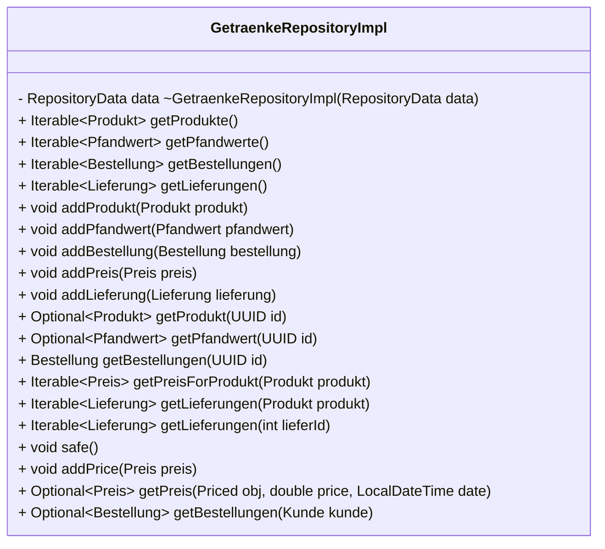

# Programmentwurf
# 1. Einführung

Die Applikation ASE_Getraenke (Adavanced Software Engeniering) ist eine Command Line Interface (CLI), welches zu Unterstützung und Verwaltung der Gertränke des Wohnheims genutzt werden kann. Die Domäin ist, deswegen auch an die Prozesse des Wohnheimes angepasst und funktioniert, deswegen in diesem am reibungslosesten.

**Funktionaliäten**

1. **Kunden:** Im Kontext der Applikation sind Kunden, Wohnheimbewohner. Diese können über die Konsole erstellt unf verwaltet werden.
2. **Bestandkontrolle:** Die Software verwaltet den aktuellen Bestand der vorhanden Getränke im Wohnheim.
3. **Produktverwaltung:** Es können über die Applikation Produkte verwaltet werden, dazu gehören **TYP** (Kasten oder Flasche), **PFAND** und der **PREIS**.
4. **Bestellungen:** Bestellungen können Kunden zugewiesen oder von Kunden ausgeführt werden um neue Produkte zu Bestellen oder Produkte aus dem Bestand aus dem "Lager" zu nehmen
5. **Ausgabenverteilung:** Die Ausgaben bzw. der Kontostand jedes Kunden wird über seine Bestellungen gespeichert und kann ausgelesehen werden. 

**Ziel der Applikation**
Die Software soll die Getränke Verwaltung des Wohnheims digitalisieren und es für die Benutzer einfacher und nachvollziehbarer machen wie Kosten zustande kommen oder wann neue Getränke bestellt werden müssen

## 1.1 Starten der Applikation

**Prerequirments**

- Java Development Kit (JDK) Version 17.0.9
- Apache Maven Version 3.9.9

**Anleitung zum Ausführen der Anwendung**

1. **Repository klonen**
```sh 
git clone https://github.com/Gamagu/ase_getraenke.git
cd asegetraenke
```

2. Projekt Installieren und bauen 
```sh
mvn clean install
``` 
Nachdem ```mvn clean install``` kann um den um den Build-Prozess zu verkürzen ```mvn compile```genutzt werden

 3. Starten der Anwendung 
```sh 
cd getraenkeadapter
mvn exec:java
```

4.  Nutzung der Applikation über die Konsole 
```console 
getraenke getstockamountforprodukt
getraenke getallpfandwerte
getraenke setpfandwert
getraenke getpriceforprodukt
getraenke setpriceforprodukt
getraenke addprodukt
getraenke getpfandwert
getraenke getallproducts
getraenke addpfandwert
getraenke acceptlieferung
getraenke setpfandwertprodukt
getraenke getpricehistoryforprodukt
getraenke getproduct
getraenke addbestellung
getraenke addzahlungsvorgang
kunde getallkunden
kunde setname
kunde getkunde
kunde createkunde
kunde getallbestellungen
kunde getkundenbalance
```
Der Nutzer kann nun die präsentierten Funktionen aufrufen und wird durch den Prozess geleitet.  


## 1.3 Ausführen der Tests
Die Tests werden über den Maven-Lifecycle automatischen bei dem Befehl ```mvn clean install```  mit ausgeführt.  Die Anwendung ermöglicht auch das konkrette Ausführen der Tests.
```sh 
cd asegetraenke
mvn test
```

Die Testergebnisse werden dann in der Konsole angezeigt.
![[Screenshot 2025-04-04 at 06.09.39.png]]

# 2. Clean Architecture

## 2.1 Was ist Clean Architecture
Clean Architecture ist ein Softwarearchitekturkonzept mit dem Ziel, Software so zu gestalten, dass sie leicht verständlich, testbar, und flexibel bei Änderungen ist. Clean Architecture zeichnet sich durch eine klare Trennung der Verantwortlichkeiten und Abhängigkeiten aus, wodurch die Kernlogik der Anwendung unabhängig von äußeren Einflüssen bleibt.

Clean Architecture setzt sich aus folgenden Grundprinzipien zusammen:
1. Unabhängigkeit der Geschäftslogik
   Die Geschäftslogik (Use Cases) sollte unabhängig von den äußeren Details sein, wie z.B. Datenbanken, Benutzeroberflächen oder externen Frameworks.
2. Trennung der Verantwortlichkeiten
   Jede Schicht in der Architektur hat eine spezifische und klar definierte Aufgabe, was die Wartbarkeit und die Erweiterbarkeit der Anwendung fördert.
3. Dependency Rule
   Innere Schichten dürfen nichts von äußeren Schichten wissen. Abhängigkeiten sollten immer von außen nach innen zeigen, wobei die Kernlogik der Anwendung (wie die Geschäftslogik) keinen Bezug zu den weniger zentralen Detailbereichen (wie UI oder Datenbank) haben sollte.

## 2.2 Analyse der Schichten 

Niklas deine Aufgabe 
## 2.3 Analyse der Dependency Rule
Das Projekt ist in der Struktur so aufgebaut, dass es nicht möglich ist gegen die Regel der Dependency Rule zu verstoßen. Im Folgenden werden, deswegen keine Negativ Beispiele gezeigt bei denen diese Regel missachtet wird. 

```shell
├── 0-getraenkeadapter
├── 1-getraenkeapplication
├── 2-getraenkedomain
├── README.md
└── pom.xml
```

### 2.3.1 Positiv Beispiel : `GetraenkeUsecases`


**Analyse:**
- **Abhängigkeiten:** Die Klasse `GetraenkeUsecases` hängt von mehren Entities der Domain Schicht ab und von den zwei Interfaces  `GetraenkeRepository`  und  `CustomerRepository` ab. 
- **Einhaltung Dependency Rule:** Die Klasse `GetraenkeUsecases` hat keine Dependencies nach außen. Sie befindet sich auf der Applikations-Schicht und hat nur Abhängigkeiten auf der Domain-Schicht. Somit verlaufen die Abhängigkeiten wie laut der Regel definiert ausschließlich von Innen nach Außen.
### 2.3.2 Positiv Beispiel : `KundenUsecases`

- **Abhängigkeiten:** Genauso wie die Klasse zuvor hat die Klasse `KundenUsecases` Abhängigkeiten zu Entities der Domain-Schicht  und zu den Interfaces `GetraenkeRepository` und `CustomerRepository`. 
- **Einhaltung der Dependency Rule:** Die Klasse `KundenUsecases` hat keine Dependencies nach außen. Sie befindet sich auf der Applikations-Schicht und hat nur Abhängigkeiten auf der Domain-Schicht. Genauso wie zuvor verlaufen die Abhängigkeiten ausschließlich von Innen nach Außen

# 3. SOLID 

## 3.1 Open/Closed Principle (OCP)

### 3.1.1 Positives Beispiel Console Adapter 


**Analyse:**
Der `ConsoleAdapter`can einfach um neue Befehle erweitert werden. Die Befehle können hinzugefügt werden indem neue Klassen erstellt werden und die Methoden mit der Annotation `@Command(value = "getstockamountforprodukt", category = "getraenke")` ausgestattet werde. Diese Speicher dann den Namen und die Kategorie für die spätere Ausgabe. Das hinzufügen der Methoden kann in der neu eigefügten Klasse erfolgen und benötigt keine Änderungen an der `ConsoleAdapter` Klasse.


### 3.1.2 Negatives Beispiel

Niklas deine Aufgabe 
## 3.2 Dependency Inversion Principle (DIP)

### 3.2.1 Positives Beispiel `KundenInputHandler`

**Analyse:**
Die Klasse `KundenInputHandler` befolgt das Dependency Inversion Principle, da sie auf keine implementierte Klassen direkt zugreift, sondern die Abstraction der Klasse als Interface benutzt. Dadurch ist sie nicht direkt von diesen Klassen abhängig und ermöglicht das austauschen von Implementierungen. 
### 3.1.2 Negatives Beispiel `CommandRegistrar`


**Analyse:**
`CommandRegistrar` befolgt nicht komplett das Dependency Inversion Principle, da es direkt die auf die implementierte Klasse `CommandRegistry`.  Die Änderung um den Aufbau zu bessern wäre ein Interface für die `CommandRegistry` Klassen zu benutzten.




## 3.3 Single Responsibility Principle (SRP)
### 3.3.1 Positives Beispiel `KundenInputHandler`



  **Aufgabenbereich:**
  Diese Klasse erfüllt das SRP Prinzip, da sie ausschließlich die kundenbezogenen Daten der Ausgabe verwalten. Aufgaben wie die Ausgabe, das Einlesen oder andere Teile der Entities zu verwalten sind nicht Teil der Klasse. Somit ist das ihre einzige Aufgabe und befolgt das Prinzip der SRP. 

### 3.3.2 Negatives Beispiel `GetraenkeRepositoryImpl`


**Analyse:**
Diese Klasse ist viel zu groß und kümmert sich um unterschiedlich Entities unsere Anwendung es wäre daher besser diese in die Einzelnen Aspekte aufzuteilen um SRP zu gewährleisten.

```mermaid 
	classDiagram 
		class GetraenkeRepositoryImpl { 
			- RepositoryData data ~GetraenkeRepositoryImpl(RepositoryData data) 
			+ Iterable~Produkt~ getProdukte() 
			+ void addProdukt(Produkt produkt) 
			+ Optional~Produkt~ getProdukt(UUID id) 
			+ void safe() 
		}
		
		class PfandwertRepositoryImpl {
			+ Optional~Pfandwert~ getPfandwert(UUID id) 
			+ void addPfandwert(Pfandwert pfandwert) 
			+ Iterable~Pfandwert~ getPfandwerte() 
		}

		class BestellungRepositoryImpl {
			+ Optional~Bestellung~ getBestellungen(Kunde kunde) 
			+ Bestellung getBestellungen(UUID id) 
			+ void addBestellung(Bestellung bestellung) 
			+ Iterable~Bestellung~ getBestellungen() 
		}

		class PriceRepositoryImpl {
			+ void addPrice(Preis preis) 
			+ Optional~Preis~ getPreis(Priced obj, double price, LocalDateTime date) 
			+ Iterable~Preis~ getPreisForProdukt(Produkt produkt)
			+ void addPreis(Preis preis) 
		}

		class LieferungRepositoryImpl {
			+ Iterable~Lieferung~ getLieferungen(Produkt produkt) 
			+ Iterable~Lieferung~ getLieferungen(int lieferId) 
			+ void addLieferung(Lieferung lieferung) 
			+ Iterable~Lieferung~ getLieferungen() 
		}
	

```


