# Programmentwurf
```table-of-contents
title: 
style: nestedList # TOC style (nestedList|nestedOrderedList|inlineFirstLevel)
minLevel: 0 # Include headings from the specified level
maxLevel: 0 # Include headings up to the specified level
includeLinks: true # Make headings clickable
hideWhenEmpty: false # Hide TOC if no headings are found
debugInConsole: false # Print debug info in Obsidian console
```
## 1. Einführung

Die Applikation ASE_Getraenke (Adavanced Software Engeniering) ist eine Command Line Interface (CLI), welches zu Unterstützung und Verwaltung der Gertränke des Wohnheims genutzt werden kann. Die Domäin ist, deswegen auch an die Prozesse des Wohnheimes angepasst und funktioniert, deswegen in diesem am reibungslosesten.

**Funktionaliäten**

1. **Kunden:** Im Kontext der Applikation sind Kunden, Wohnheimbewohner. Diese können über die Konsole erstellt unf verwaltet werden.
2. **Bestandkontrolle:** Die Software verwaltet den aktuellen Bestand der vorhanden Getränke im Wohnheim.
3. **Produktverwaltung:** Es können über die Applikation Produkte verwaltet werden, dazu gehören **TYP** (Kasten oder Flasche), **PFAND** und der **PREIS**.
4. **Bestellungen:** Bestellungen können Kunden zugewiesen oder von Kunden ausgeführt werden um neue Produkte zu Bestellen oder Produkte aus dem Bestand aus dem "Lager" zu nehmen
5. **Ausgabenverteilung:** Die Ausgaben bzw. der Kontostand jedes Kunden wird über seine Bestellungen gespeichert und kann ausgelesehen werden. 

**Ziel der Applikation**
Die Software soll die Getränke Verwaltung des Wohnheims digitalisieren und es für die Benutzer einfacher und nachvollziehbarer machen wie Kosten zustande kommen oder wann neue Getränke bestellt werden müssen

### 1.1 Starten der Applikation

**Prerequirments**

- Java Development Kit (JDK) Version 17.0.9
- Apache Maven Version 3.9.9

**Anleitung zum Ausführen der Anwendung**

1. **Repository klonen**
```sh 
git clone https://github.com/Gamagu/ase_getraenke.git
cd asegetraenke
```

2. Projekt Installieren und bauen 
```sh
mvn clean install
``` 
Nachdem ```mvn clean install``` kann um den um den Build-Prozess zu verkürzen ```mvn compile```genutzt werden

 3. Starten der Anwendung 
```sh 
cd getraenkeadapter
mvn exec:java
```

4.  Nutzung der Applikation über die Konsole 
```console 
getraenke getstockamountforprodukt
getraenke getallpfandwerte
getraenke setpfandwert
getraenke getpriceforprodukt
getraenke setpriceforprodukt
getraenke addprodukt
getraenke getpfandwert
getraenke getallproducts
getraenke addpfandwert
getraenke acceptlieferung
getraenke setpfandwertprodukt
getraenke getpricehistoryforprodukt
getraenke getproduct
getraenke addbestellung
getraenke addzahlungsvorgang
kunde getallkunden
kunde setname
kunde getkunde
kunde createkunde
kunde getallbestellungen
kunde getkundenbalance
```
Der Nutzer kann nun die präsentierten Funktionen aufrufen und wird durch den Prozess geleitet.  


### 1.3 Ausführen der Tests
Die Tests werden über den Maven-Lifecycle automatischen bei dem Befehl ```mvn clean install```  mit ausgeführt.  Die Anwendung ermöglicht auch das konkrette Ausführen der Tests.
```sh 
cd asegetraenke
mvn test
```

Die Testergebnisse werden dann in der Konsole angezeigt.
![[Screenshot 2025-04-04 at 06.09.39.png]]

## 2. Clean Architecture

### 2.1 Was ist Clean Architecture
Clean Architecture ist ein Softwarearchitekturkonzept mit dem Ziel, Software so zu gestalten, dass sie leicht verständlich, testbar, und flexibel bei Änderungen ist. Clean Architecture zeichnet sich durch eine klare Trennung der Verantwortlichkeiten und Abhängigkeiten aus, wodurch die Kernlogik der Anwendung unabhängig von äußeren Einflüssen bleibt.

Clean Architecture setzt sich aus folgenden Grundprinzipien zusammen:
1. Unabhängigkeit der Geschäftslogik
   Die Geschäftslogik (Use Cases) sollte unabhängig von den äußeren Details sein, wie z.B. Datenbanken, Benutzeroberflächen oder externen Frameworks.
2. Trennung der Verantwortlichkeiten
   Jede Schicht in der Architektur hat eine spezifische und klar definierte Aufgabe, was die Wartbarkeit und die Erweiterbarkeit der Anwendung fördert.
3. Dependency Rule
   Innere Schichten dürfen nichts von äußeren Schichten wissen. Abhängigkeiten sollten immer von außen nach innen zeigen, wobei die Kernlogik der Anwendung (wie die Geschäftslogik) keinen Bezug zu den weniger zentralen Detailbereichen (wie UI oder Datenbank) haben sollte.

### 2.2 Analyse der Schichten 

Niklas deine Aufgabe 
### 2.3 Analyse der Dependency Rule
Das Projekt ist in der Struktur so aufgebaut, dass es nicht möglich ist gegen die Regel der Dependency Rule zu verstoßen. Im Folgenden werden, deswegen keine Negativ Beispiele gezeigt bei denen diese Regel missachtet wird. 

```shell
├── 0-getraenkeadapter
├── 1-getraenkeapplication
├── 2-getraenkedomain
├── README.md
└── pom.xml
```

#### 2.3.1 Positiv Beispiel : `GetraenkeUsecases`
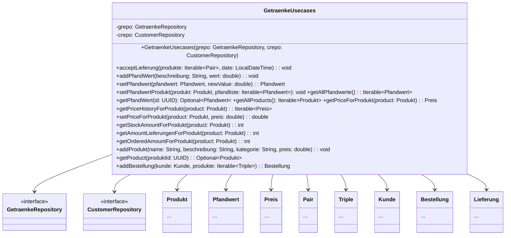

**Analyse:**
- **Abhängigkeiten:** Die Klasse `GetraenkeUsecases` hängt von mehren Entities der Domain Schicht ab und von den zwei Interfaces  `GetraenkeRepository`  und  `CustomerRepository` ab. 
- **Einhaltung Dependency Rule:** Die Klasse `GetraenkeUsecases` hat keine Dependencies nach außen. Sie befindet sich auf der Applikations-Schicht und hat nur Abhängigkeiten auf der Domain-Schicht. Somit verlaufen die Abhängigkeiten wie laut der Regel definiert ausschließlich von Innen nach Außen.
`Commit Stand: ec8012db4f8473d9cf1cad5178f139e92e3f416f`
#### 2.3.2 Positiv Beispiel : `KundenUsecases`
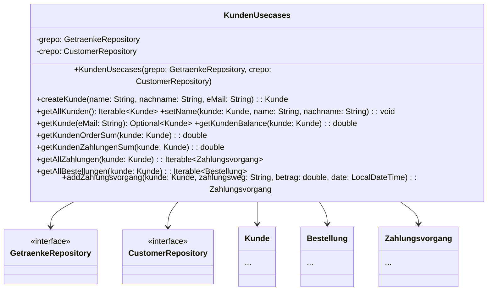
- **Abhängigkeiten:** Genauso wie die Klasse zuvor hat die Klasse `KundenUsecases` Abhängigkeiten zu Entities der Domain-Schicht  und zu den Interfaces `GetraenkeRepository` und `CustomerRepository`. 
- **Einhaltung der Dependency Rule:** Die Klasse `KundenUsecases` hat keine Dependencies nach außen. Sie befindet sich auf der Applikations-Schicht und hat nur Abhängigkeiten auf der Domain-Schicht. Genauso wie zuvor verlaufen die Abhängigkeiten ausschließlich von Innen nach Außen
`Commit Stand: ec8012db4f8473d9cf1cad5178f139e92e3f416f`

## 3. SOLID 

### 3.1 Open/Closed Principle (OCP)

#### 3.1.1 Positives Beispiel `ConsoleAdapter` 

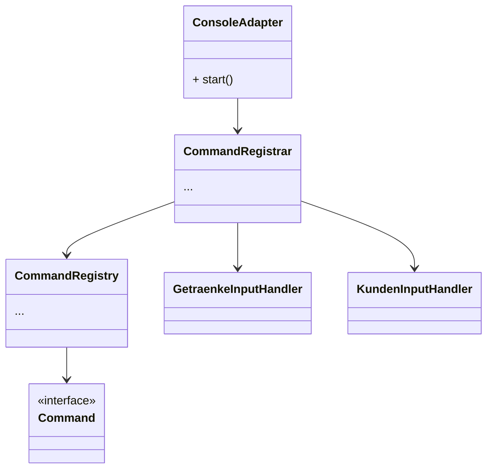
**Analyse:**
Der `ConsoleAdapter`can einfach um neue Befehle erweitert werden. Die Befehle können hinzugefügt werden indem neue Klassen erstellt werden und die Methoden mit der Annotation `@Command(value = "getstockamountforprodukt", category = "getraenke")` ausgestattet werde. Die Klasse selbst muss sich dann allerdings noch bei dem `CommandRegistrar` selbst übergeben. Dieser Speicher dann den Namen und die Kategorie für die spätere Ausgabe. Das hinzufügen der Methoden kann in der neu eigefügten Klasse erfolgen und benötigt keine Änderungen an der `ConsoleAdapter` Klasse.
`Commit Stand: ec8012db4f8473d9cf1cad5178f139e92e3f416f`
#### 3.1.2 Negatives Beispiel `ConsoleUtils`

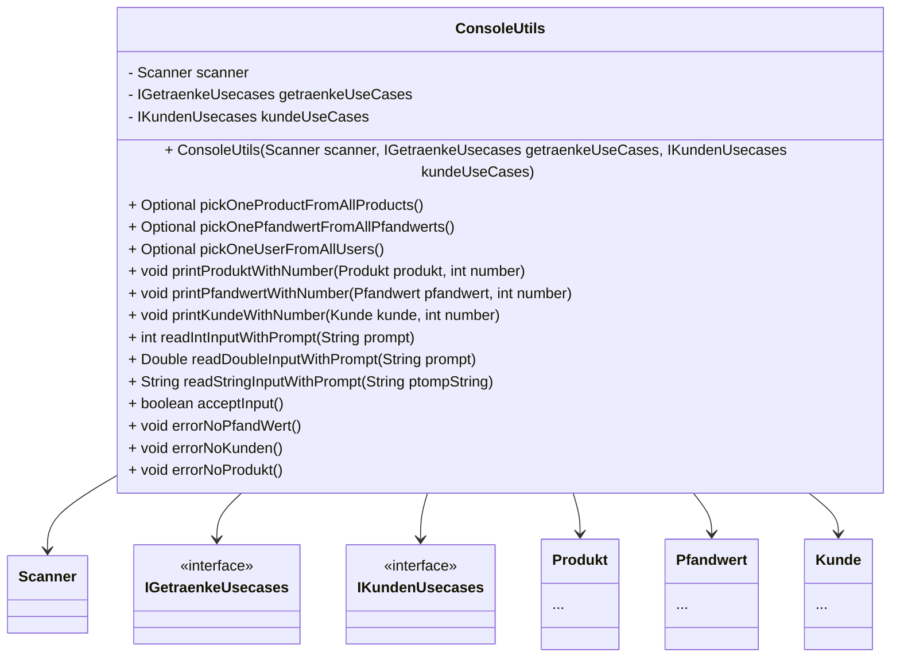
**Analyse:**
`ConsoleUtils` erlaubt keine Erweiterung ohne in der eigentliche Funktion Änderungen durchzuführen. Sie verstößt außerdem gegen mehrere Prinzipien, da sie darüber hinaus schlecht benannt ist und für mehre Aufgaben übernimmt dazu gehören. das Ein- und Auslesen, Bestätigungsabfragen und Auswahl von verschiedenen Entities. Diese Beziehen sich zwar alle auf die Reine Interaktionen des Benutzer mit der Console kann allerdings deutlich eleganter gelöst werden. 

**Lösungsvorschlag:**
Vorerst sollte erwähnt werden , dass die Funktion erstmal unterteilt werden sollte in Folgende Klassen. Zuerst sollte die Klasse unterteilt werden in:
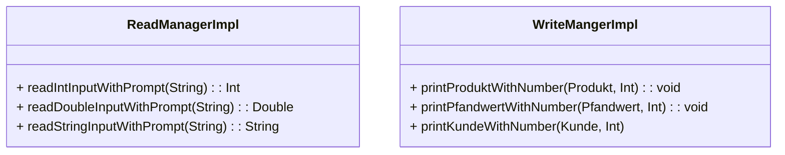
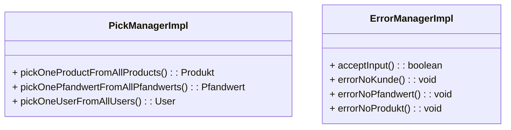

Wenn wir nun die Erweiterung der Elemente erlauben z.B. anhand von `ReadManagerImpl`. Durch des extenden der `ReadManagerImpl` würde dann ermöglicht werden neue Funktionalitäten hinzuzufügen.

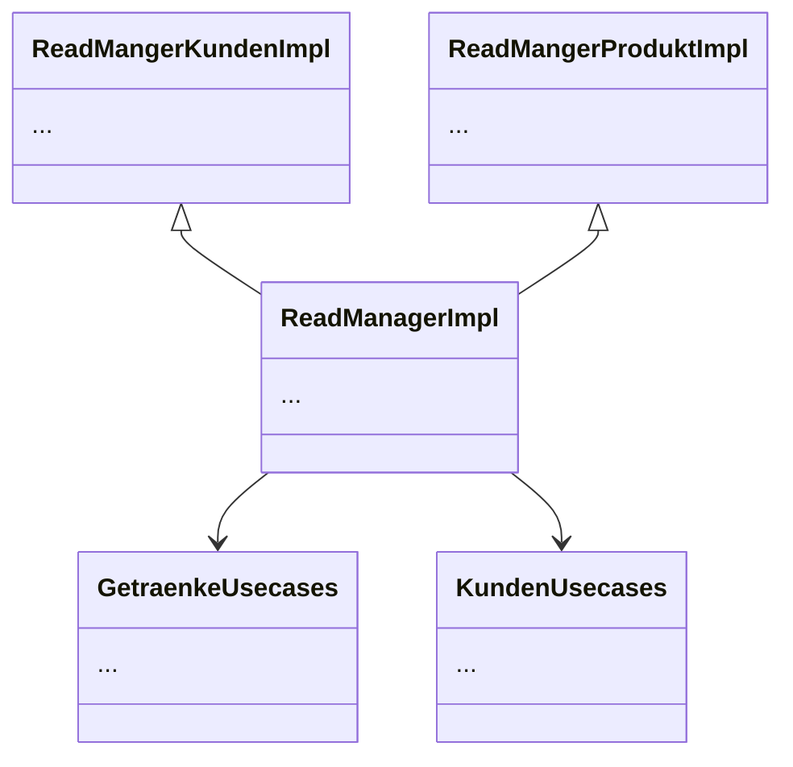
`Commit Stand: ec8012db4f8473d9cf1cad5178f139e92e3f416f`
### 3.2 Interface Segregation Principle (ISP)

#### 3.2.1 Positives Beispiel `KundenInputHandler`
Die Klasse `KundenInputHandler` ist ein gutes Beispiel für das Interface Segregation Principle (ISP). Sie hängt nur von den Interfaces `IKundenUsecases`, `IConsoleUtils` und `ICommandRegistrar` ab und nutzt jeweils nur die für sie relevanten Methoden. Dadurch ist sichergestellt, dass `KundenInputHandler` nicht gezwungen ist, Methoden zu implementieren oder zu kennen, die für ihn nicht notwendig sind. Jedes Interface ist also spezifisch und nicht überladen.
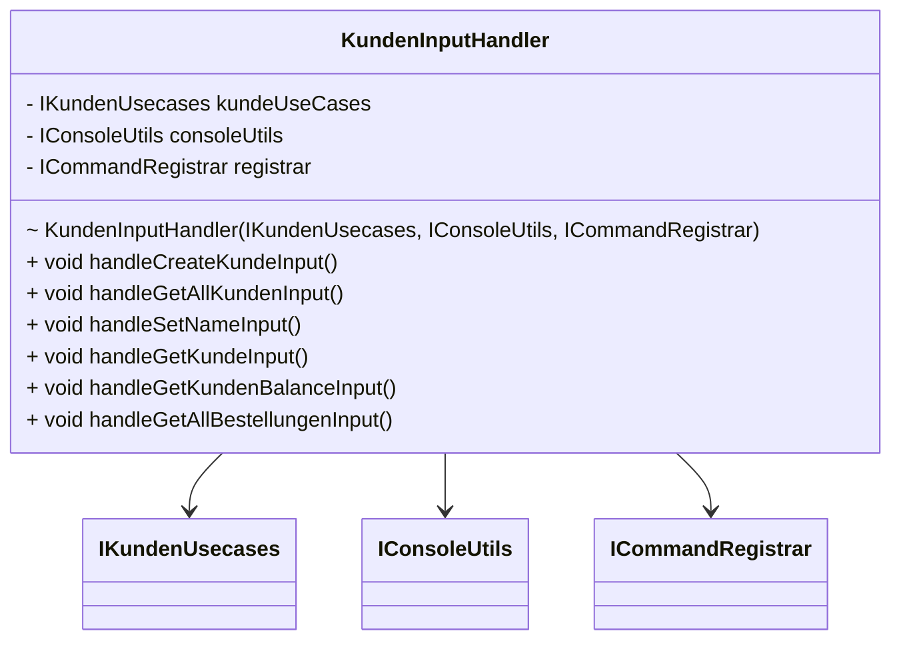

#### 3.1.2 Negatives Beispiel `CommandRegistrar`
Die Klasse `ConsoleUtils` verstößt gegen das Interface Segregation Principle, da sie Methoden für ganz unterschiedliche Aufgaben bündelt: Einlesen, Ausgabe, Auswahl und Fehlerbehandlung. Dadurch werden andere Klassen gezwungen, ein breites Interface zu kennen und ggf. zu verwenden, auch wenn sie nur Teilfunktionalität brauchen.
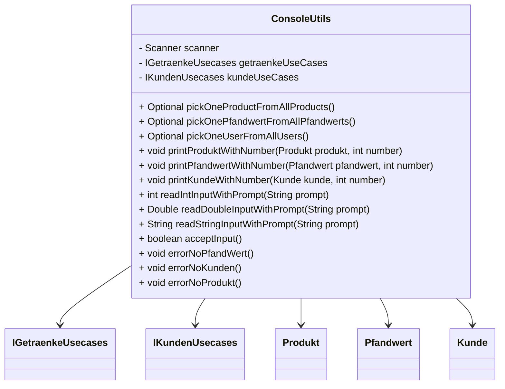
Die Klasse sollte in kleinere, spezialisierte Klassen bzw. Interfaces aufgeteilt werden:
- `ReadManager`: für das Einlesen von Daten
- `WriteManager`: für die formatierte Ausgabe
- `PickManager`: für Auswahlfunktionen
- `ErrorManager`: für Fehlermeldungen
So könnte z. B. `KundenInputHandler` nur `ReadManager` und `PickManager` verwenden, ohne mit unnötigen Methoden konfrontiert zu werden.

### 3.3 Single Responsibility Principle (SRP)
#### 3.3.1 Positives Beispiel `KundenInputHandler`

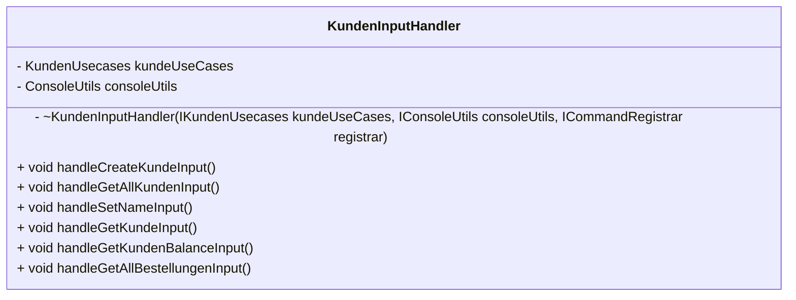

**Aufgabenbereich:**
Diese Klasse erfüllt das SRP Prinzip, da sie ausschließlich die kundenbezogenen Daten der Ein- und der Ausgabe verwalten. Aufgaben wie das tatsächliche Ausgeben, das Einlesen oder andere Teile der Entities zu verwalten sind nicht Teil der Klasse. Somit ist das ihre einzige Aufgabe und befolgt das Prinzip der SRP. 

`Commit Stand: ec8012db4f8473d9cf1cad5178f139e92e3f416f`
#### 3.3.2 Negatives Beispiel `GetraenkeRepositoryImpl`

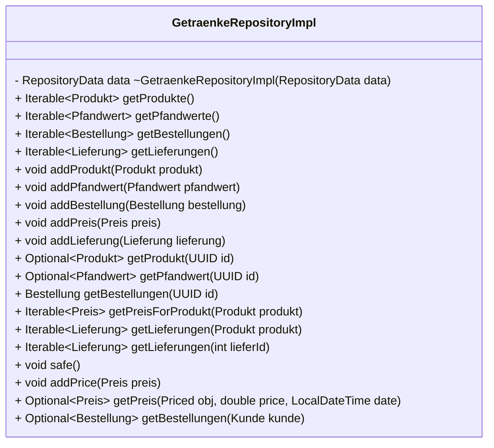
**Analyse:**
Diese Klasse `GetraenkeRepositoryImpl` kümmert sich um unterschiedliche Entities und verletzt deswegen . Außerdem könnte man diese dann nachdem Auflösen in die Einzelnen Entities, dann nach Auslesen und Einlesen unterteilen. 


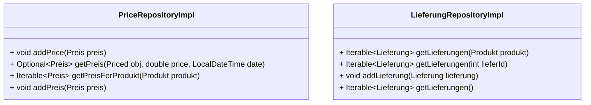


**Lösungsvorschlag:**
Indem wir die Klasse `GetraenkeRepositoryImpl` in kleiner Klassen aufteilen hier 
`GetraenkeRepositoryImpl`,  `PfandwertRepositoryImpl`, `BestellungRepositoryImpl`, `PriceRepositoryImpl` und `LieferungRepositoryImpl` aufteilen müssten die Klassen nur noch die Implementation machen die sie auch benötigen. Somit wäre SRP nicht weiter durch die Klasse verletzt
`Commit Stand: ec8012db4f8473d9cf1cad5178f139e92e3f416f`
## 4. Weiter Prinzipien

### GRASP: Kopplung

#### Positives Beispiel: `CustomerRepository`
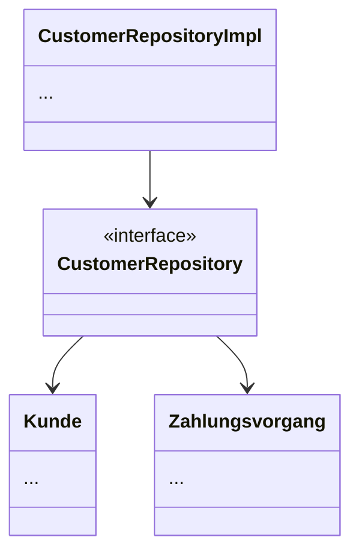
**Analyse:**

Diese Verbindung hat wenig Kopplung, da die Implementierung `CustomerRepositoryImpl` nicht direkt von einer Konkretten Implementierung abhängt sondern ein Interface implementiert `CustomerRepository`.  Die ermöglicht  mehre Möglichkeiten für die Implementierung des `CustomerRepository`.

`Commit Stand: ec8012db4f8473d9cf1cad5178f139e92e3f416f`
#### Negativ Beispiel `ConsoleUtils`
**ConsoleUtils** ist ein zentrales Beispiel für zu hohe Kopplung:  
Sie kennt und verwendet viele verschiedene Klassen und Interfaces, darunter:
- `Produkt`, `Pfandwert`, `Kunde` (Domain-Entities)
- `IGetraenkeUsecases`, `IKundenUsecases` (Use Cases)
- `Scanner` (technische Komponente)
Die Klasse ist daher mit zu vielen Komponenten des Systems stark gekoppelt. Das erschwert Testbarkeit, Wiederverwendbarkeit und Wartbarkeit.
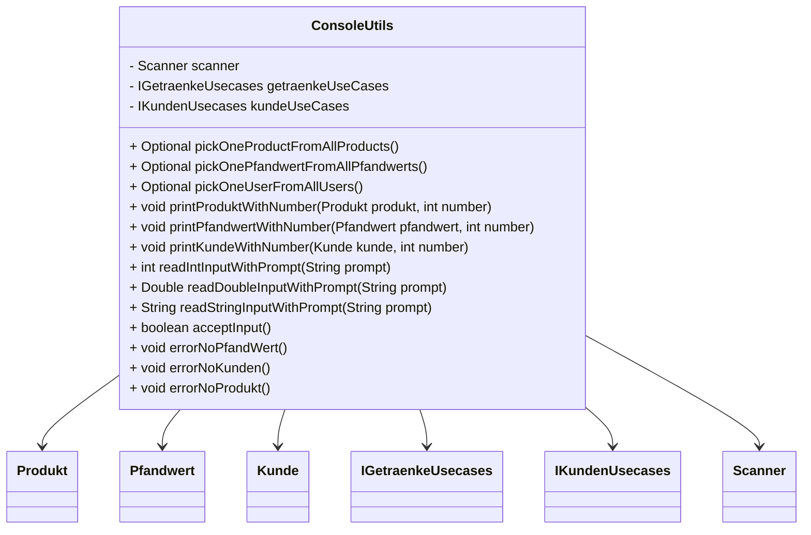
**Problematisch ist insbesondere:**
- Hohe Anzahl an direkten Abhängigkeiten.
- Enge Kopplung an konkrete Implementierungen.
- Direkte Verantwortung für viele verschiedene Aufgabenbereiche.
- Änderungen in Domain-Klassen (z. B. `Produkt`) können sich direkt auf `ConsoleUtils` auswirken.

**Lösungsvorschlag**
Die Kopplung kann durch die Aufspaltung in **spezialisierte Komponenten** deutlich reduziert werden:
- `PickManager` (für Auswahl)
- `ReadManager` (für Eingaben)
- `WriteManager` (für Ausgaben)
- `ErrorManager` (für Fehlerhandling)
Jede dieser Komponenten hängt dann nur noch von einem spezifischen Teil ab – und kann unabhängig weiterentwickelt oder getestet werden.
`Commit Stand: ec8012db4f8473d9cf1cad5178f139e92e3f416f`
### GRASP: High Cohesion

#### Positives Beispiel  `KundenInputHandler`
Die Klasse `KundenInputHandler` weist eine **hohe Kohäsion** auf, da sie sich ausschließlich um die Eingabe- und Ausgabe-Logik für Kundenfunktionen kümmert. Alle Methoden betreffen Interaktionen mit dem Nutzer im Kontext von Kundenoperationen – also z. B. Kunden erstellen, anzeigen oder deren Balance abrufen.
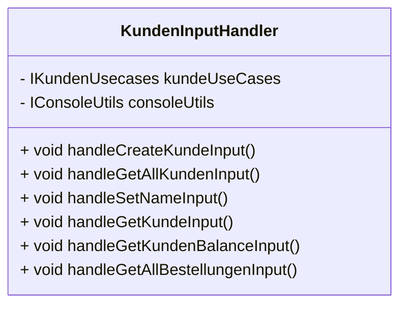
`Commit Stand: ec8012db4f8473d9cf1cad5178f139e92e3f416f`
#### Negatives Beispiel `GetraenkeRepositoryImpl`
Die Klasse `GetraenkeRepositoryImpl` ist ein klassisches Beispiel für **niedrige Kohäsion**. Sie verwaltet nicht nur eine einzelne Entität, sondern bündelt die Datenzugriffe für mehrere unterschiedliche Typen:
- `Produkt`
- `Pfandwert`
- `Bestellung`
- `Lieferung`
- `Preis`

Dadurch ist sie für sehr unterschiedliche Domänenobjekte zuständig – das macht sie schwer wartbar, weniger verständlich und problematisch bei Änderungen.
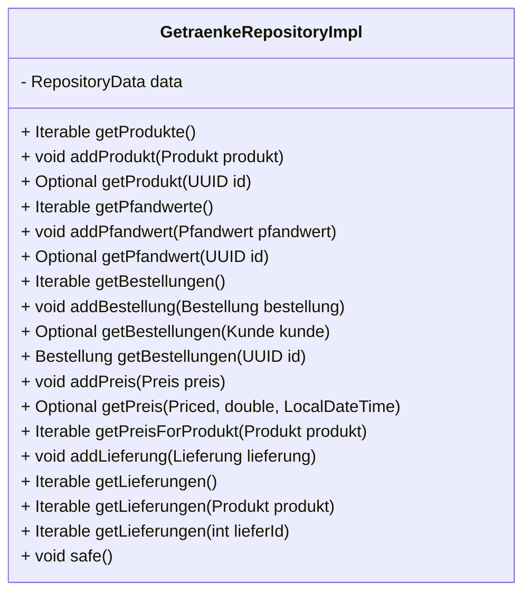
**Analyse**
Die Klasse enthält Methoden für 5 unterschiedliche Entitäten und verfügt über keinen klare fachliche Fokusierung, wie z.B. nur das erstellen neuer Objekte. Weswegen das Prinzip eine Klasse eine Aufgabe verletzt wird.

Durch die große Anzahl an Entitäten kommt es auch dazu das diese Klasse bei Änderungen der Entitäten auch überarbeitet werden muss. 

**Lösungsvorschlag**
Die Klasse sollte in spezialisierte Repositories aufgeteilt werden:
- `ProduktRepositoryImpl`
- `PfandwertRepositoryImpl`
- `BestellungRepositoryImpl`
- `PreisRepositoryImpl`
- `LieferungRepositoryImpl`

Jede dieser Klassen hätte eine **klare Verantwortlichkeit** und wäre leichter testbar und wartbar. 


### Dont Repeat Yourselfe (DRY)
