# Programmentwurf
## Inhaltsverzeichnis
- [1. Einführung](#1-einführung)
  - [1.1 Starten der Applikation](#11-starten-der-applikation)
  - [1.3 Ausführen der Tests](#13-ausführen-der-tests)
- [2. Clean Architecture](#2-clean-architecture)
  - [2.1 Was ist Clean Architecture](#21-was-ist-clean-architecture)
  - [2.2 Analyse der Schichten](#22-analyse-der-schichten)
    - [2.2.1 Domänenschicht](#221-domänenschicht)
    - [2.2.2 Anwendungsschicht](#222-anwendungsschicht)
    - [2.2.3 Adapterschicht](#223-adapterschicht)
  - [2.3 Analyse der Dependency Rule](#23-analyse-der-dependency-rule)
    - [2.3.1 Positiv Beispiel : `GetraenkeUsecases`](#231-positiv-beispiel--getraenkeusecases)
    - [2.3.2 Negativ Beispiel : `KundenUsecases`](#232-negativ-beispiel--kundenusecases)
- [3. SOLID](#3-solid)
  - [3.1 Open/Closed Principle (OCP)](#31-openclosed-principle-ocp)
    - [3.1.1 Positives Beispiel `ConsoleAdapter`](#311-positives-beispiel-consoleadapter)
    - [3.1.2 Negatives Beispiel `ConsoleError`](#312-negatives-beispiel-consoleerror)
  - [3.2 Interface Segregation Principle (ISP)](#32-interface-segregation-principle-isp)
    - [3.2.1 Positives Beispiel `KundenInputHandler`](#321-positives-beispiel-kundeninputhandler)
    - [3.1.2 Negatives Beispiel `GetraenkeUsecases`](#312-negatives-beispiel-getraenkeusecases)
  - [3.3 Single Responsibility Principle (SRP)](#33-single-responsibility-principle-srp)
    - [3.3.1 Positives Beispiel `Tripel`](#331-positives-beispiel-tripel)
    - [3.3.2 Negatives Beispiel `GetraenkeRepositoryImpl`](#332-negatives-beispiel-getraenkerepositoryimpl)
- [4. Weiter Prinzipien](#4-weiter-prinzipien)
  - [4.1 GRASP: Geringe Kopplung](#41-grasp-geringe-kopplung)
    - [4.1.1 Positives Beispiel: `Preis`](#411-positives-beispiel-preis)
    - [4.1.2 Negativ Beispiel `Product`](#412-negativ-beispiel-product)
  - [4.2 GRASP: High Cohesion](#42-grasp-high-cohesion)
  - [4.3 Dont Repeat Yourself (DRY)](#43-dont-repeat-yourself-dry)
- [5. Design Pattern](#5-design-pattern)
  - [5.1 Builder Pattern](#51-builder-pattern)
  - [5.2 Strategy Pattern](#52-strategy-pattern)
- [6. Domain Driven Design (DDD)](#6-domain-driven-design-ddd)
  - [6.1 Entities](#61-entities)
  - [6.2 Valueobjects](#62-valueobjects)
  - [6.3 Aggregates](#63-aggregates)
  - [6.4 Repositories](#64-repositories)
- [7. Unit Tests](#7-unit-tests)
  - [7.1 Zehn Unit Tests - Tabelle](#71-zehn-unit-tests---tabelle)
  - [7.2 ATRIP](#72-atrip)
  - [7.3 Code Coverage](#73-code-coverage)
  - [7.4 Fakes und Mocks](#74-fakes-und-mocks)
    - [7.4.1 Mock-Objekt: `Repo`](#741-mock-objekt-repo)
    - [7.4.2 `KundenInputHandler`](#742-kundeninputhandler)
- [8. Refactoring](#8-refactoring)
  - [8.1 Code Smells](#81-code-smells)
    - [8.1.1 Large Class](#811-large-class)
    - [8.1.2 Duplicate Code](#812-duplicate-code)
  - [8.2 Refactorings](#82-refactorings)
    - [8.2.1 Replace Parameter with Builder](#821-replace-parameter-with-builder)
    - [8.2.2 Extract Method](#822-extract-method)

## 1. Einführung

Die Applikation ASE_Getraenke (Adavanced Software Engeniering) ist eine Command Line Interface (CLI), welches zu Unterstützung und Verwaltung der Gertränke des Wohnheims genutzt werden kann. Die Domäin ist, deswegen auch an die Prozesse des Wohnheimes angepasst und funktioniert, deswegen in diesem am reibungslosesten.

**Funktionaliäten**

1. **Kunden:** Im Kontext der Applikation sind Kunden, Wohnheimbewohner. Diese können über die Konsole erstellt unf verwaltet werden.
2. **Bestandkontrolle:** Die Software verwaltet den aktuellen Bestand der vorhanden Getränke im Wohnheim.
3. **Produktverwaltung:** Es können über die Applikation Produkte verwaltet werden, dazu gehören **TYP** (Kasten oder Flasche), **PFAND** und der **PREIS**.
4. **Bestellungen:** Bestellungen können Kunden zugewiesen oder von Kunden ausgeführt werden um neue Produkte zu Bestellen oder Produkte aus dem Bestand aus dem "Lager" zu nehmen
5. **Ausgabenverteilung:** Die Ausgaben bzw. der Kontostand jedes Kunden wird über seine Bestellungen gespeichert und kann ausgelesehen werden. 

**Ziel der Applikation**
Die Software soll die Getränke Verwaltung des Wohnheims digitalisieren und es für die Benutzer einfacher und nachvollziehbarer machen wie Kosten zustande kommen oder wann neue Getränke bestellt werden müssen

### 1.1 Starten der Applikation

**Prerequirments**

- Java Development Kit (JDK) Version 17.0.9
- Apache Maven Version 3.9.9

**Anleitung zum Ausführen der Anwendung**

1. **Repository klonen**
```sh 
git clone https://github.com/Gamagu/ase_getraenke.git
cd x-getraenke
```

2. Projekt Installieren und bauen 
```sh
mvn clean install
``` 
Nachdem ```mvn clean install``` kann um den um den Build-Prozess zu verkürzen ```mvn compile```genutzt werden

 3. Starten der Anwendung 
```sh 
cd 1-getraenke-adapters
mvn exec:java
```

4.  Nutzung der Applikation über die Konsole 
```console 
getraenke getstockamountforprodukt
getraenke getallpfandwerte
getraenke setpfandwert
getraenke getpriceforprodukt
getraenke setpriceforprodukt
getraenke addprodukt
getraenke getpfandwert
getraenke getallproducts
getraenke addpfandwert
getraenke acceptlieferung
getraenke setpfandwertprodukt
getraenke getpricehistoryforprodukt
getraenke getproduct
getraenke addbestellung
getraenke addzahlungsvorgang
kunde getallkunden
kunde setname
kunde getkunde
kunde createkunde
kunde getallbestellungen
kunde getkundenbalance
```
Der Nutzer kann nun die präsentierten Funktionen aufrufen und wird durch den Prozess geleitet.  


### 1.3 Ausführen der Tests
Die Tests werden über den Maven-Lifecycle automatischen bei dem Befehl ```mvn clean install```  mit ausgeführt.  Die Anwendung ermöglicht auch das konkrette Ausführen der Tests.
```sh 
cd x-getraenke
mvn test
```

Die Testergebnisse werden dann in der Konsole angezeigt.
![[Screenshot 2025-04-04 at 06.09.39.png]]

## 2. Clean Architecture

### 2.1 Was ist Clean Architecture
Clean Architecture ist ein Softwarearchitekturkonzept mit dem Ziel, Software so zu gestalten, dass sie leicht verständlich, testbar, und flexibel bei Änderungen ist. Clean Architecture zeichnet sich durch eine klare Trennung der Verantwortlichkeiten und Abhängigkeiten aus, wodurch die Kernlogik der Anwendung unabhängig von äußeren Einflüssen bleibt.

Clean Architecture setzt sich aus folgenden Grundprinzipien zusammen:
1. Unabhängigkeit der Geschäftslogik
   Die Geschäftslogik (Use Cases) sollte unabhängig von den äußeren Details sein, wie z.B. Datenbanken, Benutzeroberflächen oder externen Frameworks.
2. Trennung der Verantwortlichkeiten
   Jede Schicht in der Architektur hat eine spezifische und klar definierte Aufgabe, was die Wartbarkeit und die Erweiterbarkeit der Anwendung fördert.
3. Dependency Rule
   Innere Schichten dürfen nichts von äußeren Schichten wissen. Abhängigkeiten sollten immer von außen nach innen zeigen, wobei die Kernlogik der Anwendung (wie die Geschäftslogik) keinen Bezug zu den weniger zentralen Detailbereichen (wie UI oder Datenbank) haben sollte.

### 2.2 Analyse der Schichten 

Das Projekt basiert auf einer klaren Trennung in drei Schichten: die Adapterschicht, die Anwendungsschicht und die Domänenschicht. Diese Schichten folgen den Prinzipien der Clean Architecture und haben jeweils spezifische Aufgaben und Verantwortlichkeiten.
#### 2.2.1 Domänenschicht
Die Domänenschicht bildet die Grundlage der Anwendung, indem sie die Datenbasis und deren Beziehungen definiert. Sie wird ausschließlich für die Datenrepräsentation genutzt und enthält nur minimale Logik. Zu dieser Logik gehören beispielsweise die Generierung von IDs oder die Verknüpfung verschiedener Datentypen. Ein Beispiel hierfür ist die Verknüpfung eines Produkts mit seinem aktuellen Preis. Das Hauptziel dieser Schicht ist es, eine konsistente und zuverlässige Datenbasis sicherzustellen, die unabhängig von äußeren Einflüssen bleibt.

#### 2.2.2 Anwendungsschicht
Die Anwendungsschicht enthält die zentrale Geschäftslogik der Anwendung. Sie wird durch sogenannte Use Cases beschrieben, die die Schnittstelle zwischen der Domänenschicht und der Adapterschicht bilden. Diese Use Cases sind dafür verantwortlich, die Daten aus der Domänenschicht zu verarbeiten und an die Adapterschicht weiterzugeben. Um die Struktur der Anwendung übersichtlich zu halten, sind die Use Cases in zwei Hauptbereiche unterteilt: kundenbezogene und getränkebezogene Funktionalitäten. Diese Unterteilung ermöglicht eine klare Trennung der Verantwortlichkeiten, reduziert die Anzahl der Source-Files und sorgt dafür, dass die Dateien nicht unnötig groß werden.

#### 2.2.3 Adapterschicht
Die Adapterschicht dient als Verbindung zwischen der Geschäftslogik und den äußeren Systemen. Sie ermöglicht den Zugriff auf die Geschäftslogik und die Speicherung der Daten. Die Speicherung erfolgt über ein Repository, das ein Interface der Domänenschicht implementiert. Die Benutzerschnittstelle wird in diesem Projekt über das Terminal bereitgestellt. Dadurch können Benutzer direkt auf die in der Anwendungsschicht implementierten Use Cases zugreifen und die verschiedenen Funktionen der Anwendung nutzen.
### 2.3 Analyse der Dependency Rule
Das Projekt ist in der Struktur so aufgebaut, dass es nicht möglich ist gegen die Regel der Dependency Rule zu verstoßen. Im Folgenden werden, deswegen keine Negativ Beispiele gezeigt bei denen diese Regel missachtet wird. 

```shell
├── 0-getraenkeadapter
├── 1-getraenkeapplication
├── 2-getraenkedomain
├── README.md
└── pom.xml
```

#### 2.3.1 Positiv Beispiel : `GetraenkeUsecases`
Die Klasse `GetraenkeUsecases` ist ein gutes Beispiel für die korrekte Umsetzung der **Dependency Rule** aus der Clean Architecture. Sie gehört zur Anwendungsschicht und hängt ausschließlich von **weiter innen liegenden Schichten** – insbesondere von der Domäne (`Produkt`, `Preis`, `Pfandwert`) und den Repositories (`GetraenkeRepository`, `CustomerRepository`) ab.
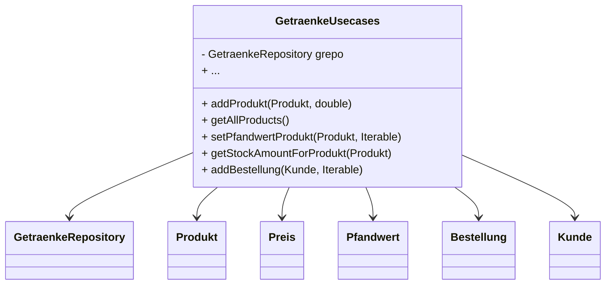
```mermaid
classDiagram
class GetraenkeUsecases {
    - GetraenkeRepository grepo

    + addProdukt(Produkt, double)
    + getAllProducts()
    + setPfandwertProdukt(Produkt, Iterable<Pfandwert>)
    + getStockAmountForProdukt(Produkt)
    + addBestellung(Kunde, Iterable<Triple>)
    + ...
}

class GetraenkeRepository
class Produkt
class Preis
class Pfandwert
class Bestellung
class Kunde

GetraenkeUsecases --> GetraenkeRepository
GetraenkeUsecases --> Produkt
GetraenkeUsecases --> Preis
GetraenkeUsecases --> Pfandwert
GetraenkeUsecases --> Bestellung
GetraenkeUsecases --> Kunde

```

**Analyse:**
- **Abhängigkeiten:** Die Klasse `GetraenkeUsecases` hängt von mehren Entities der Domain Schicht ab und von den zwei Interfaces  `GetraenkeRepository`  und  `CustomerRepository` ab. 
- **Einhaltung Dependency Rule:** Die Klasse kennt weder Adapter noch Framework-spezifische Details (wie Konsole, UI oder Datenbank). Alle Abhängigkeiten verlaufen **von außen nach innen**, was genau dem Ziel der Dependency Rule entspricht:
#### 2.3.2 Negativ Beispiel : `KundenUsecases`
Die Klasse `KundenInputHandler` verstößt nicht gegen die klassische **Dependency Rule** der Clean Architecture, da sie nur von inneren Schichten abhängt (z. B. `KundenUsecases`). Jedoch liegt ein anderes Architekturproblem vor: **starke Kopplung innerhalb der eigenen Schicht (Adapter/Konsole)**.
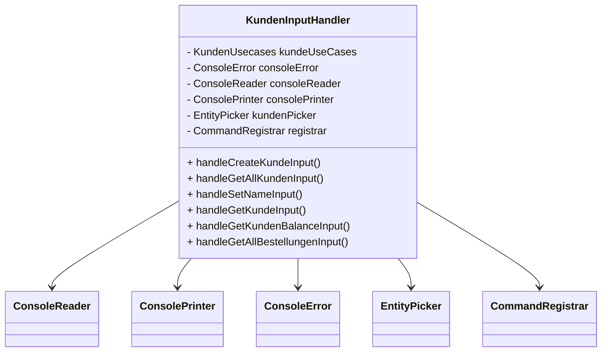
```mermaid
classDiagram
class KundenInputHandler {
    - KundenUsecases kundeUseCases
    - ConsoleError consoleError
    - ConsoleReader consoleReader
    - ConsolePrinter consolePrinter
    - EntityPicker<Kunde> kundenPicker
    - CommandRegistrar registrar

    + handleCreateKundeInput()
    + handleGetAllKundenInput()
    + handleSetNameInput()
    + handleGetKundeInput()
    + handleGetKundenBalanceInput()
    + handleGetAllBestellungenInput()
}

class ConsoleReader
class ConsolePrinter
class ConsoleError
class EntityPicker
class CommandRegistrar

KundenInputHandler --> ConsoleReader
KundenInputHandler --> ConsolePrinter
KundenInputHandler --> ConsoleError
KundenInputHandler --> EntityPicker
KundenInputHandler --> CommandRegistrar

```
**Problematisch ist hier** die enge Kopplung zu vielen konkreten Implementierungen innerhalb der Adapterschicht (z. B. Konsole). Änderungen an `ConsoleReader` oder `ConsolePrinter` können sich direkt auf `KundenInputHandler` auswirken. Auch alternative UI-Kanäle (z. B. Web-GUI, REST) lassen sich nur schwer integrieren, da die Logik an konkrete Konsolenklassen gebunden ist. 

Statt konkrete Klassen der Konsole direkt zu verwenden, sollte `KundenInputHandler` nur von abstrahierten Interfaces abhängen, die typischerweise in einem separaten _Port-Paket_ liegen. Die konkrete Konsole wäre dann eine Implementierung dieser Interfaces.
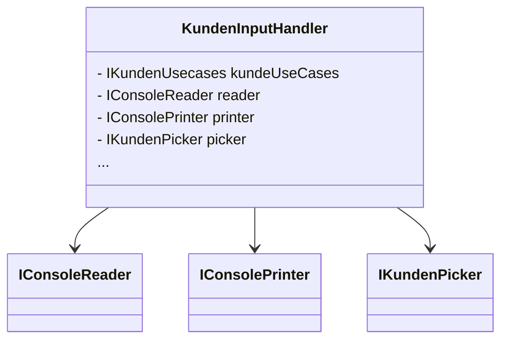
```mermaid
classDiagram
class KundenInputHandler {
    - IKundenUsecases kundeUseCases
    - IConsoleReader reader
    - IConsolePrinter printer
    - IKundenPicker picker

    ...
}

interface IConsoleReader
interface IConsolePrinter
interface IKundenPicker

KundenInputHandler --> IConsoleReader
KundenInputHandler --> IConsolePrinter
KundenInputHandler --> IKundenPicker
```

## 3. SOLID 

### 3.1 Open/Closed Principle (OCP)

#### 3.1.1 Positives Beispiel `ConsoleAdapter` 

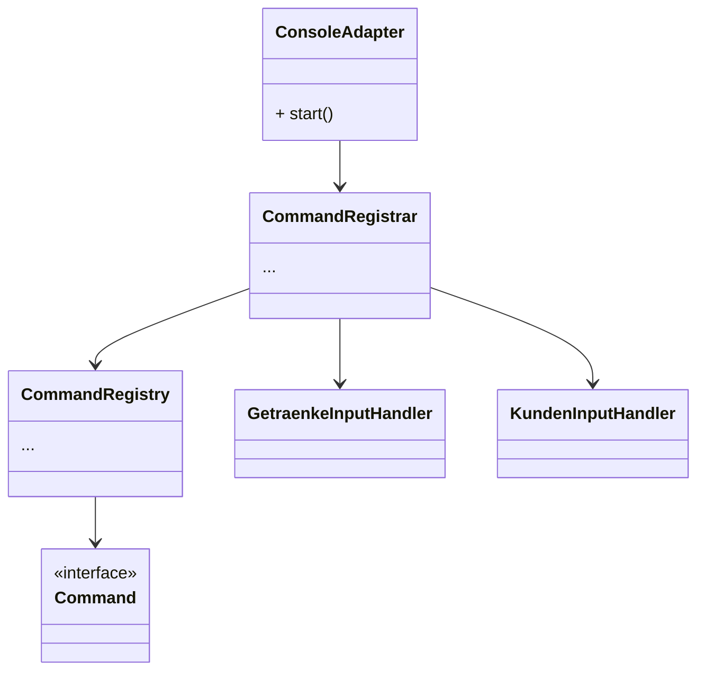
```mermaid
classDiagram
    class ConsoleAdapter {
	+ start()
	}

class Command { <<interface>> } 
class CommandRegistrar { ... }
class CommandRegistry { ... }


CommandRegistry --> Command 
CommandRegistrar --> CommandRegistry 
ConsoleAdapter --> CommandRegistrar
CommandRegistrar --> GetraenkeInputHandler
CommandRegistrar --> KundenInputHandler
```
**Analyse:**
Der `ConsoleAdapter`can einfach um neue Befehle erweitert werden. Die Befehle können hinzugefügt werden indem neue Klassen erstellt werden und die Methoden mit der Annotation `@Command(value = "getstockamountforprodukt", category = "getraenke")` ausgestattet werde. Die Klasse selbst muss sich dann allerdings noch bei dem `CommandRegistrar` selbst übergeben. Dieser Speicher dann den Namen und die Kategorie für die spätere Ausgabe. Das hinzufügen der Methoden kann in der neu eigefügten Klasse erfolgen und benötigt keine Änderungen an der `ConsoleAdapter` Klasse.
#### 3.1.2 Negatives Beispiel `ConsoleError`

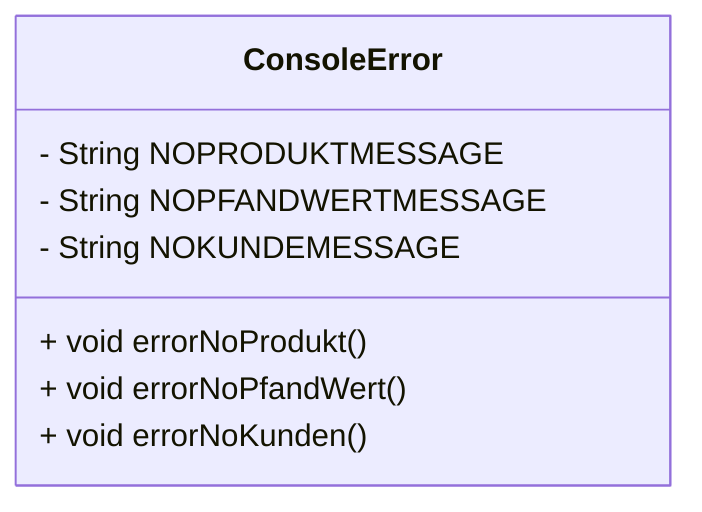
```mermaid
	classDiagram
class ConsoleError {
	- String NOPRODUKTMESSAGE
	- String NOPFANDWERTMESSAGE
	- String NOKUNDEMESSAGE

	+ void errorNoProdukt()
	+ void errorNoPfandWert()
	+ void errorNoKunden()
}

```
**Analyse:**
Die Klasse `ConsoleError` gibt feste Fehlermeldungen über einzelne Methoden aus. Mit jeder neuen Fehlerart muss die Klasse erweitert werden – etwa für Eingabefehler, leere Felder oder ungültige Formate. Dadurch wird sie bei wachsender Systemkomplexität immer umfangreicher und verletzt das Open/Closed Principle. Die Klasse ist nicht für Erweiterungen offen, sondern muss ständig verändert werden.


**Lösungsvorschlag:**
Statt alle Fehler zentral zu verwalten, sollte jede Fehlerart als eigene Klasse mit gemeinsamer Schnittstelle (`ErrorMessage`) umgesetzt werden. Ein `ErrorDispatcher` ruft dann polymorph `printError()` auf. Neue Fehler werden durch neue Klassen ergänzt – ohne Änderungen am bestehenden Code.
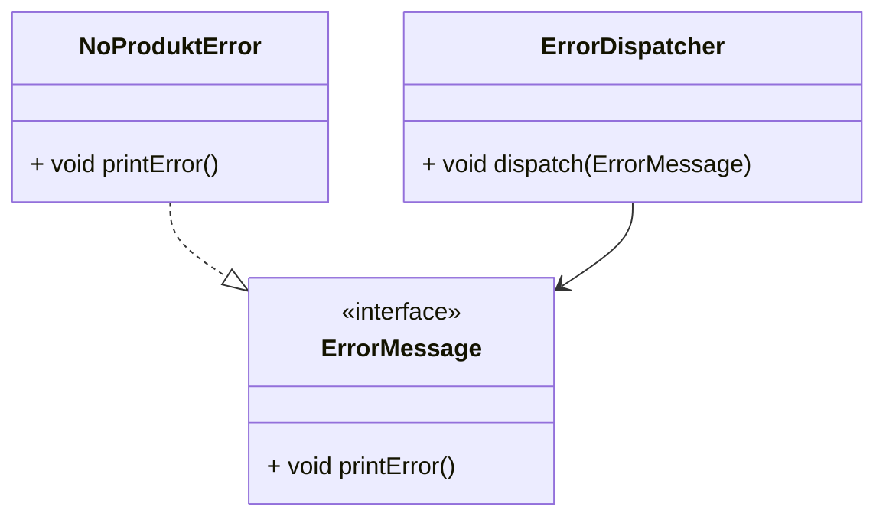
```mermaid
	classDiagram
		class ErrorMessage { <<interface>>
			+ void printError()
		}
		
		class NoProduktError {
			+ void printError()
		}
		
		class ErrorDispatcher {
			+ void dispatch(ErrorMessage)
		}
		
		NoProduktError ..|> ErrorMessage
		ErrorDispatcher --> ErrorMessage

```
So bleibt das System offen für neue Fehlerarten und erfüllt das Open/Closed Principle.

### 3.2 Interface Segregation Principle (ISP)

#### 3.2.1 Positives Beispiel `KundenInputHandler`
Die Klasse `KundenInputHandler` folgt dem Interface Segregation Principle (ISP) in ihrer Architekturidee. Sie arbeitet konzeptionell mit voneinander getrennten Schnittstellen: `IKundenUsecases` zur Geschäftslogik, `ICommand` für die Befehlsregistrierung und (im erweiterten Design) mit konsolenspezifischen Interfaces wie `IConsoleReader`, `IConsolePrinter` oder `IEntityPicker`. Damit ist sichergestellt, dass jede Abhängigkeit **nur die jeweils benötigte Funktionalität bereitstellt** – ohne Clients mit unnötigen Methoden zu belasten.

Im aktuellen Code sind zwar noch konkrete Implementierungen (`ConsoleReader`, `ConsolePrinter` etc.) eingebunden, doch diese sind **strukturell bereits trennbar**, sodass eine Interface-basierte Auslagerung ohne Bruch möglich ist. So bleibt der Handler unabhängig, modular und testbar – ganz im Sinne des ISP.
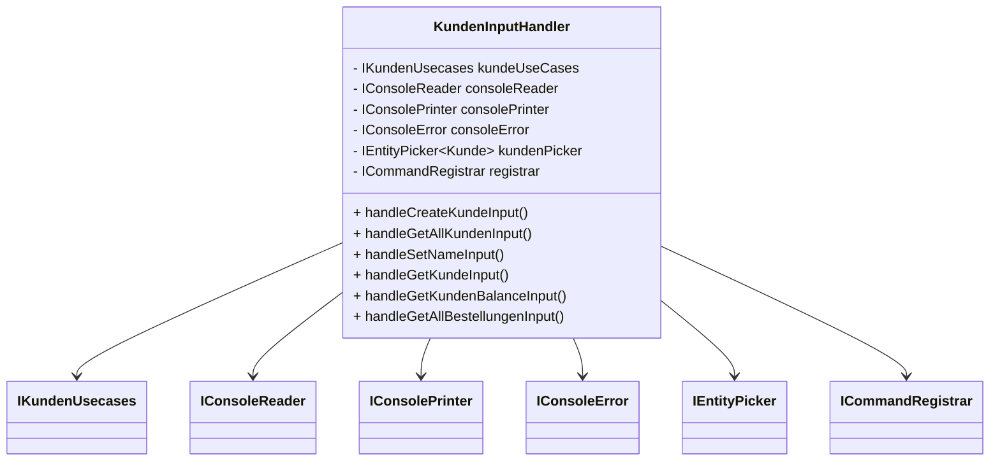
```mermaid
classDiagram
	class KundenInputHandler {
		- IKundenUsecases kundeUseCases
		- IConsoleReader consoleReader
		- IConsolePrinter consolePrinter
		- IConsoleError consoleError
		- IEntityPicker~Kunde~ kundenPicker
		- ICommandRegistrar registrar

		+ handleCreateKundeInput()
		+ handleGetAllKundenInput()
		+ handleSetNameInput()
		+ handleGetKundeInput()
		+ handleGetKundenBalanceInput()
		+ handleGetAllBestellungenInput()
	}

	interface IKundenUsecases
	interface IConsoleReader
	interface IConsolePrinter
	interface IConsoleError
	interface IEntityPicker
	interface ICommandRegistrar

	KundenInputHandler --> IKundenUsecases
	KundenInputHandler --> IConsoleReader
	KundenInputHandler --> IConsolePrinter
	KundenInputHandler --> IConsoleError
	KundenInputHandler --> IEntityPicker
	KundenInputHandler --> ICommandRegistrar

```
#### 3.1.2 Negatives Beispiel `GetraenkeUsecases`
Die Klasse `GetraenkeInputHandler` verstößt gegen das Interface Segregation Principle, da sie Methoden für völlig unterschiedliche Aufgabenbereiche enthält: Produktverwaltung, Preis- und Pfandlogik, Lagerabfragen, Bestellungen und sogar Zahlungen. Dadurch ist sie von mehreren großen Komponenten (`GetraenkeUsecases`, `KundenUsecases`) abhängig – selbst wenn einzelne Methoden nur auf eine dieser Domänen zugreifen. Andere Klassen oder Entwickler werden gezwungen, ein breites Interface zu kennen und mit Methoden zu interagieren, die für ihre jeweilige Aufgabe irrelevant sind.
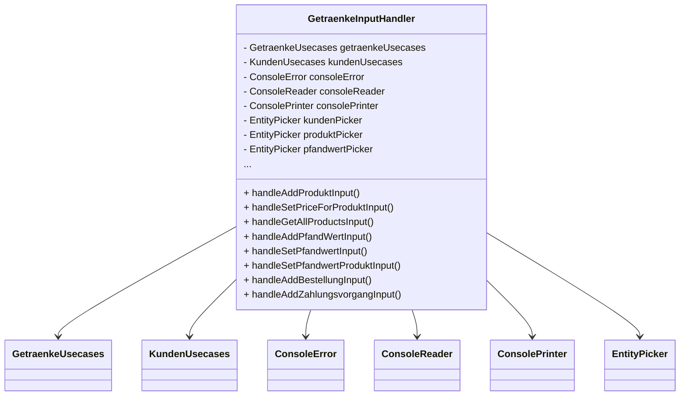
```mermaid
classDiagram
class GetraenkeInputHandler {
	- GetraenkeUsecases getraenkeUsecases
	- KundenUsecases kundenUsecases
	- ConsoleError consoleError
	- ConsoleReader consoleReader
	- ConsolePrinter consolePrinter
	- EntityPicker<Kunde> kundenPicker
	- EntityPicker<Produkt> produktPicker
	- EntityPicker<Pfandwert> pfandwertPicker

	+ handleAddProduktInput()
	+ handleSetPriceForProduktInput()
	+ handleGetAllProductsInput()
	+ handleAddPfandWertInput()
	+ handleSetPfandwertInput()
	+ handleSetPfandwertProduktInput()
	+ handleAddBestellungInput()
	+ handleAddZahlungsvorgangInput()
	...
}

class GetraenkeUsecases
class KundenUsecases
class ConsoleError
class ConsoleReader
class ConsolePrinter
class EntityPicker

GetraenkeInputHandler --> GetraenkeUsecases
GetraenkeInputHandler --> KundenUsecases
GetraenkeInputHandler --> ConsoleError
GetraenkeInputHandler --> ConsoleReader
GetraenkeInputHandler --> ConsolePrinter
GetraenkeInputHandler --> EntityPicker

```

Die Klasse sollte in kleinere, spezialisierte Handler aufgeteilt werden:
- `ProduktInputHandler`: für produktbezogene Operationen
- `PfandwertInputHandler`: für Pfandwertverwaltung
- `BestellungInputHandler`: für Bestellvorgänge
- `ZahlungInputHandler`: für Zahlungsverarbeitung

Neues UML-Diagramm am Beispiel zweier Klassen für die Übersicht:
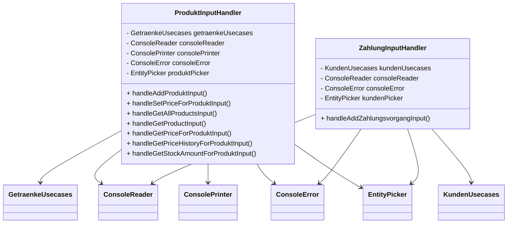
```mermaid
classDiagram
class ProduktInputHandler {
	- GetraenkeUsecases getraenkeUsecases
	- ConsoleReader consoleReader
	- ConsolePrinter consolePrinter
	- ConsoleError consoleError
	- EntityPicker<Produkt> produktPicker

	+ handleAddProduktInput()
	+ handleSetPriceForProduktInput()
	+ handleGetAllProductsInput()
	+ handleGetProductInput()
	+ handleGetPriceForProduktInput()
	+ handleGetPriceHistoryForProduktInput()
	+ handleGetStockAmountForProduktInput()
}

class ZahlungInputHandler {
	- KundenUsecases kundenUsecases
	- ConsoleReader consoleReader
	- ConsoleError consoleError
	- EntityPicker<Kunde> kundenPicker

	+ handleAddZahlungsvorgangInput()
}

class GetraenkeUsecases
class KundenUsecases
class ConsoleReader
class ConsolePrinter
class ConsoleError
class EntityPicker

ProduktInputHandler --> GetraenkeUsecases
ProduktInputHandler --> ConsoleReader
ProduktInputHandler --> ConsolePrinter
ProduktInputHandler --> ConsoleError
ProduktInputHandler --> EntityPicker

ZahlungInputHandler --> KundenUsecases
ZahlungInputHandler --> ConsoleReader
ZahlungInputHandler --> ConsoleError
ZahlungInputHandler --> EntityPicker

```
So könnte z. B. `ProduktInputHandler` ausschließlich mit `GetraenkeUsecases` arbeiten, ohne Methoden aus der Kundenverwaltung mitziehen zu müssen. Das reduziert die Kopplung, erhöht die Testbarkeit und entspricht dem Interface Segregation Principle.

### 3.3 Single Responsibility Principle (SRP)
#### 3.3.1 Positives Beispiel `Tripel`
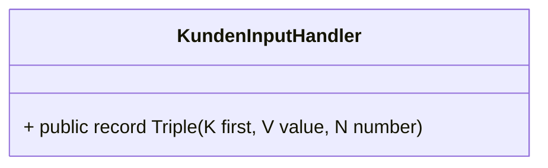
```mermaid
classDiagram
		class KundenInputHandler {
		+ public record Triple<K,V,N>(K first, V value, N number) 
		}
```

**Aufgabenbereich:**
Die Klasse `Triple<K,V,N>` erfüllt das **Single-Responsibility-Prinzip (SRP)**, da sie ausschließlich zur strukturierten Speicherung von drei miteinander verbundenen Werten dient. Sie verwaltet weder die Ein- noch die Ausgabe noch führt sie logische Operationen durch. Ihre einzige Verantwortung besteht darin, ein Tupel aus drei Werten unterschiedlicher Typen bereitzustellen. Dadurch ist ihre Aufgabe klar abgegrenzt und das SRP wird eingehalten.

#### 3.3.2 Negatives Beispiel `GetraenkeRepositoryImpl`
Die Klasse `GetraenkeRepositoryImpl` verstößt deutlich gegen das **Single Responsibility Principle (SRP)**, da sie Verantwortlichkeiten für verschiedene, unabhängige Domänenobjekte bündelt. Sie enthält Methoden zur Verwaltung von `Produkt`, `Pfandwert`, `Preis`, `Lieferung` und `Bestellung` – also fünf völlig unterschiedliche Entity-Typen.
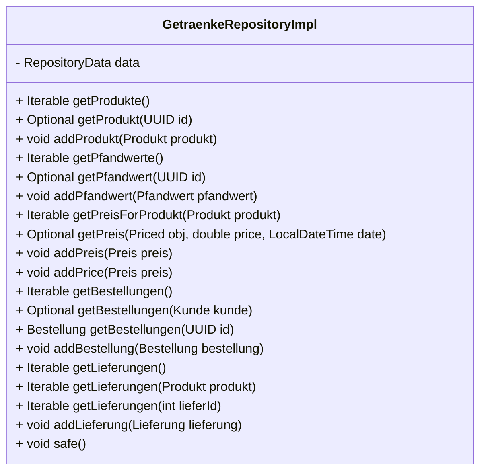
```mermaid 
classDiagram 
	class GetraenkeRepositoryImpl { 
		- RepositoryData data

		+ Iterable<Produkt> getProdukte() 
		+ Optional<Produkt> getProdukt(UUID id) 
		+ void addProdukt(Produkt produkt) 

		+ Iterable<Pfandwert> getPfandwerte() 
		+ Optional<Pfandwert> getPfandwert(UUID id) 
		+ void addPfandwert(Pfandwert pfandwert)

		+ Iterable<Preis> getPreisForProdukt(Produkt produkt)
		+ Optional<Preis> getPreis(Priced obj, double price, LocalDateTime date)
		+ void addPreis(Preis preis)
		+ void addPrice(Preis preis)

		+ Iterable<Bestellung> getBestellungen()
		+ Optional<Bestellung> getBestellungen(Kunde kunde)
		+ Bestellung getBestellungen(UUID id)
		+ void addBestellung(Bestellung bestellung)

		+ Iterable<Lieferung> getLieferungen()
		+ Iterable<Lieferung> getLieferungen(Produkt produkt)
		+ Iterable<Lieferung> getLieferungen(int lieferId)
		+ void addLieferung(Lieferung lieferung)

		+ void safe()
	}
 
```
**Analyse:**
Die Klasse `GetraenkeRepositoryImpl` ist in ihrer Funktion **nicht kohäsiv**, da sie verschiedenste Speicher- und Zugriffslogik für viele unterschiedliche Aggregate enthält. Änderungen an einer einzigen dieser Domänen – z. B. `Pfandwert` – können **unerwartete Seiteneffekte** auf völlig andere Bereiche wie `Bestellung` oder `Lieferung` haben. Dies erschwert **Wartung, Testbarkeit und Erweiterung** erheblich.

**Lösungsvorschlag:**
Um dem SRP gerecht zu werden, sollte die Klasse in mehrere spezialisierte Repository-Implementierungen aufgeteilt werden. Beispiel:
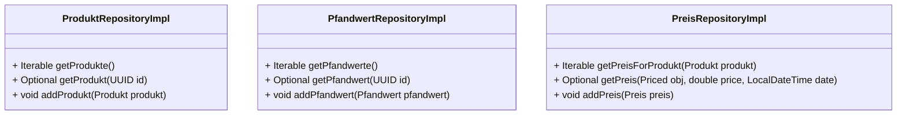
```mermaid
	classDiagram
		class ProduktRepositoryImpl {
		+ Iterable<Produkt> getProdukte()
		+ Optional<Produkt> getProdukt(UUID id)
		+ void addProdukt(Produkt produkt)
	}

	class PfandwertRepositoryImpl {
		+ Iterable<Pfandwert> getPfandwerte()
		+ Optional<Pfandwert> getPfandwert(UUID id)
		+ void addPfandwert(Pfandwert pfandwert)
	}

	class PreisRepositoryImpl {
		+ Iterable<Preis> getPreisForProdukt(Produkt produkt)
		+ Optional<Preis> getPreis(Priced obj, double price, LocalDateTime date)
		+ void addPreis(Preis preis)
	}
```
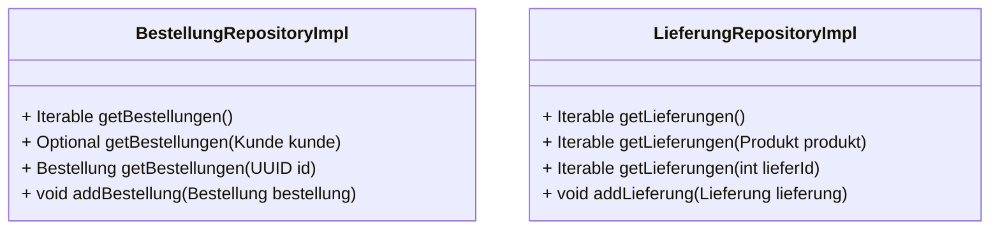
```mermaid
classDiagram

	class BestellungRepositoryImpl {
		+ Iterable<Bestellung> getBestellungen()
		+ Optional<Bestellung> getBestellungen(Kunde kunde)
		+ Bestellung getBestellungen(UUID id)
		+ void addBestellung(Bestellung bestellung)
	}

	class LieferungRepositoryImpl {
		+ Iterable<Lieferung> getLieferungen()
		+ Iterable<Lieferung> getLieferungen(Produkt produkt)
		+ Iterable<Lieferung> getLieferungen(int lieferId)
		+ void addLieferung(Lieferung lieferung)
	}

```
Durch diese Aufteilung ist jede Klasse für genau eine Entität zuständig. Änderungen an einer Domäne wirken sich nicht mehr auf andere aus, was **Wartung und Erweiterung massiv vereinfacht**.
## 4. Weiter Prinzipien

### 4.1 GRASP: Geringe Kopplung

#### 4.1.1 Positives Beispiel: `Preis`
**Aufgabenbeschreibung**
Die Klasse `Preis` ist ein Value Object, das den Preis eines Produkts oder eines anderen "Priced"-Objekts beschreibt. Sie speichert den Preiswert, einen Zeitstempel sowie eine lose referenzierte Quelle (über ein Interface).
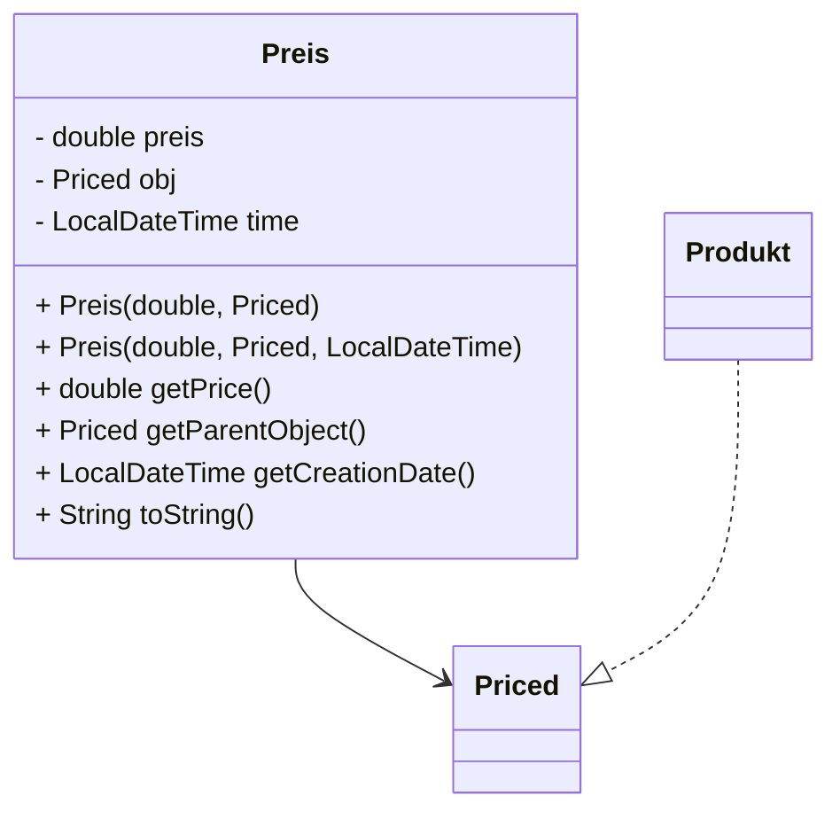
```mermaid
classDiagram
	class Preis {
		- double preis
		- Priced obj
		- LocalDateTime time

		+ Preis(double, Priced)
		+ Preis(double, Priced, LocalDateTime)
		+ double getPrice()
		+ Priced getParentObject()
		+ LocalDateTime getCreationDate()
		+ String toString()
	}

	interface Priced
	class Produkt

	Preis --> Priced
	Produkt ..|> Priced
```
**Analyse:**
`Preis` kennt kein konkretes Domänenobjekt, sondern arbeitet über das Interface `Priced`. Dadurch wird eine lose Kopplung sichergestellt. Es gibt keine Abhängigkeit zu `Produkt`, keine direkte Bindung an andere Module und keine Vermischung mit Persistenz- oder Anwendungslogik. Die Wiederverwendbarkeit der Klasse ist hoch, sie kann in beliebigen Kontexten eingesetzt werden, in denen Objekte einen Preis tragen sollen.

#### 4.1.2 Negativ Beispiel `Product`
**Produkt** hat eine zu hohe Kopplung:  
Die Klasse kennt und verwendet mehrere Komponenten aus unterschiedlichen Schichten, darunter:
- `Preis`, `Pfandwert` (Value Objects aus dem Domain Layer)
- `GetraenkeRepository` 
- `EntityWrapper` 
- `Preis.Priced`

Das führt zu einer Vermischung von Verantwortlichkeiten (SRP-Verstoß) und einer engen Verflechtung mit der Infrastruktur.
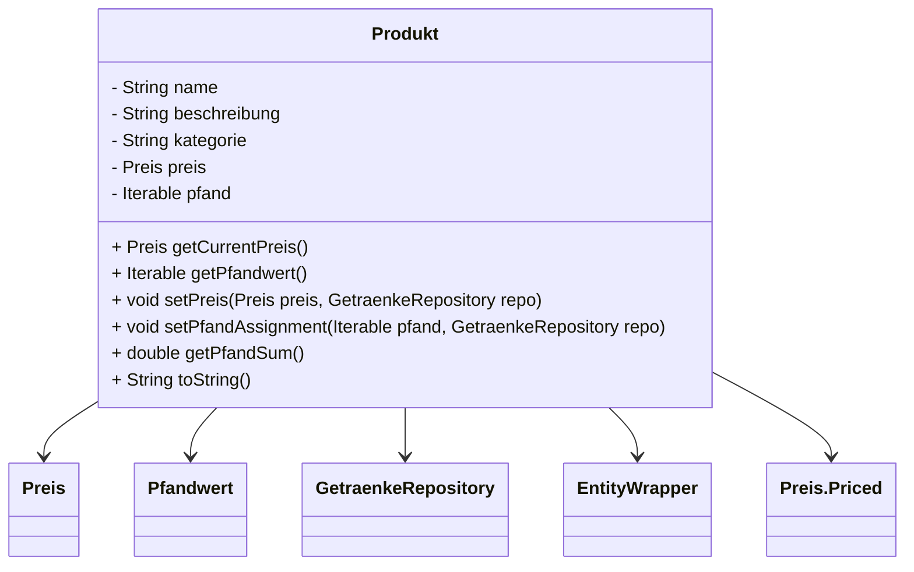
```mermaid
classDiagram
	class Produkt {
		- String name
		- String beschreibung
		- String kategorie
		- Preis preis
		- Iterable<Pfandwert> pfand

		+ Preis getCurrentPreis()
		+ Iterable<Pfandwert> getPfandwert()
		+ void setPreis(Preis preis, GetraenkeRepository repo)
		+ void setPfandAssignment(Iterable<Pfandwert> pfand, GetraenkeRepository repo)
		+ double getPfandSum()
		+ String toString()
	}

	class Preis
	class Pfandwert
	class GetraenkeRepository
	class EntityWrapper
	class Preis.Priced

	Produkt --> Preis
	Produkt --> Pfandwert
	Produkt --> GetraenkeRepository
	Produkt --> EntityWrapper
	Produkt --> Preis.Priced
```
**Analyse**
Die Klasse ist direkt mit dem Repository `GetraenkeRepository` gekoppelt, was bedeutet, dass jede Änderung in der Art, wie Persistenz gehandhabt wird, potenziell Anpassungen in der `Produkt`-Klasse erforderlich macht. Zudem vereint die Klasse zu viele Verantwortungen: Sie ist für die Datenhaltung, für Validierung und Zuweisung von Pfandwerten sowie für Preisverwaltung zuständig. Diese enge Kopplung führt dazu, dass die Klasse schwer zu testen ist und ihre Wiederverwendbarkeit stark eingeschränkt ist.

**Lösungsvorschlag**
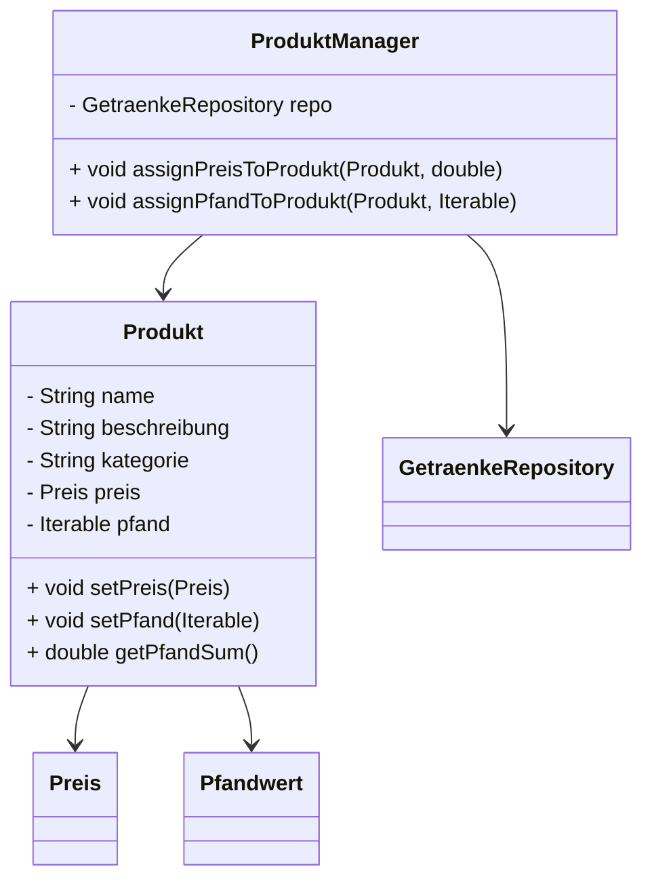
```mermaid
classDiagram
	class Produkt {
		- String name
		- String beschreibung
		- String kategorie
		- Preis preis
		- Iterable<Pfandwert> pfand

		+ void setPreis(Preis)
		+ void setPfand(Iterable<Pfandwert>)
		+ double getPfandSum()
	}

	class ProduktManager {
		- GetraenkeRepository repo

		+ void assignPreisToProdukt(Produkt, double)
		+ void assignPfandToProdukt(Produkt, Iterable<Pfandwert>)
	}

	class GetraenkeRepository
	class Preis
	class Pfandwert

	Produkt --> Preis
	Produkt --> Pfandwert
	ProduktManager --> GetraenkeRepository
	ProduktManager --> Produkt
```
Die Kopplung kann durch die Aufspaltung in spezialisierte Komponenten deutlich reduziert werden. Die Klasse `Produkt` sollte sich auf ihre Rolle als reines Domänenobjekt beschränken, das lediglich Daten hält. Die Logik zur Zuweisung und Validierung von Preisen und Pfandwerten wird aus der Klasse herausgelöst und in eine separate Komponente wie einen `ProduktManager` überführt. Diese Managerklasse ist für die Interaktion mit dem Repository verantwortlich, während `Produkt` unabhängig von Persistenz und Infrastruktur bleibt. Die so entstehende Entkopplung ermöglicht eine bessere Testbarkeit und leichtere Wartung.

### 4.2 GRASP: High Cohesion
**Aufgabenbeschreibung:**  
Die Klasse `Kunde` ist ein Beispiel für hohe Kohäsion im Sinne der GRASP-Prinzipien. Sie erfüllt ausschließlich Aufgaben, die sich direkt auf die Domäne „Kunde“ beziehen. In ihrem Aufbau kapselt sie Eigenschaften wie Vorname, Nachname und E-Mail-Adresse und stellt Methoden zur Verfügung, um auf diese Attribute zuzugreifen oder sie gezielt zu verändern. Darüber hinaus bietet sie mit `toString()` eine stringbasierte Darstellung des Kundenobjekts an. 
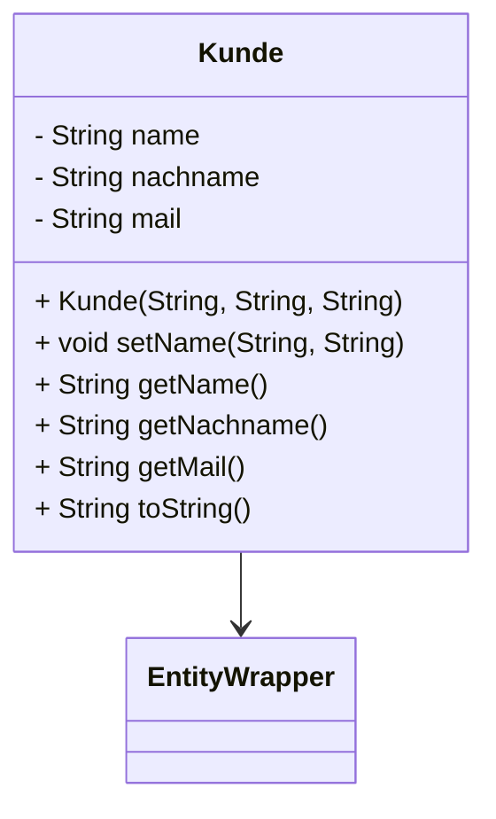
```mermaid 
classDiagram
	class Kunde {
		- String name
		- String nachname
		- String mail

		+ Kunde(String, String, String)
		+ void setName(String, String)
		+ String getName()
		+ String getNachname()
		+ String getMail()
		+ String toString()
	}

	class EntityWrapper

	Kunde --> EntityWrapper
```
**Begründung**
Die Kohäsion der Klasse `Kunde` ist hoch, da alle enthaltenen Elemente einem einzigen thematischen Zusammenhang zugeordnet werden können. Es existieren keine Abhängigkeiten zu Use Cases, Repositories oder Konsoleninteraktionen. Die Klasse ist übersichtlich, modular aufgebaut und erfüllt ausschließlich die Rolle eines Domänenobjekts. Änderungen, die das Datenmodell des Kunden betreffen (z. B. das Hinzufügen weiterer Attribute wie Telefonnummer oder Adresse), können an zentraler Stelle vorgenommen werden, ohne Seiteneffekte in anderen Systembereichen zu verursachen. Die Klasse ist dadurch einfach testbar und leicht verständlich.

### 4.3 Dont Repeat Yourself (DRY)
#### Begründung

Die ursprüngliche Implementierung der Klasse `ConsoleUtils` verstieß gegen das **DRY-Prinzip (Don't Repeat Yourself)**, da mehrfach identische oder stark ähnliche Logik zur Auswahl und Ausgabe von Entitäten implementiert wurde. Die folgenden Methoden zeigen dieses Muster deutlich:

```java

public Optional<Produkt> pickOneProductFromAllProducts() { ... } 
public Optional<Pfandwert> pickOnePfandwertFromAllPfandwerts() { ... } 
public Optional<Kunde> pickOneUserFromAllUsers() { ... }  

public void printProduktWithNumber(Produkt produkt, int number) { ... } 
public void printPfandwertWithNumber(Pfandwert pfandwert, int number) { ... } 
public void printKundeWithNumber(Kunde kunde, int number) { ... }`
```
`Commit Stand: ec8012db4f8473d9cf1cad5178f139e92e3f416f`

Diese Methoden unterscheiden sich fast ausschließlich im Typ der verwendeten Entität, folgen jedoch demselben strukturellen Ablauf (z. B. Listen-Auswahl oder nummerierte Ausgabe).

#### Refactoring zur Vermeidung von Redundanz

Zur Auflösung der Wiederholungen wurde die generische Hilfsklasse `EntityPicker<T>` eingeführt. Sie kapselt die wiederkehrende Logik zur Auswahl eines Elements aus einer Liste und ist auf verschiedene Typen anwendbar:

```java
public Optional<T> pickOneFromList(List<T> list, Function<T, String> labelFunction)`
```
`Commit Stand: 5f3b9ef74a6e7ebcc939c045b32dbf242c376569`


Die Methode verwendet einen `Function<T, String>`, um eine flexible Beschriftung für beliebige Objekte zu ermöglichen. Dadurch kann dieselbe Methode sowohl für Produkte, Pfandwerte als auch Kunden verwendet werden.

#### Vorteile dieses Refactoring
- **Weniger Redundanz**: Wiederverwendbare generische Logik ersetzt mehrfach implementierten Code.
- **Erhöhte Erweiterbarkeit**: Neue Entitätstypen können mit minimalem Mehraufwand eingebunden werden.
- **Geringere Kopplung**: Die Logik zur Benutzerauswahl ist entkoppelt von spezifischen Domänenklassen.
- **Bessere Testbarkeit**: Die Auswahl-Logik ist isoliert und kann unabhängig getestet werden.

#### Technische Metriken
Die Anzahl der Methoden in `ConsoleUtils` wurde signifikant reduziert. Die generische `EntityPicker`-Klasse wird mehrfach verwendet und erfüllt somit das DRY-Prinzip auf effektive Weise und ersetzt die drei vorherigen Funktionen. 

## 5. Design Pattern 
### 5.1 Builder Pattern 
Das Builder Pattern wird verwendet, um die Erstellung von `Kunde`-Objekten zu strukturieren. Gerade bei mehreren Parametern wie Name, Nachname und E-Mail wird dadurch die **Lesbarkeit erhöht** und die Fehleranfälligkeit durch falsche Parameterreihenfolgen reduziert.

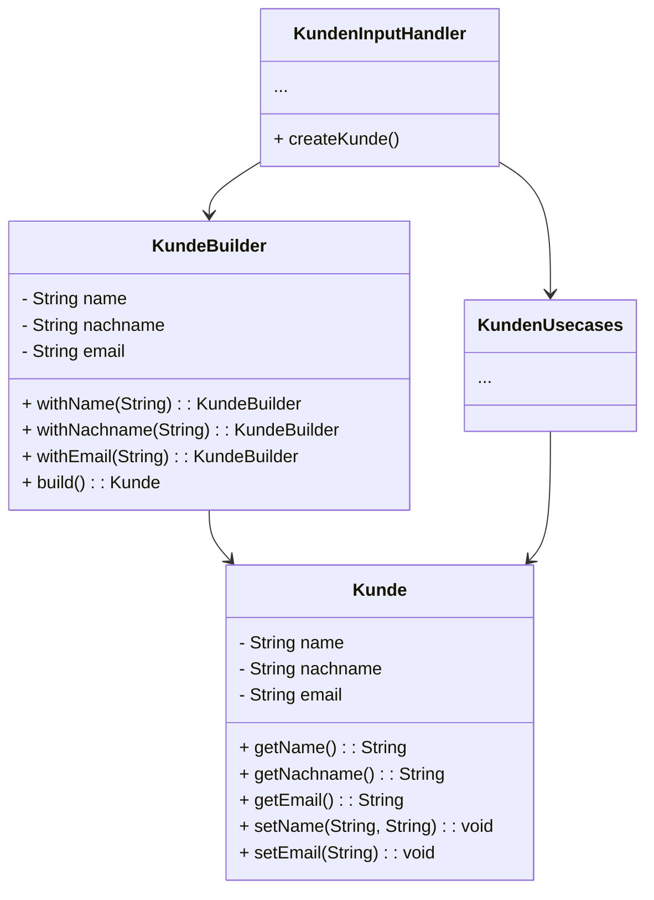
```mermaid
classDiagram

class Kunde {
    - String name
    - String nachname
    - String email
    + getName(): String
    + getNachname(): String
    + getEmail(): String
    + setName(String, String): void
    + setEmail(String): void
}

class KundeBuilder {
    - String name
    - String nachname
    - String email
    + withName(String): KundeBuilder
    + withNachname(String): KundeBuilder
    + withEmail(String): KundeBuilder
    + build(): Kunde
}

class KundenInputHandler{
	+ createKunde()
	...
}

class KundenUsecases {
	...
}

KundeBuilder --> Kunde 
KundenInputHandler --> KundeBuilder
KundenUsecases --> Kunde 
KundenInputHandler --> KundenUsecases

```


### 5.2 Strategy Pattern
Das Strategy Pattern wird im Projekt verwendet, um verschiedene Interaktionen mit Benutzereingaben flexibel zu gestalten. Beispielsweise nutzt `EntityPicker<T>` das Strategy-Prinzip, indem es die Anzeige und Auswahl von Objekten generisch hält und das Labeling über eine **konfigurierbare Strategie** (`Function<T, String>`) erlaubt.

So kann z. B. ein Produkt anders dargestellt werden als ein Kunde, **ohne dass der Auswahlmechanismus verändert werden muss**. 

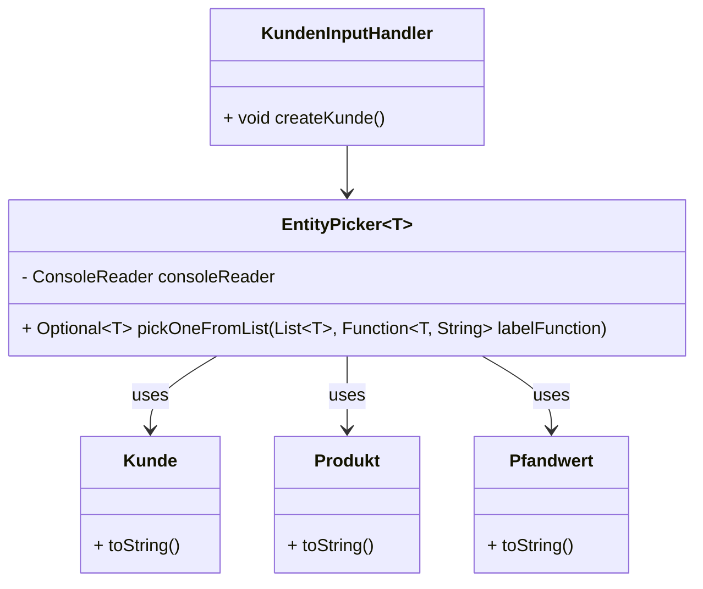
```mermaid
classDiagram
class EntityPicker~T~ {
    - ConsoleReader consoleReader
    + Optional~T~ pickOneFromList(List~T~, Function~T, String~ labelFunction)
}

class KundenInputHandler {
	+ void createKunde()
}

class Kunde {
	+ toString()
}

class Produkt {
	+ toString()
}

class Pfandwert {
	+ toString()
}

EntityPicker --> Kunde : uses
EntityPicker --> Produkt : uses
EntityPicker --> Pfandwert : uses
KundenInputHandler --> EntityPicker

```

## 6. Domain Driven Design (DDD)
Ab dem Start der Entwicklung der Projektes wurde die Domäne ins Zentrum der Entwicklung gestellt und das möglichst der reale Ablauf abgebildet wird.

### 6.1 Entities
Unserer Grund etwas als ein Entity abzubilden ist, wenn die Daten erhalten werden müssen und dabei kein Änderungsverlauf der Daten gefordert ist, bzw. wenn Änderungen eigentlich nicht vorgesehen sind. Am Beispiel eines Nutzers ist es nicht nötig die Änderungen seines Vornames zu tracken. Als beispiel für wenn ein Verlauf gefordert ist, ist ein Preis für ein Produkt. Im Vollgendem werden unsere eizelnen Entities beschriebn. Die Beschreibung umfasst das Gegenstück, welches aus der echten Welt abgebildet wird und welche Daten gespeichert werden,

- Kunden
    - Ein Kunde beschreibt eine natürliche Person, welche in dem Getränkesystem einkaufen kann.
    - Gepseichert werden Name, Vorname und die Email.
- Produkte
    - Produkte beschreiben alles was verkauft werden kann. Im normalfall sind das Getränke.
    - Dabei werden Name, Beschreibung, Kategorie gespeichert.
    - Zusätzlich dazu werden Verweise zu dem zugehörigem Pfand und dem zugehörigem derzeitigem Preis gespeichert.
- Bestellungen
    - Bestellungen beschreiben eben eine Bestellung welche von einem Kunden aufgegeben wird.
    - Diese ist identifizierbar durch eien Rechnungsnummer und einen Zeitstempel.
    - Es werden darin verweise auf den Kunden und die Bestellten Produkte verwiesen.
    - Die Bestellten Produkte werden mit der Anzahl dieser und dem abgerechnetem Preis gespeichert. (Siehe Bestellprodukt)
- Zahlungsvorgang
    - Ein Zahlungsvorgang beschreibt das Ausgleichen der Schulden, welche durch Rechnungen erzeugt werden.
    - Dabei wird für jede Zahlung der Zahlungsweg, Betrag und der Zeitpunkt gespeichert.
    - Zusätzlich wird ein verweis auf den Kunden gespeichert.
- Lieferungen
    - Lieferungen ermöglichen es alle Produkte welche vom Getränktesystem gekauft werden zu erfassen und dadurch den Lagerbestandzu errechnen.
    - Dafür wird für jedes Produkt die Menge gespeichert, welche gekauft wird pro Lieferung.

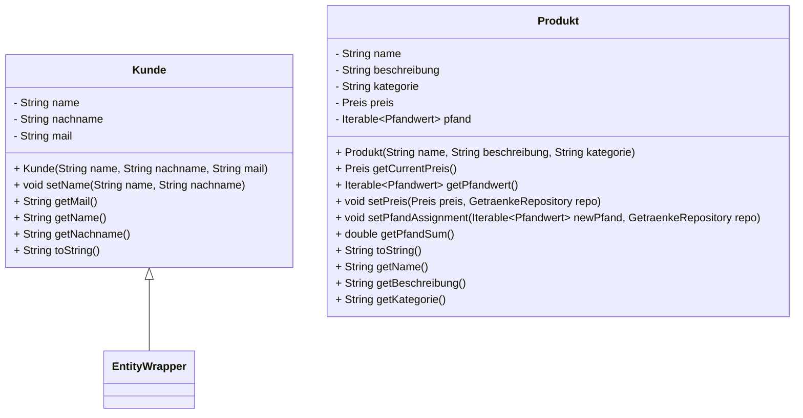
```mermaid
classDiagram
    class Kunde {
        - String name
        - String nachname
        - String mail
        + Kunde(String name, String nachname, String mail)
        + void setName(String name, String nachname)
        + String getMail()
        + String getName()
        + String getNachname()
        + String toString()
    }
    Kunde <|-- EntityWrapper

    class Produkt {
        - String name
        - String beschreibung
        - String kategorie
        - Preis preis
        - Iterable~Pfandwert~ pfand
        + Produkt(String name, String beschreibung, String kategorie)
        + Preis getCurrentPreis()
        + Iterable~Pfandwert~ getPfandwert()
        + void setPreis(Preis preis, GetraenkeRepository repo)
        + void setPfandAssignment(Iterable~Pfandwert~ newPfand, GetraenkeRepository repo)
        + double getPfandSum()
        + String toString()
        + String getName()
        + String getBeschreibung()
        + String getKategorie()
    }

```

```mermaid
	classDiagram
	    class Bestellung {
        - static AtomicInteger counter
        - Kunde kunde
        - LocalDateTime timestamp
        - Iterable~BestellungProdukt~ produkte
        - int number
        + Bestellung(Kunde kunde, LocalDateTime timestamp, Iterable~BestellungProdukt~ produkte)
        + Stream~BestellungProdukt~ getProdukte()
        + Kunde getKunde()
        + int getNumber()
        + double getSumOfOrder()
    }
    class Zahlungsvorgang {
        - Kunde kunde
        - String zahlungsweg
        - double betrag
        - LocalDateTime date
        + Zahlungsvorgang(Kunde kunde, String zahlungsweg, double betrag, LocalDateTime datetime)
        + Kunde getKunde()
        + String getZahlungsWeg()
        + double getBetrag()
        + LocalDateTime getDate()
    }
    class Lieferung {
	- Produkt produkt
	- int menge
	- LocalDateTime timestamp
	+ Lieferung(Produkt produkt, int menge, LocalDateTime timestamp)
	+ Produkt getProdukt()
	+ int getMenge()
	+ LocalDateTime getTimestamp()
    }
```

### 6.2 Valueobjects

Valueobjects haben bei uns oft den Zweck um einen Verlauf darzustellen. Diese sind möglichst kein um keine Daten redundant bei vielen Änderungen zu speichern.

- Preis
    - Ein Preis ist immer mit einem Objekt verbunden welches einen Preis haben kann. Dies ist in unserem Fall ein Produkt.
    - Darin wird eine Referenz auf das Produkt gespeichert. Zusätzlich wird der Zeitpunkt zu welchem der Preis gesetzt wird gespeichert und wie hoch der Preis ist.
- Pfandwert
    - Ein Pfandwert beschreibt beispielsweise eine Falsche oder einen Kasten, welcher mit Pfand abgerechnet wird.
    - Dafür wird eine Beschreibung eine Zeitpunkt der Erstellung und die Höhe des Pfandes gespeichert.
    - Obwohl der Pfand einen Preis hat, wird nicht ein Preis-Valueobject benutzt, da der Pfandwert sich normalerweise nicht ändert.
- Bestellungsprodukt
    - Ein Bestellungssprodukt beschreibt eine Bestellposition, d.h. ein Produkt und die zugehörige Menge.
    - Dies ist als Valueobject implementiert, da man für eine Position nachvollziehen kann wie diese geändert wurde und eventuell Bedienfehler oder fehlende Wahre gut und nachvollziehbar verbessert werden kann.

```mermaid
classDiagram
    class Preis {
        - double preis
        - Priced obj
        - LocalDateTime time
        + Preis(double preis, Priced obj)
        + Preis(double preis, Priced obj, LocalDateTime date)
        + Priced getParentObject()
        + double getPrice()
        + LocalDateTime getCreationDate()
        + boolean equals(Object obj)
    }
    class Priced {
        <<interface>>
    }

    Preis --> Priced

   class Pfandwert {
        - double wert
        - String beschreibung
        - LocalDateTime creationDate
        + Pfandwert(double wert, String beschreibung)
        + String toString()
    }
    class BestellungProdukt {
        - Produkt produkt
        - Iterable~Pfandwert~ pfand
        - Preis preis
        - int menge
        + BestellungProdukt(Produkt produkt, Preis preis, int menge)
        + Produkt getProdukt()
        + int getMenge()
        + Preis getPreis()
    }

```

### 6.3 Aggregates

Aggregate werden als Zusammenfassung von Entities und Valueobjects genutzt, um an zusammenhängende Daten einfach heranzukommen.

- CustomerDashboard
    - Das CustomerDashboard fasst alle Daten zusammen welche sich auf einen Kunden beziehen und welche den Kunden Interessieren können.
    - Diese Informationen bestehen aus dem Kunden Entity, alle Bestellungen des Kunden und alle Zahlungsvorgänge.
    - Zusätzlich wird der gesammt gezahlte Betrag und der gesammte gekaufte Betrag vorberechnet. Daraus kann dann auch die noch geschuldete Summe berechnet werden.
- ProductInformation
    - Die ProduktInformation beschreibt alle Informationen welche ein Produkt bestreffen.
    - Gepspeichert werden: Eine Referenz auf das Produkt, die derzeitigen Pfandwerte des Produktes und der verlauf des Preises.
    - Vorberechnet werden die Anzahl welche bestellt wurden und wie viele noch auf Vorrat sind.

```mermaid 
classDiagram
class CustomerDashboard {
	- Kunde kunde
	- ArrayList~Bestellung~ bestellungen
	- double gezahlt
	- double warenwert
	- ArrayList~Zahlungsvorgang~ zahlungsvorgaenge
	+ CustomerDashboard(Kunde kunde, KundenUsecases kusecases)
}

class ProductInformation {
        - Produkt produkt
        - ArrayList~Pfandwert~ pfandwerte
        - ArrayList~Preis~ preise
        - int ordered
        - int inStock
        + ProductInformation(Produkt produkt, GetraenkeUsecases gusecases)
    }

```

### 6.4 Repositories

Grundsätzlich lässt sich unsere Datenbasis in zwei verschiedene Sub-Domänen unterscheiden. Daten bezüglich der Kunden und der des Getränkesystems. Nach dieser Stuktur wurden zwei Repositories erstellt. Das Kundenrepository umfasst folgende Daten:

- Kundeninformionen, d.h. die Kunden-Entities
- Zahlungsvorgänge, d.h. die Zahlungsvorgänge-Entities.

Dazu sind Methoden vorgesehen diese Daten hinzuzufügen und auszulesen.

Das Getränkerepository umfasst die restlichen Daten:

- Produkte
- Pfandwerte
- Preise
- Lieferungen
- Bestellungen
- Bestellpositionen Dieses Repository umfasst zusäzlich Methoden um diese Daten hinzuzufügen, auszulesen und vorallem schon nach filtervorgaben Auszulesen. Beispielsweise, dass nur ein User nach seiner Email gesucht werden kann.

```mermaid
classDiagram
    class GetraenkeRepository {
        + Iterable~Produkt~ getProdukte()
        + Iterable~Pfandwert~ getPfandwerte()
        + Iterable~Bestellung~ getBestellungen()
        + Iterable~Lieferung~ getLieferungen()
        + Iterable~Lieferung~ getLieferungen(int lieferId)
        + Iterable~Lieferung~ getLieferungen(Produkt produkt)
        + void addProdukt(Produkt produkt)
        + void addPfandwert(Pfandwert pfandwert)
        + void addBestellung(Bestellung bestellung)
        + void addPrice(Preis preis)
        + void addLieferung(Lieferung lieferung)
        + Optional~Produkt~ getProdukt(UUID id)
        + Optional~Pfandwert~ getPfandwert(UUID id)
        + Optional~Bestellung~ getBestellungen(Kunde kunde)
        + Optional~Preis~ getPreis(Priced obj, double price, LocalDateTime data)
        + Iterable~Preis~ getPreisForProdukt(Produkt produkt)
        + void safe() throws Exception
    }
class CustomerRepository {
        + Iterable~Kunde~ getKunden()
        + Optional~Kunde~ getKunde(UUID id)
        + Optional~Kunde~ getKunde(String email)
        + Optional~Zahlungsvorgang~ getZahlungsvorgang(UUID id)
        + void addKunde(Kunde kunde)
        + Iterable~Zahlungsvorgang~ getZahlungsvorgaenge()
        + void addZahlungsVorgang(Zahlungsvorgang zahlungsvorgang)
    }

```

## 7. Unit Tests 

### 7.1 Zehn Unit Tests - Tabelle 
| Unit Test Name                              | Beschreibung                                                                                      |
|--------------------------------------------|---------------------------------------------------------------------------------------------------|
| testBuildValidKunde                        | Testet, ob der `KundeBuilder` ein gültiges `Kunde`-Objekt erstellt.                              |
| testBuildThrowsExceptionWhenFieldsAreNull  | Überprüft, ob der `KundeBuilder` eine Exception wirft, wenn erforderliche Felder null sind.      |
| testBuildValidProdukt                      | Testet, ob der `ProduktBuilder` ein gültiges `Produkt`-Objekt erstellt.                          |
| testBuildThrowsExceptionWhenProduktFieldsAreNull | Überprüft, ob der `ProduktBuilder` eine Exception wirft, wenn erforderliche Felder null sind.     |
| testBuildWithPreisAndPfandwerte            | Testet, ob der `ProduktBuilder` ein `Produkt` mit gültigen `Preis`- und `Pfandwert`-Objekten erstellt. |
| testGetAllKundenAndAdd                     | Testet, ob der `KundenUsecases` alle Kunden korrekt zurückgibt und neue Kunden hinzufügen kann.  |
| testGetKundenBalance                       | Überprüft, ob die `getKundenBalance`-Methode die korrekte Balance für einen Kunden zurückgibt.   |
| testAddZahlungsvorgang                     | Testet, ob der `KundenUsecases` einen neuen `Zahlungsvorgang` korrekt hinzufügen kann.           |
| testPreisCreation                          | Überprüft, ob ein `Preis`-Objekt korrekt erstellt wird und die Attribute richtig gesetzt sind.   |
| testPreisEquality                          | Testet, ob zwei `Preis`-Objekte mit identischen Attributen als gleich betrachtet werden.         |
### 7.2 ATRIP
Die ATRIP-Prinzipien (Automatisch, Tiefgehend, Reproduzierbar, Unabhängig, Professionell) sind entscheidend, um qualitativ hochwertige Tests sicherzustellen. Hier ist eine detaillierte Anwendung dieser Prinzipien mit Beispielen:

1. **Automatic**: Tests sollten ohne manuelle Eingriffe ausführbar sein. Zum Beispiel verwendet der Test `testHandleCreateKundeInput` in `KundenInputHandler` gemockte Abhängigkeiten wie `ConsoleReader` und `KundenUsecases`, sodass der Test automatisch und ohne Benutzereingabe ablaufen kann. Ein schlechtes Beispiel wäre ein Test, der die Ausführung pausiert, um auf eine manuelle Eingabe zu warten, etwa durch einen Aufruf wie `System.in.read()`, was die Automatisierung bricht.
    
2. **Thorough**: Tests sollten alle relevanten Szenarien abdecken, einschließlich Randfällen. Zum Beispiel stellt `testBuildThrowsExceptionWhenFieldsAreNull` sicher, dass der `KundeBuilder` eine Ausnahme wirft, wenn erforderliche Felder fehlen – ein kritisches Fehlerszenario. Ein schlechtes Beispiel wäre ein Test, der nur den "Happy Path" überprüft, z. B. ob ein `Kunde` erfolgreich erstellt wird, ohne ungültige Eingaben oder Randfälle zu testen.
    
3. **Repeatable**: Tests sollten unabhängig von der Umgebung konsistente Ergebnisse liefern. Zum Beispiel mockt `testGetKundenBalance` die `KundenUsecases`, um einen festen Kontostand zurückzugeben, wodurch sichergestellt wird, dass der Test bei jedem Durchlauf gleich funktioniert. Ein schlechtes Beispiel wäre ein Test, der von externen Systemen wie einer Live-Datenbank oder einem Netzwerk abhängt, bei denen die Ergebnisse durch äußere Faktoren variieren können.
    
4. **Independent**: Tests sollten nicht von der Ausführungsreihenfolge oder gemeinsam genutztem Zustand abhängen. Zum Beispiel isoliert `testAddZahlungsvorgang` die Logik des Hinzufügens einer Zahlung durch das Mocken aller externen Abhängigkeiten, sodass er unabhängig von anderen Tests ausgeführt werden kann. Ein schlechtes Beispiel wäre ein Test, der sich auf einen globalen Zustand verlässt, der von einem vorherigen Test verändert wurde – das führt zu instabilen Ergebnissen, wenn sich die Reihenfolge ändert.
    
5. **Professional**: Tests sollten gut strukturiert, lesbar und wartbar sein. Zum Beispiel verbessert die Verwendung beschreibender Methodennamen wie `testBuildValidKunde` und klarer Assertions die Lesbarkeit und Professionalität. Ein schlechtes Beispiel wäre ein Test mit vagen Namen wie `test1` oder ohne aussagekräftige Assertions, was das Verständnis und Debugging erschwert.

Durch die Einhaltung dieser Prinzipien werden Tests zuverlässig, wartbar und effektiv bei der Validierung des Verhaltens einer Anwendung.

### 7.3 Code Coverage 
Um die Qualität und Korrektheit der Anwendung sicherzustellen, wurden für die zentralen Use Cases Unit Tests geschrieben. Ein zentrales Ziel war es, eine möglichst hohe Testabdeckung (Code Coverage) in den **Anwendungsfällen (Usecases)** zu erreichen, da diese die Kernlogik des Systems abbilden. Die Code Coverage wurde mit Hilfe des Maven-Plug-ins `jacoco-maven-plugin` gemessen.

Die Coverage-Metrik gibt an, wie viel Prozent des Quellcodes durch Tests tatsächlich ausgeführt werden. Dabei gilt: Eine hohe Abdeckung allein garantiert keine Fehlerfreiheit, ist jedoch ein wichtiger Indikator für die Testtiefe und -qualität. Wichtig ist auch zu erwähnen das Tests nie beweisen können, das Software Fehlerfrei ist nur, dass ein Fehler vorliegt.

Die Tests konzentrieren sich hauptsächlich auf die Anwendungsschicht (Layer `getraenkeapplication`). Mit Fokus auf die Klassen:
- `GetraenkeUsecases`
- `KundenUsecases`

Die Coverage-Berichte zeigen, dass diese Klassen zu einem großen Teil durch automatisierte Tests abgedeckt sind. Besonders häufig getestete Methoden sind:
- `createKunde(...)`, `getKundenBalance(...)`
- `addProdukt(...)`, `getStockAmountForProdukt(...)`, `setPriceForProdukt(...)`
![[Screenshot 2025-06-03 at 10.27.33.png]]
![[Screenshot 2025-06-03 at 10.27.47.png]]
![[Screenshot 2025-06-03 at 10.27.57.png]]

### 7.4 Fakes und Mocks

####  7.4.1 Mock-Objekt: `Repo`
In dem Domain Layer der Applikation wird eine Mock-Klasse genutzt, welche die Funktionlität des Repositories simuliert. Diese Klasse implementiert das Interface, welches in der Applikationsschicht genutzt wird um eine DB. nachzubilden. Diese Mock-Klasse ist ungefähr eine Abbildung der Klasse aus der Applikationsschicht. Diese werden nicht zusammengefasst, da sie Semantisch etwas unterschiedliches bedeuten und getrennt voneinander benutzt werden.

Die Mock-Klasse wird benötigt, um die Logik des Domain Layers zu testen, da darin eine Abhänigkeits zum Repository besteht. Diese Abhänigkeit ist notwendig aus, da der Preis eines Produktes und das Produkt jeweils einen verweis auf das jeweils andere Objekt haben. Dadurch entsteht ein 'Henne-Ei'-Problem, welches mit der Abhänigkeit zum Repository gelöst wird. Diese Abhänigkeit lässt das Produkt checken, ob ein Preis im Repository existiert und wenn dies nicht der Fall ist, wird ein neuer Preis erstellt, bzw. andersherum wird ein Fehler geworfen. Dieses Mock-Objekt ermöglicht es diese Logik ordentlich zu testen. Dies ist notwendig, da es eine zentrale Bedingung testet, welche für unser Datenmodell notwendig ist und potentiell bei falscher Bedienung der Anwendung zu Inkonsistenzen führen könnte.

```mermaid
classDiagram
    class GetraenkeRepositoryMock {
        - RepositoryData data
        - static GetraenkeRepositoryMock instance
        + GetraenkeRepositoryMock(RepositoryData data)
        + static GetraenkeRepositoryMock getGetraenkeMockRepo()
        + Iterable~Produkt~ getProdukte()
        + Iterable~Pfandwert~ getPfandwerte()
        + Iterable~Bestellung~ getBestellungen()
        + Iterable~Lieferung~ getLieferungen()
        + void addProdukt(Produkt produkt)
        + void addPfandwert(Pfandwert pfandwert)
        + void addBestellung(Bestellung bestellung)
        + void addPreis(Preis preis)
        + void addLieferung(Lieferung lieferung)
        + Optional~Produkt~ getProdukt(UUID id)
        + Optional~Pfandwert~ getPfandwert(UUID id)
        + Iterable~Preis~ getPreisForProdukt(Produkt produkt)
        + Iterable~Lieferung~ getLieferungen(Produkt produkt)
        + Iterable~Lieferung~ getLieferungen(int lieferId)
        + void safe()
        + void addPrice(Preis preis)
        + Optional~Preis~ getPreis(Priced obj, double price, LocalDateTime date)
        + Optional~Bestellung~ getBestellungen(Kunde kunde)
        + Iterable~Kunde~ getKunden()
        + Iterable~Zahlungsvorgang~ getZahlungsvorgaenge()
        + void addKunde(Kunde kunde)
        + Optional~Kunde~ getKunde(UUID id)
        + Optional~Zahlungsvorgang~ getZahlungsvorgang(UUID id)
        + Optional~Kunde~ getKunde(String email)
        + void addZahlungsVorgang(Zahlungsvorgang zahlungsvorgang)
    }
```

#### 7.4.2 `KundenInputHandler`
In den Tests des `KundenInputHandler` werden alle externen Abhängigkeiten durch **Mock-Objekte** ersetzt. Dies ermöglicht eine **isolierte Testbarkeit** der Benutzereingabe-Logik, ohne auf die reale Implementierung der Geschäftslogik oder auf tatsächliche Benutzereingaben angewiesen zu sein. Durch das mocken der der Abhänigkeiten ist der Test vollkommen isoliert von Benutzereingaben oder anderen Methoden. 

Zu den gemockten Abhängigkeiten zählen:
- `KundenUsecases` – zentrale Geschäftsanwendungsfälle
- `ConsoleReader` – zum Einlesen von Benutzereingaben
- `ConsolePrinter` – für formatierte Ausgaben
- `ConsoleError` – für Fehlerausgaben
- `EntityPicker<Kunde>` – zur Auswahl von Kunden
- `CommandRegistrar` – zur Registrierung von Befehlen

```mermaid
classDiagram
    class KundenInputHandler {
        - KundenUsecases kundenUsecases
        - ConsoleError consoleError
        - CommandRegistrar commandRegistrar
        - EntityPicker~Kunde~ kundenPicker
        - ConsoleReader consoleReader
        - ConsolePrinter consolePrinter
        + void handleCreateKundeInput()
        + void handleSetNameInput()
        + void handleGetAllKundenInput()
        + ...
    }

    class KundenUsecases {
        <<interface>>
        + createKunde(String, String, String)
        + getAllKunden()
        + getKunde(String)
        + getKundenBalance(Kunde)
        + getAllBestellungen(Kunde)
        + setName(Kunde, String, String)
    }

    class ConsoleReader {
        + readStringInputWithPrompt(String)
        + acceptInput()
    }

    class ConsolePrinter {
        + printKundeWithNumber(Kunde, int)
    }

    class ConsoleError {
        + errorNoKunden()
    }

    class EntityPicker~Kunde~ {
        + Optional~Kunde~ pickOneFromList(List~Kunde~, Function)
    }

    class CommandRegistrar {
        + registerCommand(...)
    }

    KundenInputHandler --> KundenUsecases : uses
    KundenInputHandler --> ConsoleError : uses
    KundenInputHandler --> CommandRegistrar : uses
    KundenInputHandler --> EntityPicker~Kunde~ : uses
    KundenInputHandler --> ConsoleReader : uses
    KundenInputHandler --> ConsolePrinter : uses

```

```java 
@Test
public void testHandleCreateKundeInput() {
    when(mockedKundeusecases.createKunde(anyString(), anyString(),anyString())).thenReturn(null);
    when(mockedConsoleReader.readStringInputWithPrompt("Name: ")).thenReturn("Max");
    when(mockedConsoleReader.readStringInputWithPrompt("Nachname: ")).thenReturn("Mustermann");
    when(mockedConsoleReader.readStringInputWithPrompt("E-Mail: ")).thenReturn("max@example.com");
    when(mockedConsoleReader.acceptInput()).thenReturn(true);

    kundenInputHandler.handleCreateKundeInput();

    verify(mockedKundeusecases).createKunde("Max", "Mustermann", "max@example.com");
}

```

**Beschreibung**
Das Mock-Objekt `KundenUsecases` simuliert die Kundenlogik, um den `KundenInputHandler` **unabhängig von der tatsächlichen Business-Logik** testen zu können. Auch Eingaben über `ConsoleReader` und die Auswahl über `EntityPicker` werden gemockt, um automatisierte Tests ohne Benutzereingabe zu ermöglichen. So kann gezielt überprüft werden, ob der Handler auf Eingaben korrekt reagiert und die erwarteten Usecase-Methoden wie `createKunde()` oder `setName()` aufruft – **ohne echte Implementierungen auszuführen**.

**Ziel**
Getestet wird ausschließlich die **Verarbeitung der Eingaben und Steuerung des Ablaufs** innerhalb des `KundenInputHandler`. Die tatsächliche Geschäftslogik (wie z. B. Datenbankzugriffe) wird **nicht** aufgerufen.
## 8. Refactoring 

### 8.1 Code Smells
#### 8.1.1 Large Class
Before: `ec8012db4f8473d9cf1cad5178f139e92e3f416f`
After: `5f3b9ef74a6e7ebcc939c045b32dbf242c376569`

Code Beispiel ist die Klasse`ConsoleUtils` in der Adapterschicht. Auf dem Stand `Commit Stand: ec8012db4f8473d9cf1cad5178f139e92e3f416f`. Diese ist eindeutig zu lange und ist für mehrere Aufgaben zuständig. 

```java
package de.nyg.adapters.asegetraenke.console.Utils;


import java.util.ArrayList;
...


public class ConsoleUtils {
    private final String NOPRODUKTMESSAGE = "There are no Product/s found";
    private final String NOPFANDWERTMESSAGE = "There are no Pfandwert/s found";
    private final String NOKUNDEMESSAGE = "There are no Customer/s found";

    private final Scanner scanner;
    private final GetraenkeUsecases getraenkeUseCases;
    private final KundenUsecases kundeUseCases;

    public ConsoleUtils(Scanner scanner, GetraenkeUsecases getraenkeUseCases, KundenUsecases kundeUseCases) {
        this.scanner = scanner;
        this.getraenkeUseCases = getraenkeUseCases;
        this.kundeUseCases = kundeUseCases;
    }

    public Optional<Produkt> pickOneProductFromAllProducts() {
        Iterable<Produkt> productVec = getraenkeUseCases.getAllProducts();
        List<Produkt> productList = StreamSupport.stream(productVec.spliterator(), false)
                                    .collect(Collectors.toList());
        if(productList.isEmpty()){
            return Optional.empty();
        }

        int count = 1;
        for(Produkt product : productList) {
            printProduktWithNumber(product, count);
        }
        int indexProdukt = 0;
        while (true) {
            indexProdukt = readIntInputWithPrompt("Which Customername do you want to change? Enter the Number: ");
            if(indexProdukt < productList.size()+1 && indexProdukt > 0){
                break;
            }
            System.out.println("Something went wrong the "+ indexProdukt +  " is not in the list");
        }
        Produkt produkt = productList.get(indexProdukt-1);
        System.out.println("Chosen Produkt: "+ produkt.toString());
        return Optional.of(productList.get(indexProdukt-1));
    }

    public Optional<Pfandwert> pickOnePfandwertFromAllPfandwerts() {
        Iterable<Pfandwert> pfandwertVec = getraenkeUseCases.getAllPfandwerte();
        List<Pfandwert> pfandwertList = StreamSupport.stream(pfandwertVec.spliterator(), false)
                                    .collect(Collectors.toList());
        if(pfandwertList.isEmpty()){
            return Optional.empty();
        }

        int count = 1;
        for(Pfandwert pfandwert : pfandwertList) {
            printPfandwertWithNumber(pfandwert, count);
        }
        int indexProdukt = 0;
        while (true) {
            indexProdukt = readIntInputWithPrompt("Which Customername do you want to change? Enter the Number: ");
            if(indexProdukt < pfandwertList.size()+1 && indexProdukt > 0){
                break;
            }
            System.out.println("Something went wrong the "+ indexProdukt +  " is not in the list");
        }
        Pfandwert pfandwert = pfandwertList.get(indexProdukt-1);
        System.out.println("Chosen Produkt: "+ pfandwert.toString());
        return Optional.of(pfandwertList.get(indexProdukt-1));
    }

    public Optional<Kunde> pickOneUserFromAllUsers(){
        Iterable<Kunde> kundenOptVec = this.kundeUseCases.getAllKunden();
        List<Kunde> kundenList = new ArrayList<Kunde>();
        kundenList = StreamSupport.stream(kundenOptVec.spliterator(), false).collect(Collectors.toList());
        int count = 1;
        for(Kunde kunde : kundenList) {
            printKundeWithNumber(kunde, count);
        }
        int indexCustomer = 0;
        while (true) {
            indexCustomer = readIntInputWithPrompt("Which Customername do you want to change? Enter the Number: ");
            if(indexCustomer < kundenList.size()+1 && indexCustomer > 0){
                break;
            }
            System.out.println("Something went wrong the "+ indexCustomer +  " is not in the list");
        }
        return Optional.of(kundenList.get(indexCustomer-1));
    }
    
    public void printProduktWithNumber(Produkt produkt, int number){
        System.out.println(number + ". "+ produkt.toString());
    }

    public void printPfandwertWithNumber(Pfandwert pfandwert, int number){
        System.out.println(number + ". "+ pfandwert.toString());
    }

    public void printKundeWithNumber(Kunde kunde, int number){
        System.out.println(number + ". "+ kunde.toString());
    } 

    public int readIntInputWithPrompt(String prompt){
        System.out.print(prompt);
        while(true){
            String input = this.scanner.nextLine();
            try{
                int inputCastInt = Integer.parseInt(input);
                return inputCastInt;
            }catch(Exception e){
                System.out.println("The input: "+ input+ " can not be translated into a number");
            }
        }
    }

    public Double readDoubleInputWithPrompt(String prompt){
        System.out.print(prompt);
        while(true){
            String input = this.scanner.nextLine();
            try{
                double inputCastInt = Double.parseDouble(input);
                return inputCastInt;
            }catch(Exception e){
                System.out.println("The input: "+ input+ " can not be translated into a number");
            }
        }
    }

    public String readStringInputWithPrompt(String ptompString){
        System.out.print(ptompString);
        return this.scanner.nextLine();
    }

    public boolean acceptInput(){
    ...
    }

    public void errorNoPfandWert() {
        System.out.println(NOPFANDWERTMESSAGE);
    }
 
    public void errorNoKunden() {
        System.out.println(NOKUNDEMESSAGE);
    }
    
    public void errorNoProdukt() {
        System.out.println(NOPRODUKTMESSAGE);
    }
}
```

Um die Länge und Komplexität dieser Klasse zu reduzieren wurde sie in 4 Klassen aufgeteilt. 
```mermaid 
classDiagram
class ConsoleError {
		+ void errorNoPfandWert()
		+ void errorNoKunden()
		+ void errorNoProdukt()
	}
	
class EntityPicker {
	- ConsoleReader consoleReader
	+ public Optional pickOneFromList(List list, Function(T, String) labelFunction) 
}
```
```mermaid 
classDiagram
class ConsoleReader {
	- Scanner scanner 
	+ int readIntInputWithPrompt(String prompt)
	+ Double readDoubleInputWithPrompt(String prompt)
	+ String readStringInputWithPrompt(String prompt)
	+ boolean acceptInput()
}

class ConsolePrinter {
	+ void printProduktWithNumber(Produkt produkt, int number)
	+ void printPfandwertWithNumber(Pfandwert pfandwert, int number)
	+ void printKundeWithNumber(Kunde kunde, int number)
}
```
Dies macht die einzelnen Klassen einfacher zu warten und spezifiziert die eigentliche Aufgabe, als alles in einem Überbegriff `Utils` zu vereinen. 


#### 8.1.2 Duplicate Code 
Before: `ec8012db4f8473d9cf1cad5178f139e92e3f416f`
After: `5f3b9ef74a6e7ebcc939c045b32dbf242c376569`
Am Beispiel des `EntityPicker` dieser vereint 3 Methoden die jeweils eine sehr ähnliche Aufgabe ausführen. 
```java
    public Optional<Produkt> pickOneProductFromAllProducts() {
        Iterable<Produkt> productVec = getraenkeUseCases.getAllProducts();
        List<Produkt> productList = StreamSupport.stream(productVec.spliterator(), false)
                                    .collect(Collectors.toList());
        if(productList.isEmpty()){
            return Optional.empty();
        }

        int count = 1;
        for(Produkt product : productList) {
            printProduktWithNumber(product, count);
        }
        int indexProdukt = 0;
        while (true) {
            indexProdukt = readIntInputWithPrompt("Which Customername do you want to change? Enter the Number: ");
            if(indexProdukt < productList.size()+1 && indexProdukt > 0){
                break;
            }
            System.out.println("Something went wrong the "+ indexProdukt +  " is not in the list");
        }
        Produkt produkt = productList.get(indexProdukt-1);
        System.out.println("Chosen Produkt: "+ produkt.toString());
        return Optional.of(productList.get(indexProdukt-1));
    }

    public Optional<Pfandwert> pickOnePfandwertFromAllPfandwerts() {
        Iterable<Pfandwert> pfandwertVec = getraenkeUseCases.getAllPfandwerte();
        List<Pfandwert> pfandwertList = StreamSupport.stream(pfandwertVec.spliterator(), false)
                                    .collect(Collectors.toList());
        if(pfandwertList.isEmpty()){
            return Optional.empty();
        }

        int count = 1;
        for(Pfandwert pfandwert : pfandwertList) {
            printPfandwertWithNumber(pfandwert, count);
        }
        int indexProdukt = 0;
        while (true) {
            indexProdukt = readIntInputWithPrompt("Which Customername do you want to change? Enter the Number: ");
            if(indexProdukt < pfandwertList.size()+1 && indexProdukt > 0){
                break;
            }
            System.out.println("Something went wrong the "+ indexProdukt +  " is not in the list");
        }
        Pfandwert pfandwert = pfandwertList.get(indexProdukt-1);
        System.out.println("Chosen Produkt: "+ pfandwert.toString());
        return Optional.of(pfandwertList.get(indexProdukt-1));
    }

    public Optional<Kunde> pickOneUserFromAllUsers(){
        Iterable<Kunde> kundenOptVec = this.kundeUseCases.getAllKunden();
        List<Kunde> kundenList = new ArrayList<Kunde>();
        kundenList = StreamSupport.stream(kundenOptVec.spliterator(), false).collect(Collectors.toList());
        int count = 1;
        for(Kunde kunde : kundenList) {
            printKundeWithNumber(kunde, count);
        }
        int indexCustomer = 0;
        while (true) {
            indexCustomer = readIntInputWithPrompt("Which Customername do you want to change? Enter the Number: ");
            if(indexCustomer < kundenList.size()+1 && indexCustomer > 0){
                break;
            }
            System.out.println("Something went wrong the "+ indexCustomer +  " is not in the list");
        }
        return Optional.of(kundenList.get(indexCustomer-1));
    }
```

Diese Methoden können generisch formuliert werden um die Wiederholungen selber Logik zu vermeiden und das anpassen im späteren Verlauf einheitlich zu ändern.

``` java
public Optional<T> pickOneFromList(List<T> list, Function<T, String> labelFunction) {
	if (list.isEmpty()) {
		System.out.println("Keine Einträge verfügbar.");
		return Optional.empty();
	}
	
	for (int i = 0; i < list.size(); i++) {
		System.out.println((i + 1) + ": " + labelFunction.apply(list.get(i)));
	}

	int choice = consoleReader.readIntInputWithPrompt("Bitte Nummer eingeben: ");
	
	if (choice >= 1 && choice <= list.size()) {
		return Optional.of(list.get(choice - 1));
	}

	return Optional.empty();
}

```

### 8.2 Refactorings

### 8.2.1 Replace Parameter with Builder
Before: `ec8012db4f8473d9cf1cad5178f139e92e3f416f`
After: `5b8c6a97f985ae77d85279b8d977d2ae98857c00`
**Begründung:**  
In der ursprünglichen Implementierung wurde bei der Erstellung eines Kundenobjekts direkt mit mehreren Parametern gearbeitet. Durch das Refactoring wurde der Builder Pattern eingeführt, um die Objekterstellung klarer zu strukturieren und zu kapseln. Das verbessert sowohl die Lesbarkeit als auch die Erweiterbarkeit, z. B. bei zusätzlichen Attributen.

**Code vorher:**

``` java
kundeUseCases.createKunde(name, nachname, email);
```

**Code nachher:**

```java
Kunde kunde = new KundeBuilder()
	.withName(name)    
	.withNachname(nachname)     
	.withEmail(email)     
	.build(); 
	
kundeUseCases.createKunde(kunde);`
```

**UML vorher:**

```mermaid
classDiagram     
	class KundenInputHandler {        
	+ handleCreateKundeInput()     
	}     
	class IKundenUsecases {         
	+createKunde(String, String, String)     
	}     
	
	KundenInputHandler --> IKundenUsecases

```

**UML nachher:**

```mermaid
	classDiagram     
	class KundenInputHandler {         +handleCreateKundeInput()     }     
	class IKundenUsecases {         +createKunde(Kunde)     }     
	class KundeBuilder {         +withName()         +withNachname()         +withEmail()         +build()     }     
	KundenInputHandler --> KundeBuilder     
	KundenInputHandler --> IKundenUsecases

```


### 8.2.2 Extract Method

**Begründung:**  
In der Methode wie z.B. `addBestellung(Kunde, Iterable<Tiple<Produkt, Integer, Double>>)` war das Parsen der Triples zu Bestellungsprodukten direkt in der Methode implementiert. Durch das Refactoring wurde diese Logik in eine separate Methode `parseBestellungsProdukte` ausgelagert. Das verbessert die Lesbarkeit und Wiederverwendbarkeit des Codes, da die Logik nun klar getrennt ist und einfacher getestet werden kann.

**Code vorher:**

```java
public Bestellung addBestellung(Kunde kunde, Iterable<Triple<Produkt, Integer, Double>> produkte) throws Exception{
        ArrayList<BestellungProdukt> prodList = new ArrayList<>();
        LocalDateTime now = LocalDateTime.now();
        for(Triple<Produkt,Integer, Double> prod : produkte){
            Preis preis = grepo.getPreis(prod.first(), prod.value(), now).orElse(null);
            if(preis == null){
                preis = new Preis(prod.number(), prod.first());
                grepo.addPrice(preis);
            }
            prodList.add(new BestellungProdukt(prod.first(), preis, prod.value()));
        }
        Bestellung b = new Bestellung(kunde, now, prodList);
        grepo.addBestellung(b);
        return b;
    }
```

**Code nachher:**

```java
public Bestellung addBestellung(Kunde kunde, Iterable<Triple<Produkt, Integer, Double>> produkte) throws Exception{
         LocalDateTime now = LocalDateTime.now();
        ArrayList<BestellungProdukt> prodList =parseBestellungsProdukte(produkte, now);
        Bestellung b = new Bestellung(kunde, now, prodList);
        grepo.addBestellung(b);
        return b;
    }

    private ArrayList<BestellungProdukt> parseBestellungsProdukte(Iterable<Triple<Produkt, Integer, Double>> produkte, LocalDateTime timestamp) {
        ArrayList<BestellungProdukt> prodList = new ArrayList<>();
        for(Triple<Produkt,Integer, Double> prod : produkte){
            Preis preis = grepo.getPreis(prod.first(), prod.value(), timestamp).orElse(null);
            if(preis == null){
                preis = new Preis(prod.number(), prod.first());
                grepo.addPrice(preis);
            }
            prodList.add(new BestellungProdukt(prod.first(), preis, prod.value()));
        }
 
        return prodList;
    }```

**Commit:**  
`d466a91601dd9049ba24b728c1355a829e575dc5`  refactor - extraction parseBestellungsProdukte

**UML vorher:**

```mermaid
	classDiagram     
	class GetraenkeUsecases{
             ...
             +addBestellung(Kunde, Iterable<Tiple<Produkt, Integer, Double>>)  
       }
```

**UML nachher:**
```mermaid
	classDiagram     
	class GetraenkeUsecases{         
	+addBestellung(Kunde, Iterable<Tiple<Produkt, Integer, Double>>)      
	-parseBestellungsProdukte(Iterable<Tiple<Produkt, Integer, Double>>, LocalDateTime)      
	}
```

